# DESIGN_DOC.md

**System:** Document Specialist skill  
**Version:** 3.3.0-PDA  
**Status:** Accepted  
**Audience:** Skill authors, architects, and agent hosts  
**Voice:** Google developer documentation style  
**Output file:** `DESIGN_DOC.md`

This software design document describes [SpillwaveSolutions/document-specialist-skill](https://github.com/SpillwaveSolutions/document-specialist-skill). It uses the arc42 outline. Diagrams use Mermaid first. PlantUML is reserved for wireframes, use cases, timing, ArchiMate, network racks, and WBS.

The skill already ships SRS, PRD, OpenAPI, manuals, tutorials, and runbooks. It did not ship a design-document template, an architecture-document template, or working SDD examples, even though the examples TOC pointed at them. This document, the templates beside it, and the four-host plugin close that gap.

---

## 1. Introduction and goals

Document Specialist turns an agent into a documentation specialist. It writes new docs from templates (greenfield) and reverse-engineers docs from code (brownfield). It also audits, converts formats, and draws diagrams.

### 1.1 Core problems

- Agents dump unstructured prose when a team needs an SDD, an architecture note, or an SRS.
- Greenfield templates existed for requirements and user docs. Design and architecture were named in the TOC and missing on disk.
- Mermaid renders on GitHub wiki. PlantUML does not. The skill must pick the right tool per publish target.
- The same skill must load on Claude Code, Grok Build, Codex, and a universal Agent Plugins client without four different source trees.

### 1.2 Quality goals

| ID | Goal | Scenario |
|----|------|----------|
| QG-1 | Progressive disclosure | The agent loads SKILL.md, then one workflow, then one template, then one example. |
| QG-2 | Traceable design | Every SDD maps requirements to building blocks and to diagrams. |
| QG-3 | Host portable | One plugin directory installs on Claude, Grok, Codex, and Agent Plugins 1.0. |
| QG-4 | Diagram fidelity | GitHub wiki keeps fenced Mermaid. PlantUML always ships as PNG or SVG plus source. |
| QG-5 | Voice control | Exactly one voice pack per document: STE100 default, or Google style when named. |

### 1.3 Stakeholders

| Stakeholder | Expectation |
|-------------|-------------|
| Application architect | A complete `DESIGN_DOC.md` they can review in a PR. |
| Agent host (Claude, Grok, Codex) | A skill the model can discover and follow. |
| Technical writer | Templates that already encode heading order and diagram placement. |
| Operator | Runbooks and diagrams that match deployed topology. |

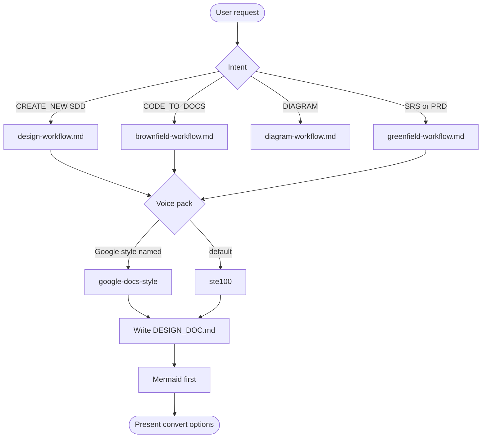

---

## 2. Constraints

- Token budget. SKILL.md stays under about 9k characters. Workflows stay on demand.
- No mixed voice packs. STE100 and Google style are mutually exclusive.
- No em dash in generated prose. No sentence that starts with So, That, Thus, or Hence.
- Mermaid is the default diagram tool. PlantUML is leftover types and raster images only.
- Plugin layout must match Agent Plugins 1.0: root `plugin.json`, skills in `skills/`, host extras in reverse-domain folders.
- GitHub wiki renders fenced `mermaid`. It does not render raw PlantUML.

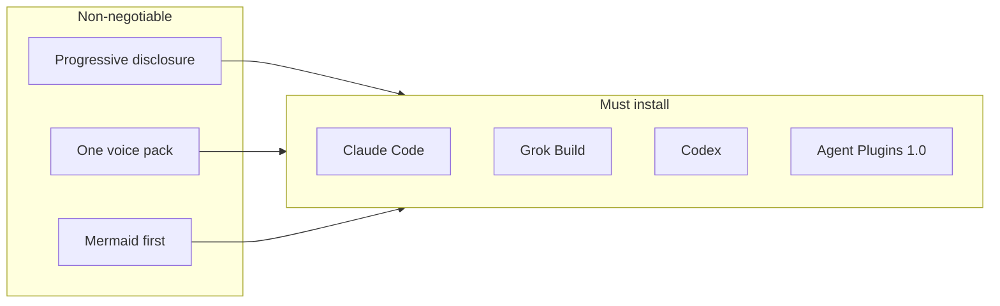

---

## 3. Context and scope

Document Specialist sits between a human (or WikiTicket SDD) and an agent host. It reads the repository, loads a workflow, and writes Markdown. Sister skills own style and figures.

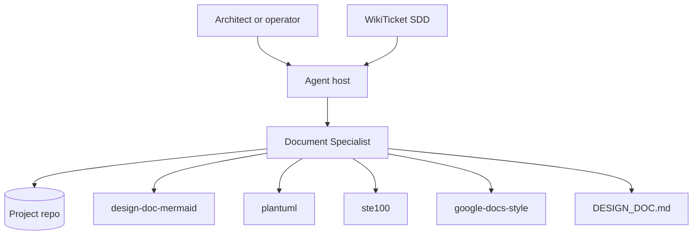

**In scope:** SRS, PRD, OpenAPI, user docs, tutorials, runbooks, SDD (`DESIGN_DOC.md`), architecture documents, ADRs, audits, MD/DOCX/PDF conversion, Mermaid and PlantUML diagrams.

**Out of scope:** Compiling code, deploying infrastructure, running production agents. Sister skills own STE100 lint, Google style lint, and diagram renderers.

---

## 4. Solution strategy

1. Classify intent from keywords, then load one workflow.
2. Pick one voice pack.
3. Load one template and one few-shot example.
4. Write the document. For design work the filename is `DESIGN_DOC.md`.
5. Draw Mermaid in the host Markdown. Save `.mmd` copies under `docs/diagrams/`.
6. For leftover UML, write `.puml`, render PNG or SVG, and link the image.

arc42 is the SDD skeleton. A shorter architecture document is allowed when the user asks for C4 context and containers without the full twelve sections.

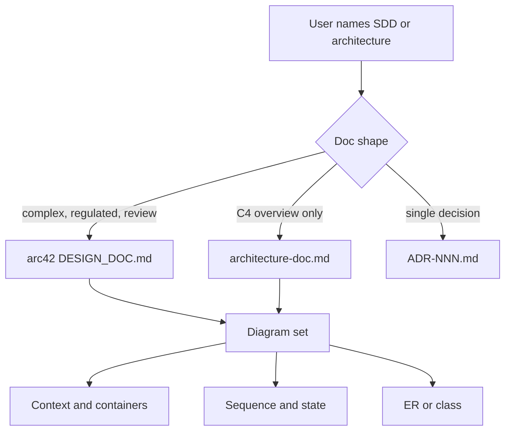

---

## 5. Building block view

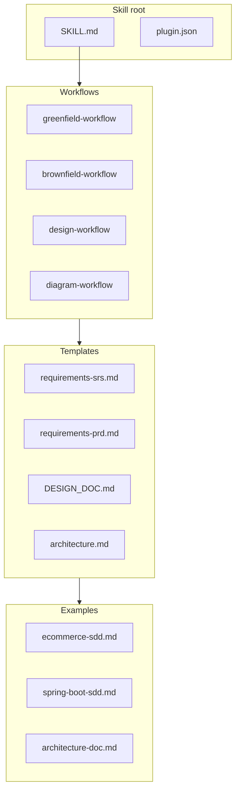

| Module | Responsibility |
|--------|----------------|
| `SKILL.md` | Triggers, intent table, voice pack, template map. |
| `design-workflow.md` | SDD and architecture generation steps. |
| `diagram-workflow.md` | Tool choice, publish target, node cap. |
| `templates/markdown/DESIGN_DOC.md` | arc42 skeleton with diagram slots. |
| `templates/markdown/architecture.md` | C4-first shorter document. |
| `examples/greenfield/ecommerce-sdd.md` | Few-shot complete SDD. |
| `examples/brownfield/spring-boot-sdd.md` | Few-shot reverse-engineered SDD. |
| Host manifests | Claude, Grok, Codex, Cursor, universal. |

### 5.1 Directory tree

```text
document-specialist-skill/
  SKILL.md
  plugin.json
  .claude-plugin/plugin.json
  .grok-plugin/plugin.json
  .codex-plugin/plugin.json
  skills/documentation-specialist/SKILL.md
  commands/write-sdd.md
  commands/write-architecture.md
  references/
    workflows/design-workflow.md
    templates/markdown/DESIGN_DOC.md
    templates/markdown/architecture.md
    examples/greenfield/ecommerce-sdd.md
    examples/brownfield/spring-boot-sdd.md
    reference/03-design-arc42.md
```

---

## 6. Runtime view

### 6.1 Greenfield SDD

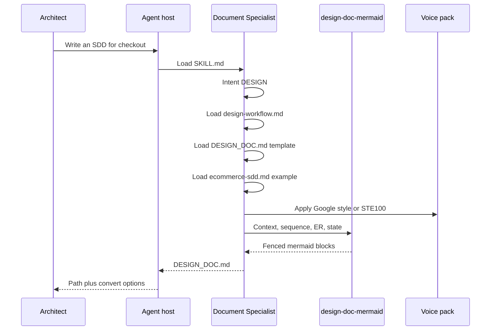

### 6.2 Brownfield SDD

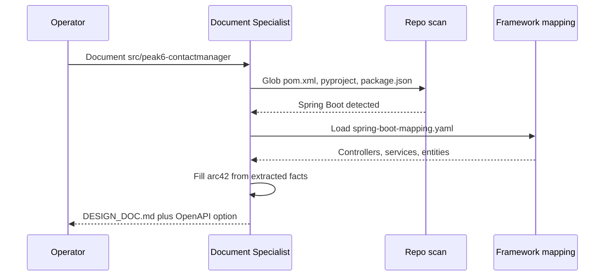

### 6.3 Document lifecycle

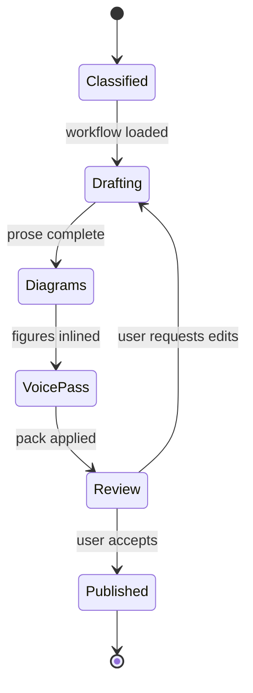

---

## 7. Deployment view

The skill is a directory, not a server. Hosts discover `SKILL.md` and `plugin.json`.

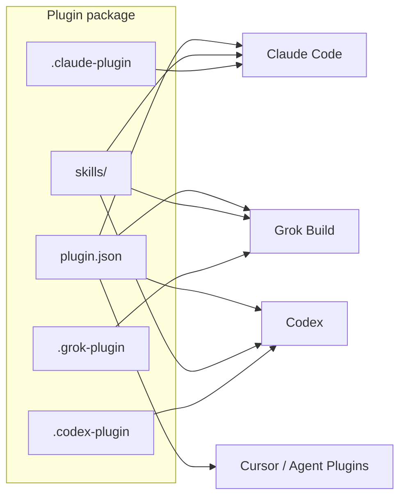

Install:

```text
skilz install SpillwaveSolutions_document-specialist-skill/documentation-specialist
claude plugin install document-specialist
```

Grok Build loads Claude plugins zero-config when `.claude-plugin/` is present. Codex reads `.codex-plugin/plugin.json` and `skills/`.

---

## 8. Crosscutting concepts

**Voice.** Default STE100. Switch only when the user names Google style.

**Diagrams.** Cap about 16 nodes. Write "+N more" instead of silent truncation. Fall back from experimental Mermaid (C4, `architecture-beta`) to `flowchart TD` on GitHub wiki.

**Error handling.** If the framework is unknown, ask Spring Boot, FastAPI, or other. If both voice packs are named, ask which one. If a template is missing, use the closest match and say so.

**Extensibility.** Add a template under `references/templates/markdown/`, a row in SKILL.md, a workflow keyword, and one example. Do not inline the example in SKILL.md.

### 8.1 UI wireframes

Folio is a document studio. Screens use PlantUML Salt, not Mermaid. Full few-shots live in the UI wireframes example.

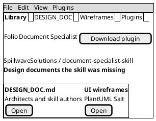

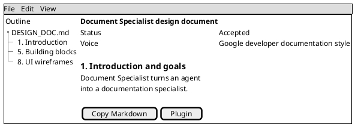

---

## 9. Architectural decisions

### ADR-001: Mermaid first, PlantUML leftover

**Status:** Accepted

**Context:** GitHub wiki renders Mermaid fences. It does not render PlantUML source. Confluence often needs images for both.

**Decision:** Use `design-doc-mermaid` for context, containers, sequence, class, ER, state, and activity. Use PlantUML for wireframes (Salt), use case, timing, ArchiMate, nwdiag, and WBS. Always render PlantUML to PNG or SVG.

**Consequences:** Wiki pages stay reviewable in GitHub. PlantUML types still work as images. Agents must not leave a raw `puml` fence as the only view.

### ADR-002: arc42 for SDD, C4-first for short architecture docs

**Status:** Accepted

**Context:** Full arc42 is heavy for a CRUD service. Regulated systems need the twelve sections.

**Decision:** `DESIGN_DOC.md` uses arc42. `architecture-doc.md` is the short form. ADRs stay one decision each.

**Consequences:** Agents have a clear filename. Reviewers know which outline they will get.

### ADR-003: Four-host plugin from one directory

**Status:** Accepted

**Context:** Claude, Grok, Codex, and Cursor each want a manifest in a different folder.

**Decision:** Root `plugin.json` follows Agent Plugins 1.0. Host extras live in `.claude-plugin/`, `.grok-plugin/`, `.codex-plugin/`, and `.cursor-plugin/`. The skill body is shared.

**Consequences:** One git tree. Host-specific UI metadata (Codex `interface`) does not leak into other clients.

---

## 10. Quality requirements

| ID | Requirement | Verify |
|----|-------------|--------|
| NFR-PDA-001 | Agent loads at most one workflow per turn. | Inspect tool reads. |
| NFR-DIA-001 | Every SDD includes context, one sequence, and one data figure. | Checklist in design-workflow. |
| NFR-HOST-001 | `plugin.json` validates against Agent Plugins 1.0. | Schema check. |
| NFR-VOICE-001 | Generated SDD contains no em dash. | grep on output. |

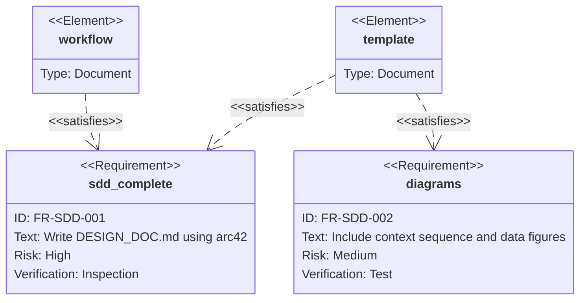

---

## 11. Risks and technical debt

- Examples TOC historically linked `ecommerce-sdd.md` and `design-sdd.md` that were not in the tree. This release adds them.
- Experimental Mermaid C4 can fail on GitHub. Flowchart fallback is mandatory.
- Voice pack skills must be installed beside this plugin. If they are missing, write Markdown and say the lint step was skipped.
- PlantUML rasterization needs `plantuml` or a renderer on PATH. Wiki uploads are a manual host step.

---

## 12. Glossary

| Term | Meaning |
|------|---------|
| SDD | Software design document. Stored as `DESIGN_DOC.md`. arc42 outline. |
| Architecture document | Shorter C4-first cousin of the SDD. |
| PDA | Progressive disclosure architecture. Load only the file you need. |
| Voice pack | STE100 or google-docs-style. Never both. |
| Brownfield | Docs extracted from existing code. |
| Greenfield | Docs created from templates. |
| Host | Claude Code, Grok Build, Codex, Cursor, or any Agent Plugins client. |

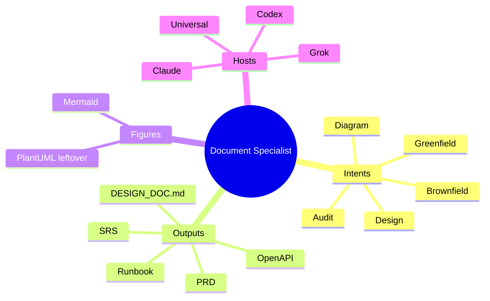
