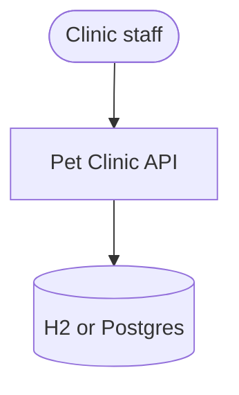
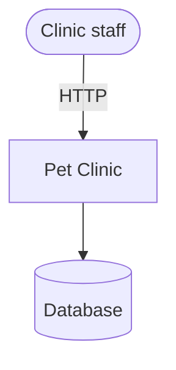
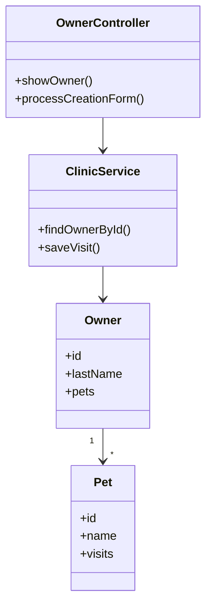
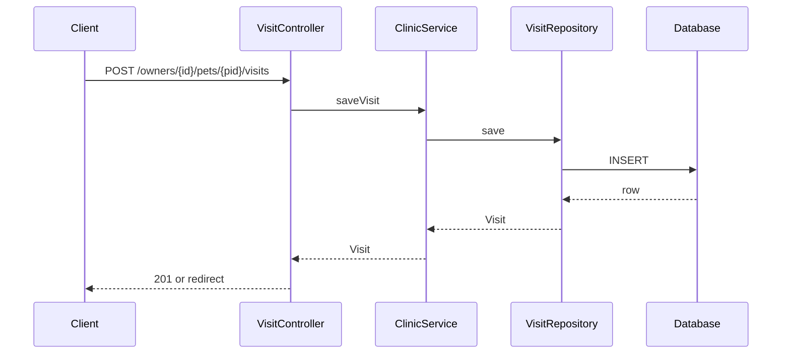
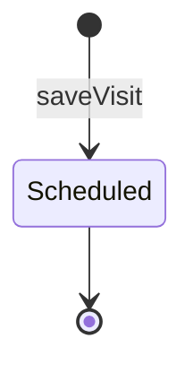
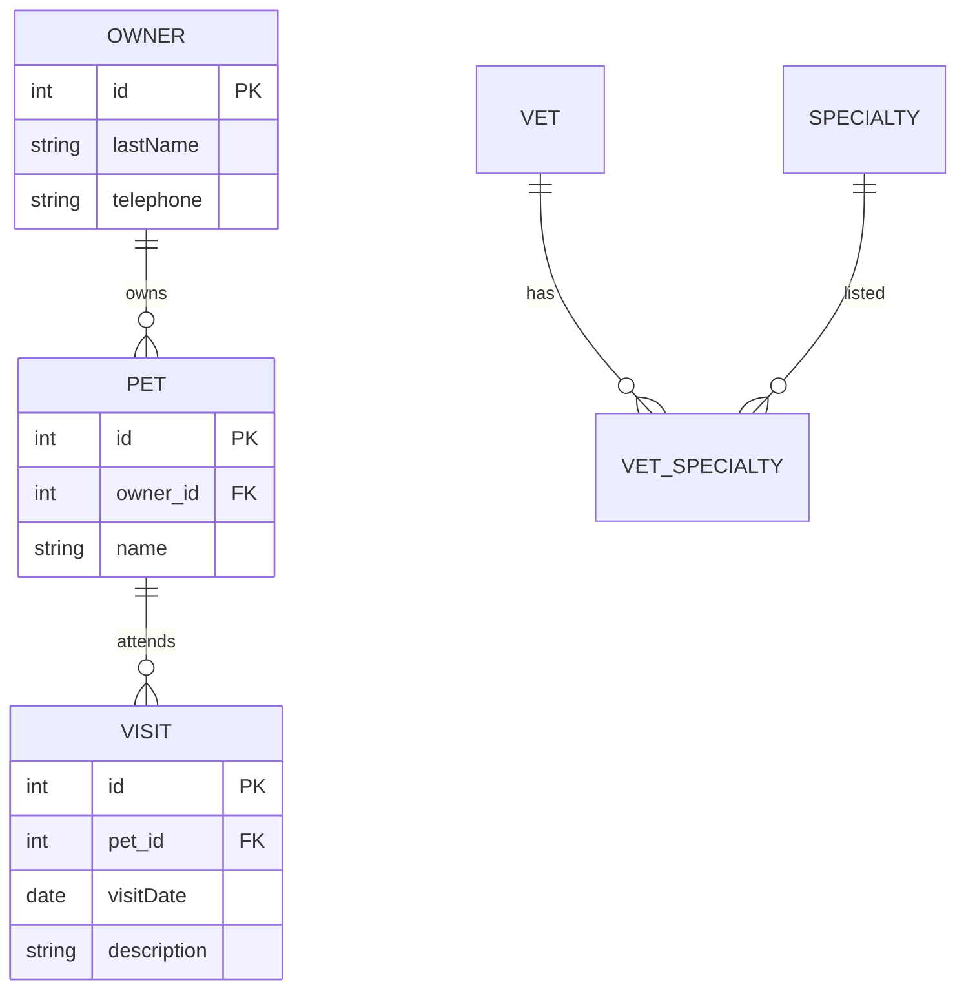
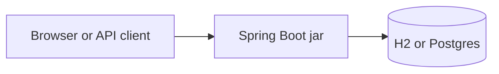
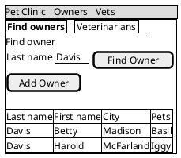
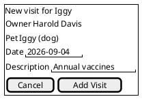

# DESIGN_DOC.md

**System:** Pet Clinic API  
**Version:** reverse-engineered from `src/main/java`  
**Status:** Draft  
**Audience:** Maintainers of the brownfield service  
**Voice:** Google developer documentation style  
**Source tree:** `spring-petclinic` (Spring Boot 3)

This SDD is the brownfield few-shot example. Every type name and path below is the kind of fact an agent must extract from code. Do not invent controllers that grep did not find.

---

## 1. Introduction and goals

Pet Clinic is a Spring Boot service for veterinarians. Staff register owners, pets, and visits. The original sample is a monolith with Thymeleaf. This document describes the extracted API module an agent would recover from package scans.

### 1.1 Quality goals

| ID | Goal | Scenario |
|----|------|----------|
| QG-1 | Accurate extraction | Every `@RestController` appears in section 5. |
| QG-2 | Operability | A new on-call can find health, datasource, and deploy shape. |



---

## 2. Constraints

- Spring Boot 3, Java 17.
- JPA entities in `org.springframework.samples.petclinic.model`.
- Default sample uses H2. Production overlay uses Postgres.

---

## 3. Context and scope

**In scope:** owners, pets, vets, visits, REST plus the original web UI if present.  
**Out of scope:** billing, insurance, imaging.



---

## 4. Solution strategy

Classic Spring layered monolith: controllers, services, repositories, JPA entities. No message bus in the sample. Persistence is transactional per request.

---

## 5. Building block view

Detected from mappings in `spring-boot-mapping.yaml` style scans.

| Building block | Evidence | Responsibility |
|----------------|----------|----------------|
| `OwnerController` | `@Controller` / `@RestController` | Owner CRUD |
| `PetController` | same | Pets under an owner |
| `VetController` | same | Veterinarian list |
| `VisitController` | same | Visit create |
| `ClinicService` | `@Service` | Use-case orchestration |
| `*Repository` | Spring Data | Persistence |



### 5.1 Directory tree

```text
src/main/java/org/springframework/samples/petclinic/
  owner/
  pet/
  vet/
  visit/
  model/
  system/
src/main/resources/application.properties
```

---

## 6. Runtime view

### 6.1 Record a visit



### 6.2 Visit state

The sample visit is append-only. There is no explicit status field. If you add cancellations, extend this diagram.



### 6.3 Schema recovered from entities



---

## 7. Deployment view



Local: `mvn spring-boot:run`. Production overlay: container, Postgres URL, Actuator `/health`.

---

## 8. Crosscutting concepts

- Validation on form objects.
- Actuator for health.
- Thymeleaf error pages in the web module.
- Transactions on `ClinicService`.

### 8.1 UI wireframes

Recovered from Thymeleaf templates. Owners search and new visit.





---

## 9. Architectural decisions

### ADR-B-001: Layered Spring monolith

**Status:** Observed, not chosen in this pass  
**Context:** The sample predates this SDD.  
**Decision:** Keep the layered package layout until a module boundary is proven.  
**Consequences:** Fast onboarding. Harder independent scaling.

---

## 10. Quality requirements

| ID | Requirement | Verify |
|----|-------------|--------|
| NFR-EXT-001 | Newly added controllers appear in section 5 after the next brownfield run | Diff the SDD |

---

## 11. Risks and technical debt

- H2 default hides production lock and migration issues.
- Web and API share entities. JSON views are incomplete.

---

## 12. Glossary

| Term | Meaning |
|------|---------|
| Owner | Pet owner on file. |
| Visit | Appointment row, not a streaming event. |
