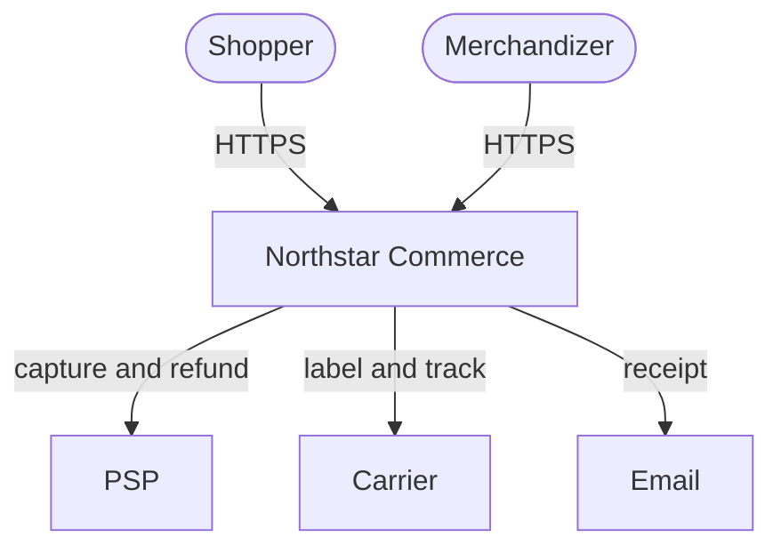
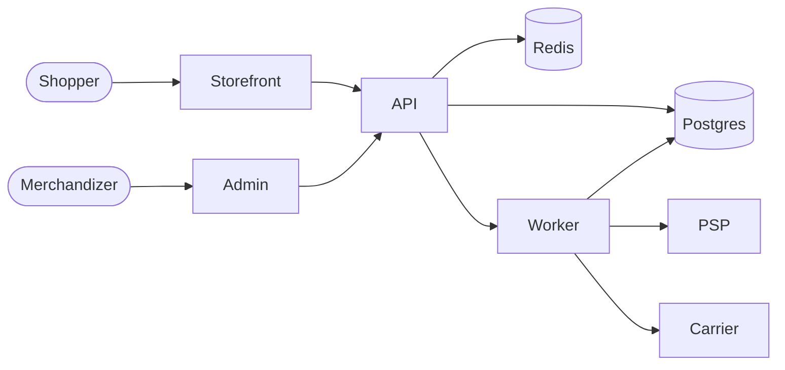
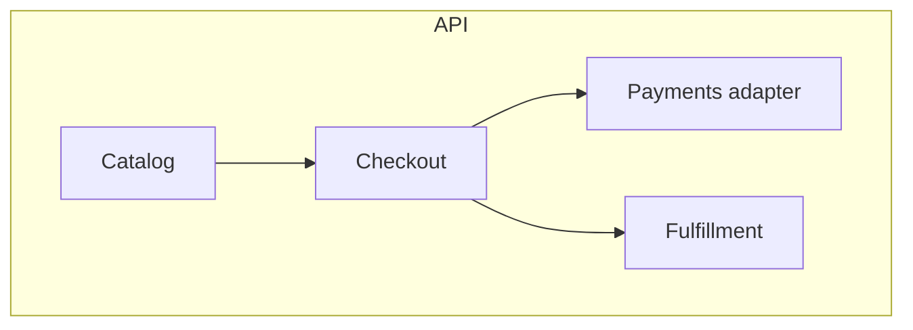
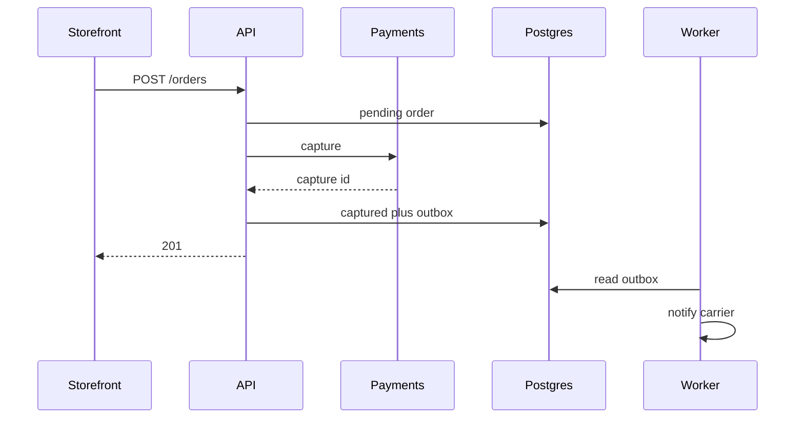
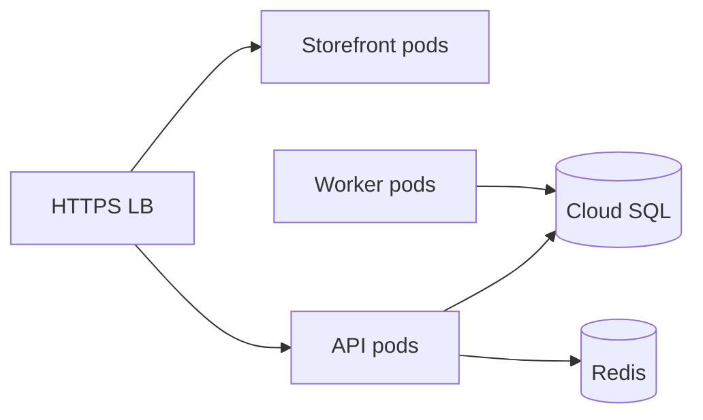
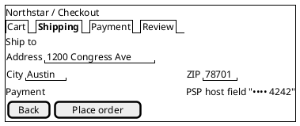
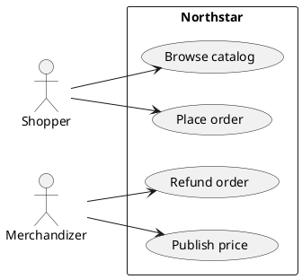

# Architecture document

**System:** Northstar Commerce  
**Version:** 1.2.0  
**Status:** Accepted  
**Audience:** Engineers joining the platform  
**Voice:** Google developer documentation style

This is the short C4-first cousin of `DESIGN_DOC.md`. Use it when the user wants system context, containers, and key sequences without the full arc42 ceremony. For regulated reviews, write the SDD instead.

---

## Purpose

Northstar lets a retailer publish a catalog, take payment, and hand a parcel to a carrier. This note shows where those responsibilities live and how a checkout call travels.

---

## System context

Shoppers and merchandizers are people. The PSP, the carrier, and email are external systems. Northstar is the single system of record for orders.

---

## Containers

| Container | Tech | Role |
|-----------|------|------|
| Storefront | SSR web app | Shopper UI |
| Admin console | SPA | Merchandizing |
| API | Java 21 | Catalog, checkout, fulfillment |
| Postgres | Cloud SQL | Orders and catalog |
| Redis | Memorystore | Carts |
| Worker | Java 21 | Outbox drain |

---

## Components inside the API

Catalog owns products and prices. Checkout owns orders. Payments never stores PAN. Fulfillment drains the outbox.

---

## Key sequence: checkout

Keep this to five participants.

---

## Deployment

Staging mirrors production with a smaller replica. Promotes with a tagged image.

---

## Decisions to read next

- ADR-001 Modular monolith
- ADR-002 Transactional outbox

When a change crosses two containers or a quality goal, update this file and `DESIGN_DOC.md` in the same PR.

---

## UI wireframes

PlantUML Salt for the shopper checkout. Full catalog and admin screens are in the UI wireframes example.

---

## Use cases (PlantUML leftover)

GitHub wiki does not render the following source. Render PNG or SVG, commit it under `docs/diagrams/`, and upload the image with the wiki page.

