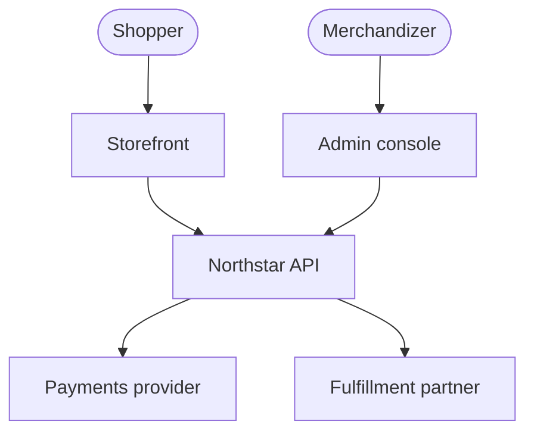
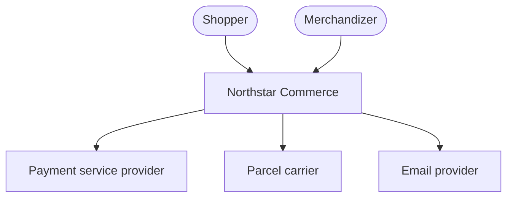
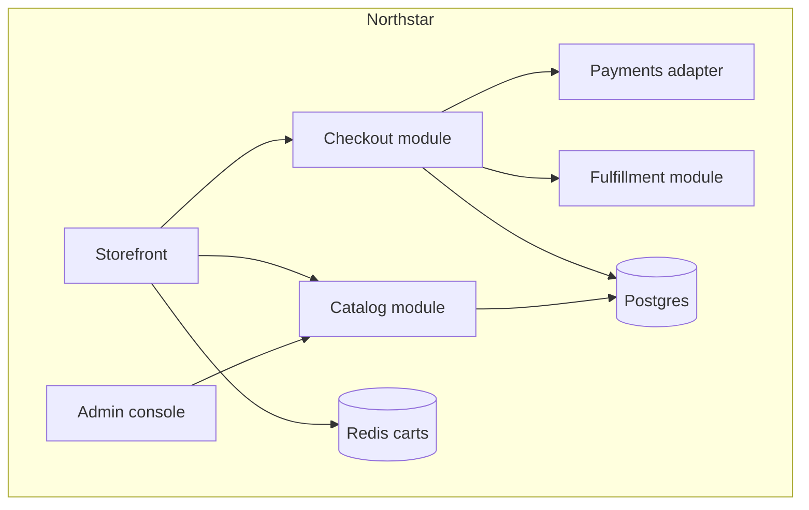
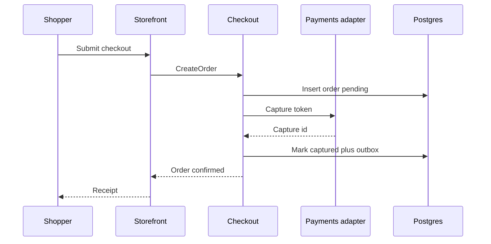
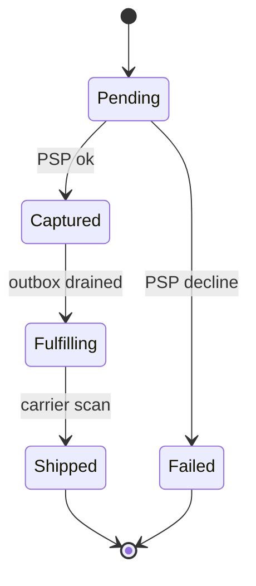
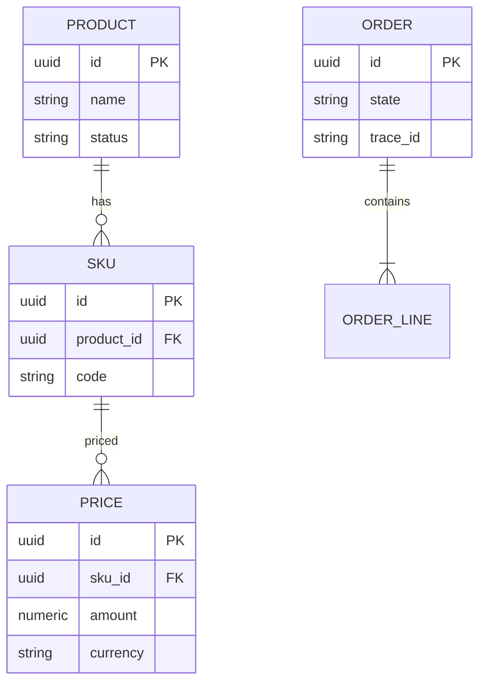
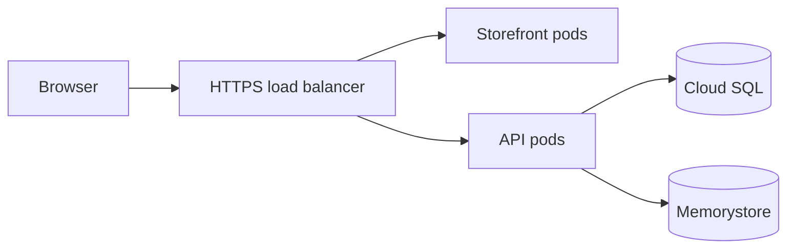
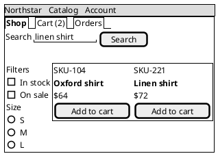
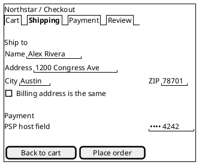

# DESIGN_DOC.md

**System:** Northstar Commerce  
**Version:** 1.2.0  
**Status:** Accepted  
**Audience:** Platform architects and service owners  
**Voice:** Google developer documentation style  
**Related requirements:** `docs/srs/billing-srs.md`

Northstar is a checkout and catalog platform for mid-market retailers. Shoppers browse a catalog, pay, and track fulfillment. Operators price, merchandize, and refund. This SDD records the architecture that satisfies those flows.

Use this file as the greenfield few-shot example when a user asks for a new software design document.

---

## 1. Introduction and goals

Northstar splits storefront, catalog, checkout, and fulfillment so pricing and payments can change without redeploying the storefront. The primary users are shoppers, merchandizers, and on-call operators.

### 1.1 Quality goals

| ID | Goal | Scenario |
|----|------|----------|
| QG-1 | Checkout availability | A region loss does not block capture for more than 60 seconds. |
| QG-2 | Price integrity | Two shoppers never pay different prices for the same SKU in the same second unless a promotion applies. |
| QG-3 | Auditability | Every capture, refund, and catalog publish has a trace id an auditor can pull. |

### 1.2 Stakeholders

| Stakeholder | Expectation |
|-------------|-------------|
| Shopper | Fast browse and a single-page checkout. |
| Merchandizer | Publish a price without an engineering ticket. |
| Payments lead | PCI scope stays inside the payments adapter. |
| On-call | One dashboard for order state. |



---

## 2. Constraints

- PCI-DSS SAQ A-EP. Card data never touches Northstar databases.
- Primary region `us-central1` with a warm `us-east1` replica.
- Java 21 and PostgreSQL 16 are the default runtime.
- Team of four. No more than six deployable units.

---

## 3. Context and scope

**In scope:** catalog browse, cart, checkout, capture, refund, shipment events.  
**Out of scope:** warehouse robotics, store POS, loyalty points.



---

## 4. Solution strategy

- Modular monolith first. Extract payments only if PCI scope forces it.
- Postgres for orders and catalog. Redis for cart sessions.
- Outbox pattern for shipment events. No dual writes.
- Server-side rendered storefront with a JSON API for the admin console.

ADR-001 chooses the modular monolith. ADR-002 chooses the outbox.

---

## 5. Building block view

| Building block | Responsibility | Requirements |
|----------------|----------------|--------------|
| Storefront | Browse, cart, checkout UI | FR-CAT-001, FR-CHK-001 |
| Catalog module | SKU, price, publish | FR-CAT-002 |
| Checkout module | Order, tax, capture handoff | FR-CHK-001, FR-PAY-001 |
| Payments adapter | PSP tokens, refunds | FR-PAY-001 |
| Fulfillment module | Shipment events | FR-FUL-001 |
| Admin console | Merchandizing | FR-CAT-002 |



### 5.1 Directory tree

```text
northstar/
  apps/storefront/
  apps/admin/
  modules/catalog/
  modules/checkout/
  modules/payments/
  modules/fulfillment/
  infra/
  docs/DESIGN_DOC.md
```

---

## 6. Runtime view

### 6.1 Place order



### 6.2 Order lifecycle



### 6.3 Catalog data



---

## 7. Deployment view



Two GKE namespaces, `prod` and `staging`. Secrets in Secret Manager. Traces on every checkout span.

---

## 8. Crosscutting concepts

- Authn: OIDC for admin. Session cookie for shoppers.
- Idempotency keys on capture and refund.
- Structured logs with `trace_id` and `order_id`.
- Feature flags for payment PSPs.

### 8.1 UI wireframes

Salt sketches for the two shopper screens. Card PAN never appears on the checkout wireframe.





---

## 9. Architectural decisions

### ADR-001: Modular monolith

**Status:** Accepted  
**Context:** Four engineers. Payments must stay isolatable.  
**Decision:** One deployable API with Maven modules.  
**Consequences:** Simple ops today. A future extract of `modules/payments` is a package move, not a rewrite.  
**Alternatives:** Microservices rejected. Too many moving parts for the team size.

### ADR-002: Transactional outbox

**Status:** Accepted  
**Context:** Dual writes to Postgres and a queue drift.  
**Decision:** Outbox table in the same transaction as the order row.  
**Consequences:** At-least-once delivery. Consumers must be idempotent.

---

## 10. Quality requirements

| ID | Requirement | Risk | Verify |
|----|-------------|------|--------|
| NFR-AVL-001 | Checkout capture remains available through a single-zone loss | High | Game day |
| NFR-AUD-001 | Every capture stores PSP id, token last4, and trace id | High | Audit query |

---

## 11. Risks and technical debt

- Tax tables are still a CSV loaded at boot. Owner: catalog team. Mitigation: move to a versioned table in Q3.
- Admin console shares the shopper API. Split authz filters before adding more roles.

---

## 12. Glossary

| Term | Meaning |
|------|---------|
| Capture | Funds pulled from the PSP token. |
| Outbox | Table of pending domain events written with the business row. |
| SKU | Sellable unit under a product. |
