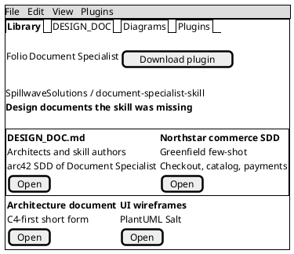
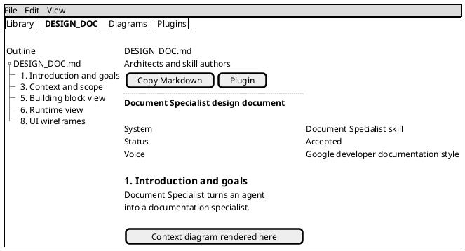
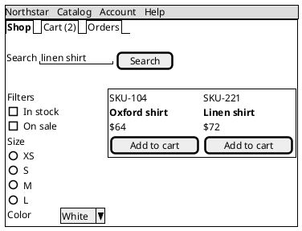
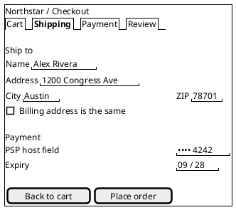
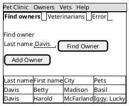
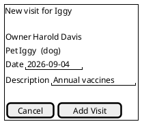
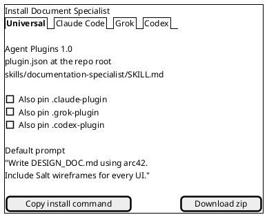

# UI wireframes (PlantUML Salt)

**System:** Document Specialist and example products  
**Tool:** PlantUML Salt  
**Voice:** Google developer documentation style

Mermaid cannot sketch screens. Use PlantUML Salt for every UI in an SDD or architecture document. Keep the `.puml` source, render PNG or SVG, and link the image. GitHub wiki does not render Salt fences.

This page is the few-shot set. Copy a wireframe, rename the window title, and swap labels for the product under design.

---

## Salt cheatsheet

| Mark | Control |
|------|---------|
| `"text"` | Text field |
| `[OK]` | Button |
| `[]` | Checkbox |
| `()` | Radio |
| `^` | Drop-down |
| `{* File \| Edit }` | Menu bar |
| `{/ Tab1 \| Tab2 }` | Tabs |
| `{+ ... }` | Window |
| `{T + item ++ child}` | Tree |
| `==` `--` `..` | Separators |
| `\|` | Table cell |

Prefix the diagram with `salt` inside `@startuml`. Do not use Mermaid `block-beta` for screens.

---

## Folio library

Landing view of the Document Specialist studio. Menu, tabs, and a two-up card grid.

---

## Folio document paper

Reading an SDD. Outline on the left, paper in the center, copy and plugin actions on the toolbar.

---

## Northstar catalog

Shopper browse. Filters, product grid, cart count.

---

## Northstar checkout

Single-page checkout. Shipping, payment token, place order. Card number never appears. That is a PCI constraint.

---

## Pet Clinic: owners

Brownfield staff UI recovered from Spring MVC templates. Search by last name, then open an owner.

---

## Pet Clinic: record a visit

---

## Document Specialist plugin hosts

Settings-style screen for the four manifests.

---

## How agents should file these

1. Write Salt source under `docs/diagrams/[screen].puml`.
2. Render PNG or SVG. PlantUML server, `plantuml` CLI, or this studio.
3. Link the image from `DESIGN_DOC.md`. Keep the fence so reviewers can edit.
4. One screen per diagram. Do not nest an entire product in one Salt block.

When the user names a UI, a screen, a mock, or a wireframe, load this page and `design-workflow.md`, then emit Salt. Do not substitute a Mermaid flowchart for a screen.
