# Diagram playbook

Use this with `references/workflows/diagram-workflow.md`. Default tool is Mermaid. PlantUML is leftover types and images.

Cap a figure at about 16 nodes. Prefer several small diagrams over one dense one.

---

## Chooser

| You need to show | Diagram | Tool |
|------------------|---------|------|
| Who talks to the system | Context flowchart | Mermaid |
| Deployable pieces | Container flowchart | Mermaid |
| Modules inside a container | Component flowchart or class | Mermaid |
| Time-ordered calls | Sequence | Mermaid |
| Branching process | Flowchart | Mermaid |
| Lifecycle | State | Mermaid |
| Tables and keys | ER | Mermaid |
| Types and inheritance | Class | Mermaid |
| Nested ideas | Mind map | Mermaid |
| Schedule | Gantt | Mermaid |
| Shall-statements | Requirement | Mermaid |
| User feeling over time | Journey | Mermaid |
| Wire format | Packet | Mermaid |
| Actors and goals | Use case | PlantUML |
| UI sketch | Salt wireframe | PlantUML |
| Clock / waveform | Timing | PlantUML |
| Enterprise layers | ArchiMate | PlantUML |
| Rack / network | nwdiag | PlantUML |
| Breakdown structure | WBS | PlantUML |

If GitHub fails to render C4, `architecture-beta`, or `block-beta`, rewrite as `flowchart TD`. Do not switch to PlantUML for that reason on wiki.

---

## Flowchart

Process, decisions, or C4-style boxes.

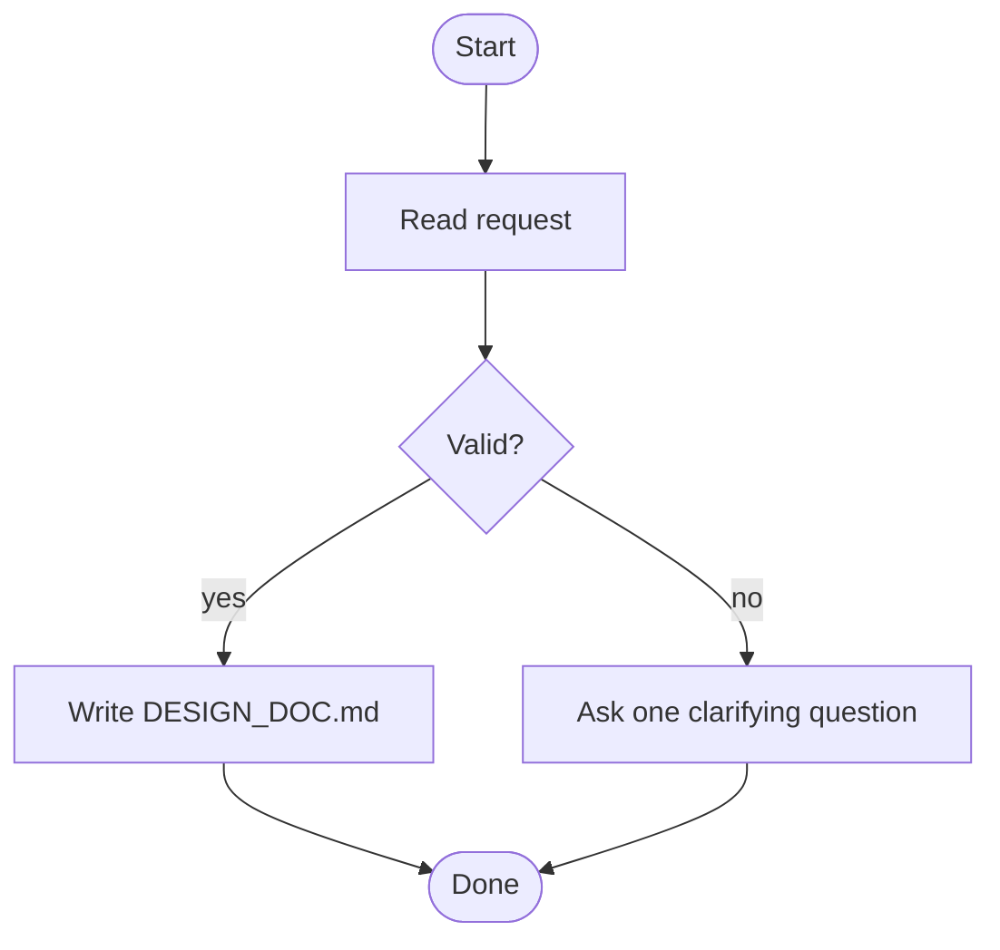

Direction: `TD` for documents, `LR` for deployment. Multi-line labels use ` `.

---

## Sequence

Keep five participants or fewer. Use subsystems, not every class.

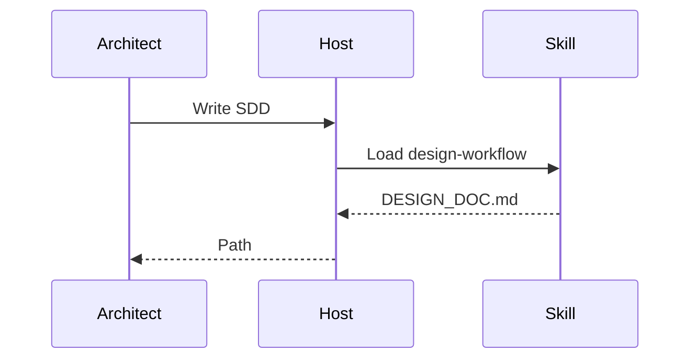

---

## State

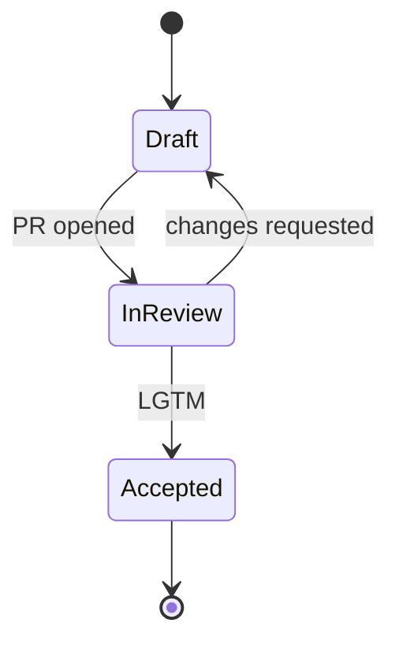

---

## Class

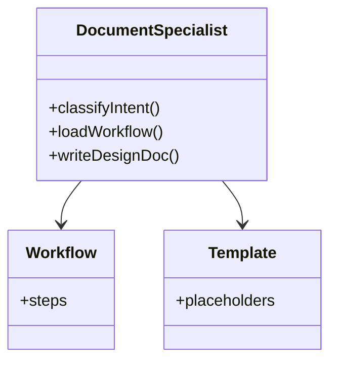

---

## ER

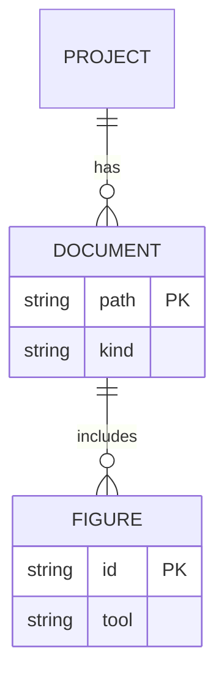

---

## User journey

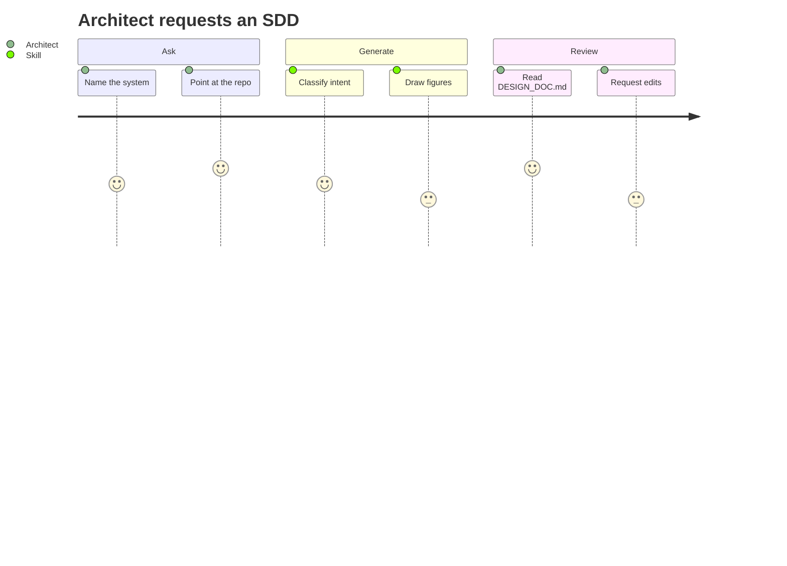

---

## Mind map

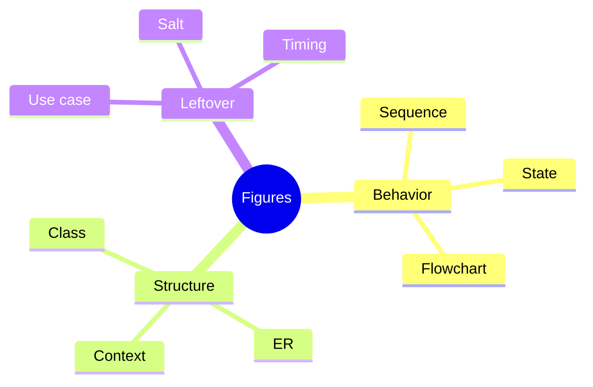

---

## Gantt

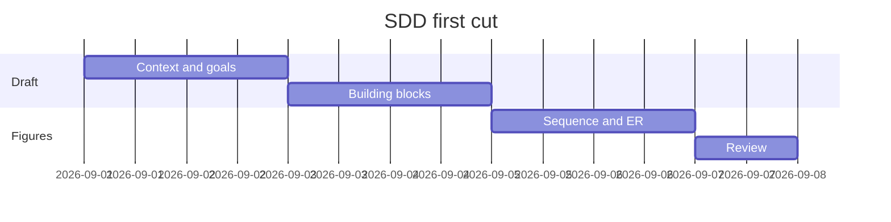

---

## Requirement

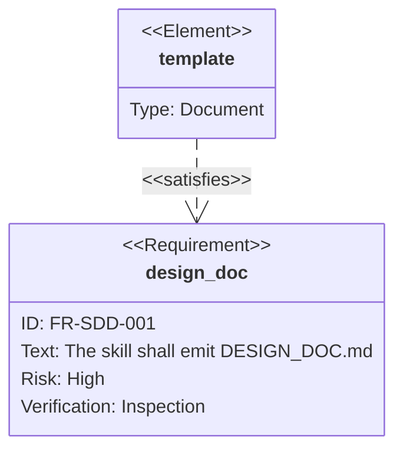

---

## Packet

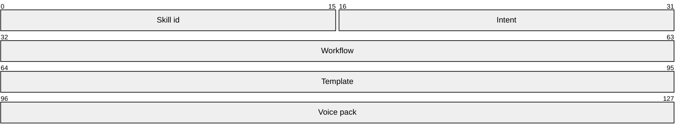

---

## Salt wireframe

Use PlantUML Salt for every UI, mock, or screen. Mermaid has no wireframe type. One screen per diagram.

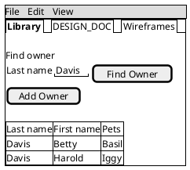

Copy labels from the real product. Full Folio, Northstar, and Pet Clinic screens are in the UI wireframes example.

---

## PlantUML leftover: use case

Render this to PNG or SVG. Do not leave it as the only view on GitHub wiki.

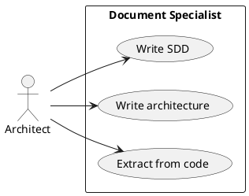

---

## Formatting notes

- Set direction explicitly (`TD`, `LR`).
- Quote labels that contain punctuation.
- Style with `classDef` when you need contrast. Prefer theme variables over one-off hex in every node.
- Break a crowded figure into two linked diagrams rather than shrinking fonts.
- For wiki: keep the `mermaid` fence. For Confluence, Notion, Word, or PDF: render PNG or SVG and upload the image.
