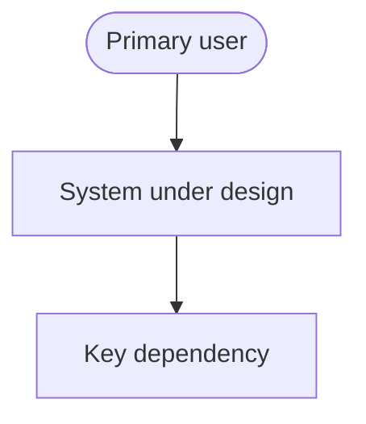
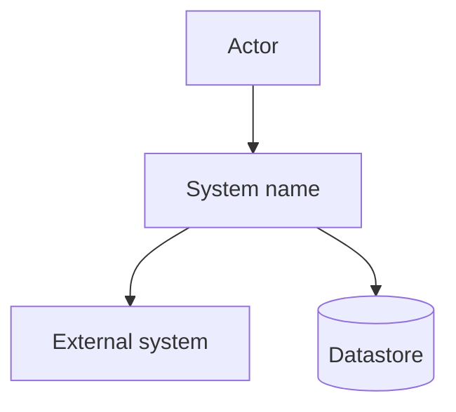
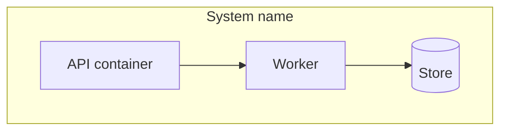
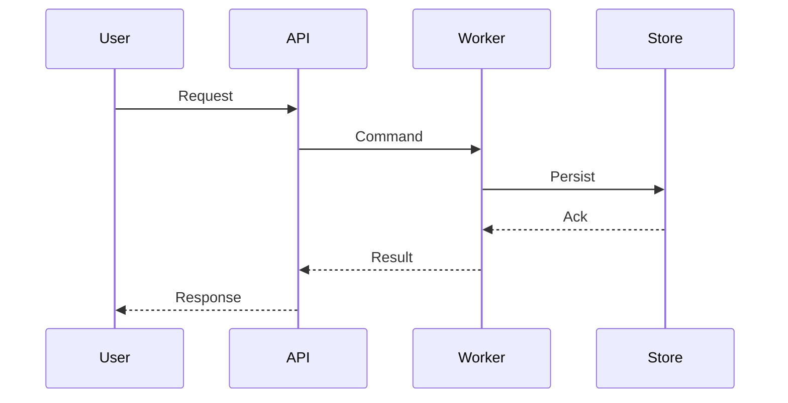
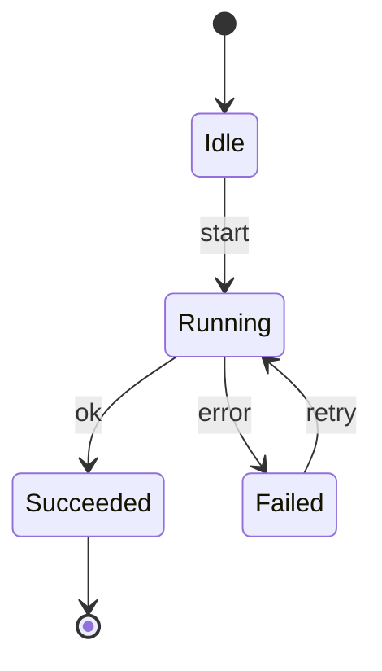
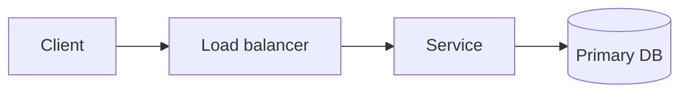
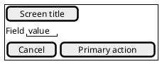

# DESIGN_DOC.md template

**System:** `[System name]`  
**Version:** `[0.1.0]`  
**Status:** `[Proposed | Accepted]`  
**Audience:** `[Architects, implementers, reviewers]`  
**Voice:** `[STE100 | google-docs-style]`  
**Related requirements:** `[SRS or PRD path]`

Replace every `[placeholder]`. Keep the twelve arc42 sections. Insert Mermaid where the slots say so. Use PlantUML only for leftover types, and always link a PNG or SVG beside the source.

Save this file as `DESIGN_DOC.md` at the project root or as `docs/DESIGN_DOC.md`.

---

## 1. Introduction and goals

`[One or two paragraphs. What the system does. Which problem it solves. Who uses it.]`

### 1.1 Quality goals

| ID | Goal | Scenario |
|----|------|----------|
| QG-1 | `[e.g. auditability]` | `[concrete scenario]` |
| QG-2 | `[e.g. recoverability]` | `[concrete scenario]` |
| QG-3 | `[e.g. latency]` | `[concrete scenario]` |

### 1.2 Stakeholders

| Stakeholder | Expectation |
|-------------|-------------|
| `[role]` | `[what they need from this document]` |



---

## 2. Constraints

- Business: `[budget, timeline, team shape]`
- Technical: `[language, cloud, datastore]`
- Legal: `[PCI, HIPAA, SOC2, data residency]`

---

## 3. Context and scope

Describe the system boundary. Name every actor and every external system. Then draw context.

**In scope:** `[list]`  
**Out of scope:** `[list]`



---

## 4. Solution strategy

`[The few high-level choices that drive the rest of the design. Link ADRs.]`

- ADR-001: `[decision]`
- ADR-002: `[decision]`

---

## 5. Building block view

List modules, packages, or containers. One sentence each. Then draw the static decomposition.

| Building block | Responsibility | Requirements |
|----------------|----------------|--------------|
| `[name]` | `[does what]` | `[FR-ids]` |



### 5.1 Directory tree

```text
[paste a trimmed tree of the repo]
```

---

## 6. Runtime view

Pick two or three use cases. Keep each sequence at five participants or fewer. Prefer subsystems over classes.

### 6.1 `[Use case name]`



### 6.2 Lifecycle



---

## 7. Deployment view



Runtime: `[process model, regions, secrets, observability]`.

---

## 8. Crosscutting concepts

- Logging and tracing: `[...]`
- Authn and authz: `[...]`
- Error handling: `[...]`
- Configuration: `[...]`
- Extensibility: `[...]`

---

## 9. Architectural decisions

Copy the ADR mini-template for each significant choice.

### ADR-001: `[title]`

**Status:** `[Proposed | Accepted]`  
**Context:** `[forces]`  
**Decision:** `[what]`  
**Consequences:** `[positive and negative]`  
**Alternatives:** `[rejected options and why]`

---

## 10. Quality requirements

| ID | Requirement | Risk | Verify |
|----|-------------|------|--------|
| NFR-001 | `[The system shall ...]` | High | Test |

---

## 11. Risks and technical debt

- `[risk or debt item, owner, mitigation]`

---

## 12. Glossary

| Term | Meaning |
|------|---------|
| `[term]` | `[definition used in this document]` |

### Required figures

Every `DESIGN_DOC.md` includes at least:

1. Context flowchart (section 3)
2. Building-block flowchart (section 5)
3. One sequence diagram (section 6)
4. One state or ER diagram if the domain has a lifecycle or a schema
5. Deployment flowchart (section 7)
6. PlantUML Salt wireframe for every user-facing screen

PlantUML use-case, Salt wireframe, timing, ArchiMate, nwdiag, or WBS go in `docs/diagrams/` as `.puml` plus PNG or SVG. Keep the Salt fence in `DESIGN_DOC.md` so reviewers can edit the screen.

### UI wireframe slot


