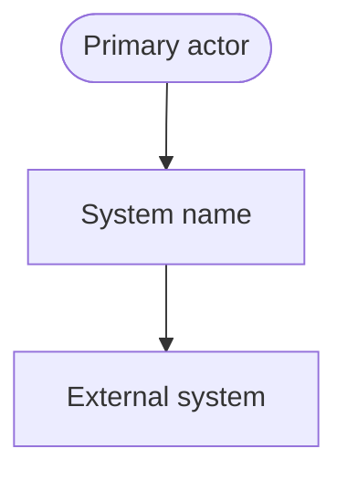
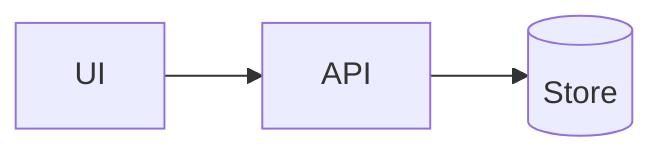
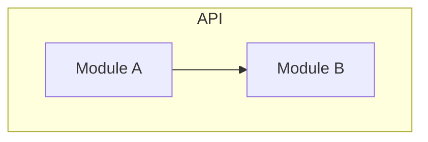
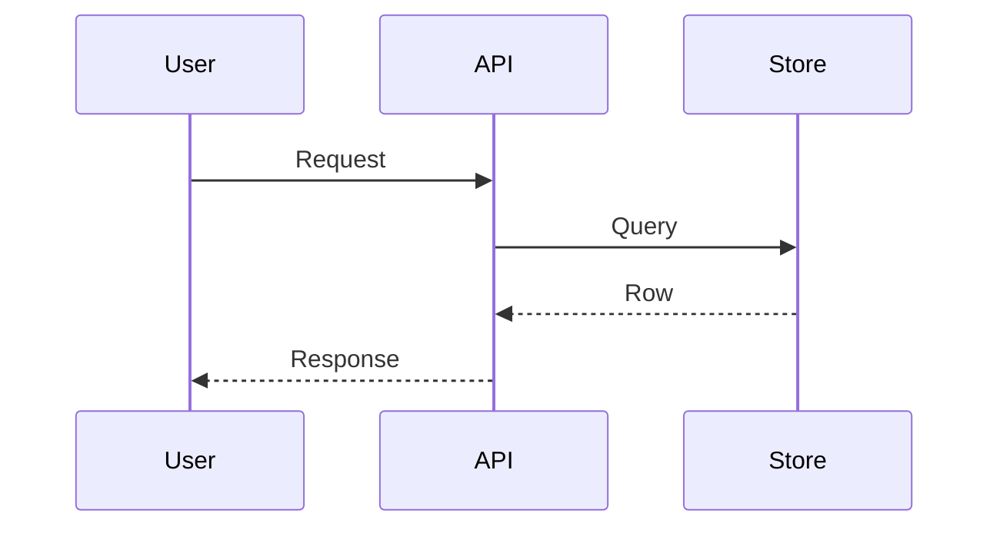
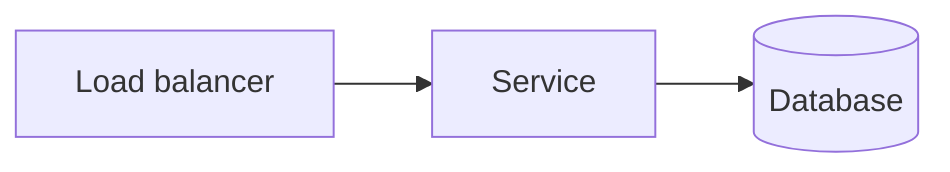
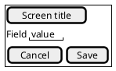

# Architecture document

**System:** `[System name]`  
**Version:** `[0.1.0]`  
**Status:** `[Proposed | Accepted]`  
**Audience:** `[Engineers joining the system]`  
**Voice:** `[STE100 | google-docs-style]`

Short C4-first document. Use this when the user wants context, containers, and a key sequence without the full arc42 SDD. For regulated reviews, write `DESIGN_DOC.md` instead.

---

## Purpose

`[Two or three sentences. What the system does. Who uses it.]`

---

## System context

**In scope:** `[list]`  
**Out of scope:** `[list]`

---

## Containers

| Container | Tech | Role |
|-----------|------|------|
| `[name]` | `[stack]` | `[role]` |

---

## Components

---

## Key sequence

Five participants or fewer.

---

## Deployment

---

## UI wireframes

One Salt diagram per screen. Do not sketch UI in Mermaid.

## Decisions to read next

- ADR-001: `[title]`

When a change crosses two containers, update this file in the same PR as the code.
