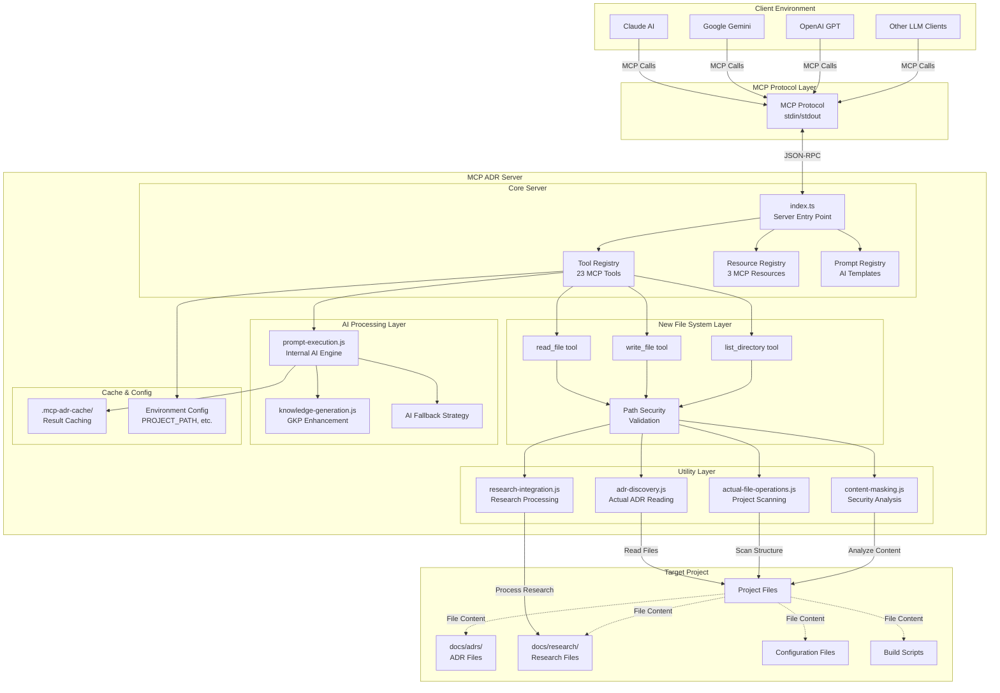

# MCP ADR Analysis Server Architecture

## Overview

The MCP ADR Analysis Server is an intelligent architectural analysis platform that provides LLM clients with comprehensive ADR (Architectural Decision Record) analysis capabilities. The server has evolved from a prompt-only system to a hybrid architecture that combines actual file system operations with intelligent AI processing.

## High-Level Communication Flow



## Detailed Tool Communication Pattern


## Before vs After Architecture Comparison


## Core Components

### 1. MCP Server Core (`src/index.ts`)

- **Entry Point**: Main server initialization and protocol handling
- **Tool Registry**: 31 MCP tools for comprehensive ADR analysis and project management
- **Resource Registry**: 3 MCP resources for structured data access
- **Prompt Registry**: AI-ready templates for analysis tasks
- **Knowledge Graph**: Advanced intent tracking and TODO synchronization

### 2. File System Layer (New)

Three new fundamental tools that enable universal LLM compatibility:

#### `read_file` Tool

```typescript
{
  name: 'read_file',
  description: 'Read contents of a file',
  inputSchema: {
    type: 'object',
    properties: {
      path: { type: 'string', description: 'Path to file' }
    },
    required: ['path']
  }
}
```

#### `write_file` Tool

```typescript
{
  name: 'write_file',
  description: 'Write content to a file',
  inputSchema: {
    type: 'object',
    properties: {
      path: { type: 'string', description: 'Path to file' },
      content: { type: 'string', description: 'Content to write' }
    },
    required: ['path', 'content']
  }
}
```

#### `list_directory` Tool

```typescript
{
  name: 'list_directory',
  description: 'List contents of a directory',
  inputSchema: {
    type: 'object',
    properties: {
      path: { type: 'string', description: 'Path to directory' }
    },
    required: ['path']
  }
}
```

### 3. Utility Layer

Provides actual file operations and intelligent processing:

#### ADR Discovery (`src/utils/adr-discovery.js`)

- **Function**: `discoverAdrsInDirectory()`
- **Purpose**: Actually read and parse ADR files + initialize `.mcp-adr-cache` infrastructure
- **Output**: Structured ADR data with content
- **Note**: Always initializes cache infrastructure, regardless of ADR presence

#### File Operations (`src/utils/actual-file-operations.js`)

- **Function**: `scanProjectStructure()`
- **Purpose**: Comprehensive project analysis
- **Features**: Shell script detection, content masking, pattern matching

#### Content Masking (`src/utils/content-masking.js`)

- **Function**: `analyzeSensitiveContent()`
- **Purpose**: Security analysis and data protection
- **Features**: Pattern detection, confidence scoring, masking strategies

#### Research Integration (`src/utils/research-integration.js`)

- **Function**: `monitorResearchDirectory()`
- **Purpose**: Research file processing and ADR impact analysis
- **Features**: Topic extraction, impact evaluation, update suggestions

### 4. AI Processing Layer

#### Internal AI Engine (`src/utils/prompt-execution.js`)

```typescript
// Enhanced analysis with actual file content
const result = await discoverAdrsInDirectory(adrDirectory, true, projectPath);
const analysisPrompt = generatePrompt(result.actualContent);
const aiResult = await executePromptWithFallback(analysisPrompt);
```

#### AI-Powered Tool Orchestration

- **OpenRouter.ai Integration**: Advanced AI planning through external LLM services
- **Dynamic Tool Sequencing**: AI generates optimal tool execution sequences
- **Hallucination Detection**: Reality checks prevent AI confusion and loops
- **Human Override Patterns**: Predefined workflows bypass AI confusion

#### Generated Knowledge Prompting (GKP)

- **Enhanced Analysis**: Leverages architectural knowledge for better insights
- **Context-Aware**: Understands project-specific patterns and technologies
- **Confidence Scoring**: Provides reliability metrics for recommendations

#### Intelligent Workflow Management

```typescript
// AI-powered tool orchestration
const plan = await generateToolPlan(userIntent, availableTools);
const sequence = await validateToolSequence(plan.tools);
const execution = await executeWithFallback(sequence);
```

#### Fallback Strategy

```typescript
if (executionResult.isAIGenerated) {
  // Return smart analysis
  return formatMCPResponse({...});
} else {
  // Return raw data for external processing
  return { content: [...] };
}
```

## Key Architectural Improvements

### 1. Universal LLM Compatibility

- **Before**: Worked only with Claude (had file access)
- **After**: Works with all LLM providers through internal file operations

### 2. Intelligent Fallback Strategy

The server provides both AI-enhanced analysis and raw data depending on capabilities:

- **AI Available**: Smart insights with confidence scores
- **AI Unavailable**: Structured prompts with actual file content

### 3. Security-First File Access

- **Path Validation**: Absolute paths required, security sandboxing
- **Content Masking**: Automatic sensitive data detection and protection
- **Access Control**: Configurable project boundaries

### 4. Performance Optimization

- **Caching System**: Results cached in `.mcp-adr-cache/` with TTL
- **Lazy Loading**: Utilities loaded on-demand
- **Intelligent Filtering**: Content-aware file processing

### 5. Enhanced AI Capabilities

- **Generated Knowledge Prompting**: Domain expertise enhancement
- **Context Awareness**: Project-specific analysis
- **Risk Assessment**: Confidence scoring and impact evaluation

### 6. Advanced Project Management Tools

- **Smart Scoring System**: Dynamic project health assessment across all dimensions
- **TODO Lifecycle Management**: Complete task tracking with status transitions
- **AI-Powered Troubleshooting**: Systematic failure analysis with test plan generation
- **Intelligent Tool Orchestration**: Dynamic workflow automation based on user intent
- **Human Override System**: Force planning when LLMs get confused or stuck
- **Smart Git Operations**: Release readiness analysis with sensitive content filtering

### 7. Knowledge Graph Integration

- **Intent Tracking**: Comprehensive tracking of human requests and AI responses
- **Tool Execution History**: Complete audit trail of all tool executions
- **TODO Synchronization**: Bidirectional sync between TODO.md and knowledge graph
- **Analytics Generation**: Real-time project insights and completion metrics

## Communication Protocols

### MCP Protocol Integration

The server communicates with LLM clients via the Model Context Protocol:

- **Transport**: stdin/stdout JSON-RPC
- **Format**: Structured tool calls and responses
- **Validation**: Zod schema validation for all inputs/outputs

### Tool Execution Flow

1. **Client Request**: LLM client calls MCP tool
2. **Security Validation**: Path and content validation
3. **File Operations**: Read actual project files
4. **AI Processing**: Internal analysis or prompt generation
5. **Response**: Structured insights or prompts for external processing

## File System Security

### Path Security

```typescript
// Absolute path requirement
if (!path.isAbsolute(filePath)) {
  throw new McpAdrError('File path must be absolute', 'INVALID_PATH');
}

// Project boundary validation
const projectPath = process.env.PROJECT_PATH || process.cwd();
if (!filePath.startsWith(projectPath)) {
  throw new McpAdrError('Access denied: file outside project', 'ACCESS_DENIED');
}
```

### Content Masking

- **Automatic Detection**: API keys, tokens, passwords, secrets
- **Configurable Patterns**: Project-specific sensitive data patterns
- **Masking Strategies**: Full, partial, placeholder, environment-based

## Deployment Architecture

### Environment Configuration

```bash
PROJECT_PATH=/path/to/target/project
ADR_DIRECTORY=docs/adrs
LOG_LEVEL=INFO
CACHE_ENABLED=true
```

### Cache Management

- **Location**: `.mcp-adr-cache/`
- **TTL**: Configurable time-to-live
- **Invalidation**: Automatic on file changes
- **Structure**: Organized by tool and query parameters

## Integration Examples

### Claude Code Integration

```typescript
// Claude automatically uses internal file tools
const adrAnalysis = await mcpClient.call('discover_existing_adrs', {
  adrDirectory: 'docs/adrs',
});
// Returns intelligent analysis with actual ADR content
```

### Gemini/OpenAI Integration

```typescript
// Gemini/OpenAI get actual file content through MCP file tools
const adrAnalysis = await mcpClient.call('discover_existing_adrs', {
  adrDirectory: 'docs/adrs',
});
// Returns structured data they can process independently
```

## Tool Categories and Advanced Features

### Core Analysis Tools (Original)

- `discover_existing_adrs` - ADR discovery and cataloging
- `analyze_project_ecosystem` - Technology stack analysis
- `suggest_adrs` - Implicit decision identification
- `generate_adrs_from_prd` - Requirements-driven ADR generation

### Enhanced TDD and TODO Management

- `generate_adr_todo` - Two-phase TDD task generation with ADR linking
- `manage_todo` - Advanced TODO.md lifecycle management
- `compare_adr_progress` - Implementation validation with mock detection

### AI-Powered Orchestration and Planning

- `tool_chain_orchestrator` - Dynamic tool sequencing based on user intent
- `troubleshoot_guided_workflow` - Systematic failure analysis with test plans

### Project Health and Operations

- `smart_score` - Cross-tool project health scoring coordination
- `smart_git_push` - Release readiness analysis with content security
- `generate_deployment_guidance` - AI-driven deployment guidance generation

### Knowledge Graph and Analytics

- Comprehensive intent tracking and execution history
- Real-time TODO.md synchronization and change detection
- Cross-ADR dependency validation and analytics
- Project completion metrics and velocity tracking

## Future Enhancements

### Planned Improvements

1. **Real-time File Watching**: Automatic updates on file changes
2. **Distributed Caching**: Multi-project cache sharing
3. **Enhanced Security**: Role-based access control
4. **Performance Metrics**: Analysis timing and resource usage
5. **Plugin Architecture**: Extensible tool framework
6. **Advanced AI Integration**: More sophisticated hallucination detection
7. **Multi-Repository Support**: Cross-repository architectural analysis

### Integration Opportunities

- **CI/CD Pipelines**: Automated ADR compliance checking
- **IDE Extensions**: Real-time architectural guidance
- **Documentation Systems**: Automated documentation generation
- **Compliance Tools**: Regulatory requirement tracking
- **Team Collaboration**: Shared knowledge graphs and scoring metrics

## Conclusion

The MCP ADR Analysis Server architecture represents a significant evolution from a prompt-only system to an intelligent architectural analysis platform. By combining actual file system operations with AI-enhanced processing, the server provides universal LLM compatibility while delivering sophisticated architectural insights.

The hybrid approach ensures that all LLM providers can benefit from the server's capabilities, whether through direct AI analysis or by processing structured data and prompts. This architecture makes the server a true architectural intelligence platform rather than just a prompt generator.
