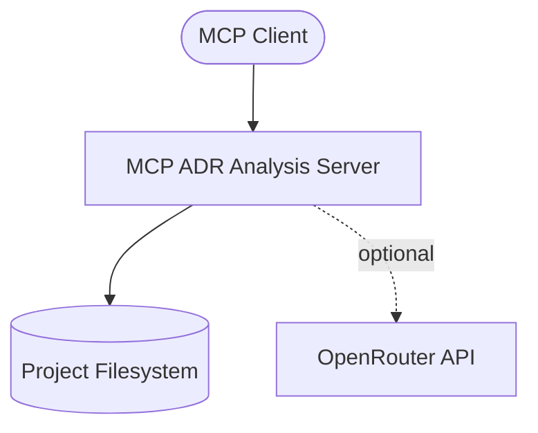
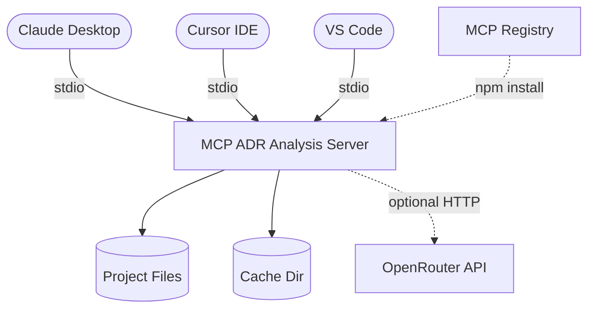
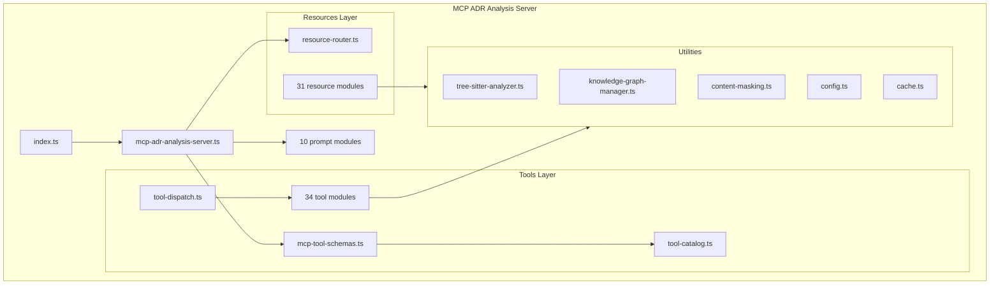
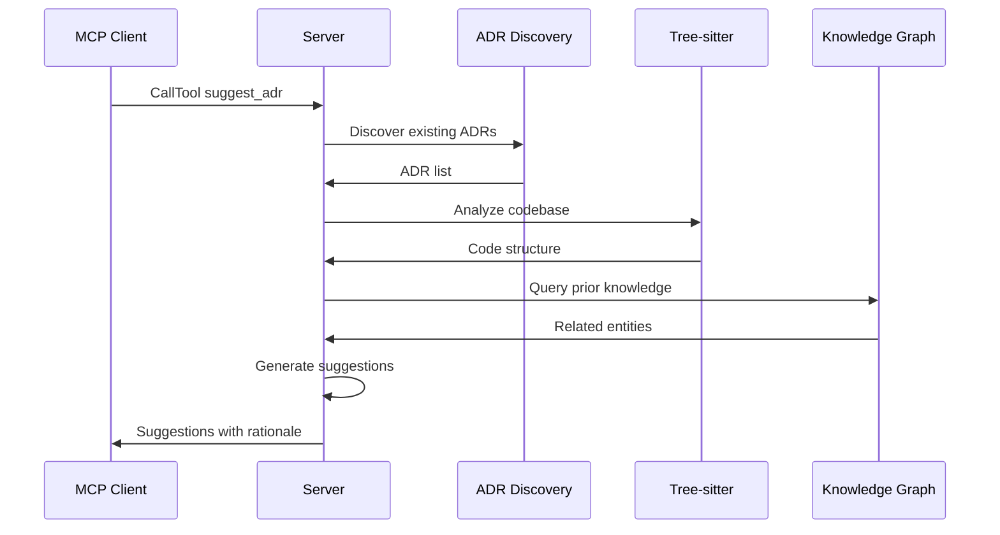
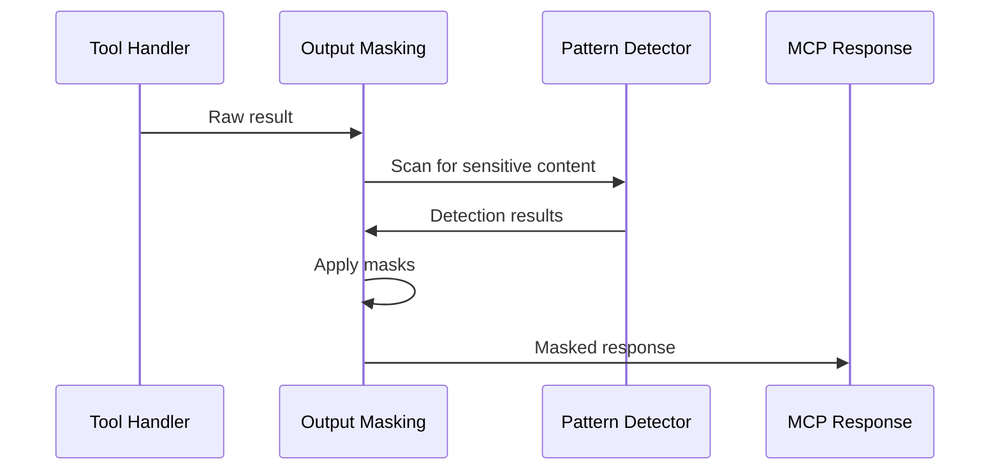
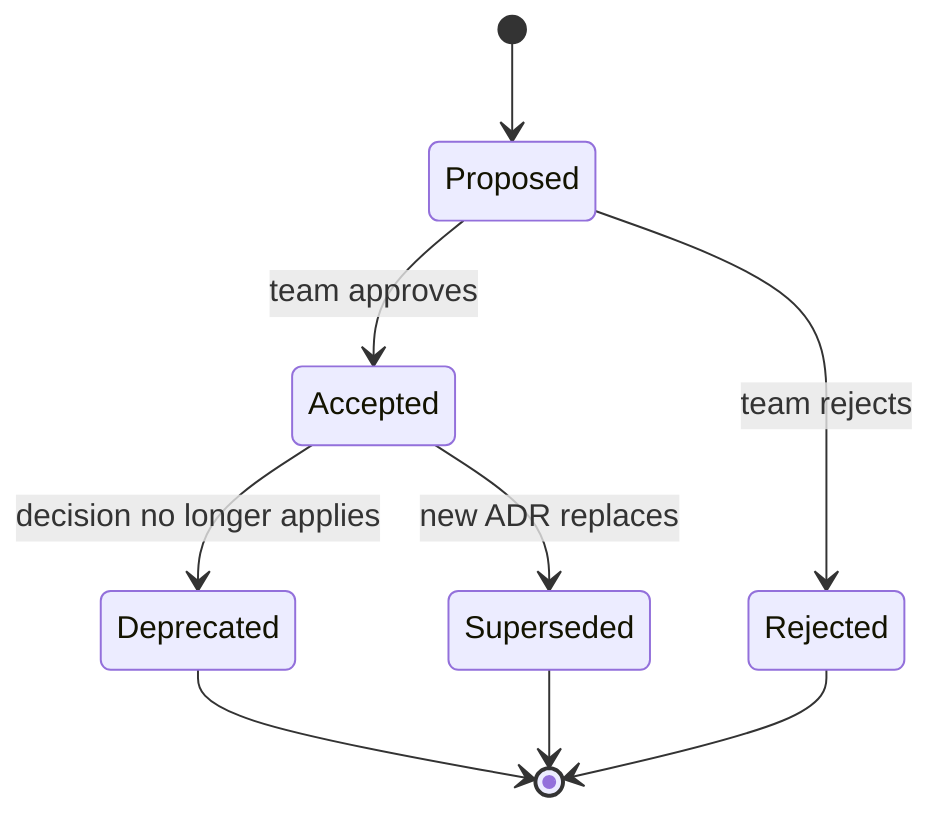
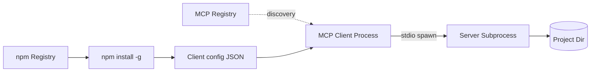

# DESIGN_DOC.md

**System:** MCP ADR Analysis Server
**Version:** 2.14.12
**Status:** Accepted
**Audience:** Architects, contributors, MCP client integrators
**Voice:** STE100
**Related requirements:** `docs/planning/PRD-v3.0-tool-registry-and-ai-layer.md`

---

## 1. Introduction and goals

MCP ADR Analysis Server is a Model Context Protocol server that manages the lifecycle of Architectural Decision Records. It detects drift between documented decisions and the actual codebase, enforces content safety on sensitive material, and maintains a persistent knowledge graph of architectural knowledge.

The server exposes 34 tools, 31 resources, and 10 prompt modules over the MCP stdio transport. MCP clients (Claude Desktop, Cursor, VS Code, and other MCP-compatible hosts) connect to the server as a subprocess. The server reads the project filesystem directly and optionally calls the OpenRouter API for AI-powered analysis.

### 1.1 Quality goals

| ID | Goal | Scenario |
|----|------|----------|
| QG-1 | Offline-first operation | The server produces useful analysis without any network call. The CE-MCP execution mode returns structured prompts that the host model executes locally. |
| QG-2 | Content safety | The server never returns raw secrets, credentials, or PII to the MCP client. The content-masking pipeline intercepts every outbound response. |
| QG-3 | Token efficiency | A single tool call consumes fewer than 2,000 tokens on average. The CE-MCP directive system reduces round-trips by returning host-executable instructions instead of verbose prose. |
| QG-4 | Extensibility | A contributor adds a new tool by creating one file in `src/tools/`, one schema entry in `mcp-tool-schemas.ts`, and one catalog entry in `tool-catalog.ts`. No server restart code changes are required. |

### 1.2 Stakeholders

| Stakeholder | Expectation |
|-------------|-------------|
| MCP client developer | A stable tool surface with typed schemas and predictable response shapes. |
| Enterprise architect | Drift detection alerts when code diverges from accepted ADRs. |
| Security engineer | No secrets leak through MCP responses, even when the project tree contains credentials. |
| Open-source contributor | Clear module boundaries, comprehensive test suite, documented ADRs for every major decision. |



---

## 2. Constraints

- **Runtime:** Node.js >= 20.0.0, npm >= 9.0.0.
- **Protocol:** Model Context Protocol over stdio transport. The server never opens a network listener.
- **Distribution:** Published to npm as `mcp-adr-analysis-server` and registered at `registry.modelcontextprotocol.io`.
- **Tree-sitter version lock:** ADR-017 pins tree-sitter to 0.21.x. The TypeScript parser requires `^0.21.0`. Upgrading the core library to 0.25.x breaks TypeScript and Java parsing.
- **Module system:** ESM (`"type": "module"` in `package.json`). All imports use `.js` extensions for Node ESM compatibility.
- **Configuration:** Zod-validated environment variables (`PROJECT_PATH`, `ADR_DIRECTORY`, `EXECUTION_MODE`, `OPENROUTER_API_KEY`). No config files.

---

## 3. Context and scope

The server operates as a subprocess launched by an MCP client. It reads files from the project directory, analyzes them with tree-sitter and pattern-based detectors, and returns structured results over stdio.

**In scope:**
- ADR discovery, validation, suggestion, and drift detection
- Content-safety scanning and masking
- Knowledge graph persistence and querying
- Deployment readiness and environment analysis
- Research orchestration and codebase search

**Out of scope:**
- Editing project files on behalf of the user (the server is read-only except for its own cache directory)
- Running tests or build commands
- Managing Git operations (deprecated in ADR-023)



---

## 4. Solution strategy

The following ADRs record the major design choices.

| ADR | Decision | Status |
|-----|----------|--------|
| ADR-001 | MCP protocol with stdio transport | Deprecated (SSE portion never shipped, stdio always used) |
| ADR-003 | Memory-centric architecture with JSON knowledge graph | Accepted |
| ADR-004 | Multi-layered content masking with tree-sitter integration | Accepted |
| ADR-014 | CE-MCP directive system for token-efficient execution | Accepted |
| ADR-017 | Tree-sitter pinned to 0.21.x for language compatibility | Accepted |
| ADR-018 | Atomic tools replacing orchestrator classes | Accepted |
| ADR-022 | MADR format for all new ADRs | Accepted |
| ADR-023 | Tool surface scope: deprecate host-native tools | Accepted |

**Core strategy:** The server is a stateless request handler. Each tool call receives arguments, reads the filesystem, computes a result, and returns it. The knowledge graph provides cross-call persistence. The CE-MCP directive system lets the host model execute multi-step analysis locally instead of making multiple round-trips.

---

## 5. Building block view

The server is organized into seven source packages under `src/`.

| Building block | Responsibility | Key files |
|----------------|----------------|-----------|
| `tools/` (34 modules) | MCP tool implementations. Each module exports a handler function. | `mcp-tool-schemas.ts`, `tool-catalog.ts`, `tool-dispatch.ts` |
| `resources/` (31 modules) | MCP resource handlers. URI-routed via `resource-router.ts`. | `resource-router.ts`, `index.ts` |
| `prompts/` (10 modules) | MCP prompt templates for AI-driven analysis. | `analysis-prompts.ts`, `security-prompts.ts` |
| `utils/` (66 modules) | Shared utilities: tree-sitter analyzer, knowledge graph, caching, content masking, ADR format. | `tree-sitter-analyzer.ts`, `knowledge-graph-manager.ts`, `content-masking.ts`, `config.ts` |
| `config/` (2 modules) | AI configuration and APE (Automatic Prompt Engineering) descriptions. | `ai-config.ts`, `ape-descriptions.ts` |
| `types/` | TypeScript interfaces and Zod schemas for tool arguments, context, and knowledge graph entities. | `tool-arguments.ts`, `tool-context.ts`, `knowledge-graph-schemas.ts` |
| `templates/` | Prompt and output templates. | Used by prompts and tools at runtime. |



### 5.1 Directory tree

```text
src/
  config/          AI configuration, APE descriptions
  prompts/         MCP prompt templates (10 modules)
  resources/       MCP resource handlers (31 modules)
  templates/       Output templates
  tools/           MCP tool handlers (34 modules)
  types/           TypeScript interfaces and Zod schemas
  utils/           Shared utilities (66 modules)
  index.ts         CLI entry point
  mcp-adr-analysis-server.ts   Server class, handler registration
```

---

## 6. Runtime view

### 6.1 ADR suggestion flow

A user asks the MCP client to suggest ADRs for a project. The client calls `suggest_adr`. The server discovers existing ADRs, analyzes the codebase with tree-sitter, identifies undocumented decisions, and returns suggestions.



### 6.2 Content masking flow

Every outbound response passes through the content-masking pipeline. The pipeline detects secrets, credentials, and PII, then replaces them with safe placeholders before the response reaches the MCP client.



### 6.3 ADR lifecycle

ADRs move through a defined lifecycle. The server tracks transitions and detects drift when the codebase contradicts an accepted decision.



---

## 7. Deployment view

The server is distributed as an npm package. Users install it globally or locally and configure their MCP client to launch it as a subprocess.



**Installation:**

```bash
npm install -g mcp-adr-analysis-server
```

**MCP client configuration (Claude Desktop example):**

```json
{
  "mcpServers": {
    "mcp-adr-analysis-server": {
      "command": "npx",
      "args": ["-y", "mcp-adr-analysis-server"],
      "env": {
        "PROJECT_PATH": "/path/to/project"
      }
    }
  }
}
```

**Execution modes:**

| Mode | `EXECUTION_MODE` | Behavior |
|------|------------------|----------|
| CE-MCP (default) | `ce-mcp` | Returns structured directives for the host model to execute. No OpenRouter calls. |
| Full | `full` | Calls OpenRouter API for AI-powered analysis. Requires `OPENROUTER_API_KEY`. |
| Prompt-only | `prompt-only` | Returns prompts without executing them. |

---

## 8. Crosscutting concepts

### Content masking (ADR-004)

The `output-masking.ts` module wraps every `CallToolResult` before it leaves the server. It applies pattern-based detection for API keys, connection strings, JWTs, and PII. The masking configuration is loaded once at server startup. Tools do not need to handle masking themselves.

### Caching

The `cache.ts` module provides a file-backed cache under `.mcp-adr-cache/`. Cache entries have TTLs. The knowledge graph, ADR discovery results, and tree-sitter parse trees are cached to avoid repeated filesystem scans.

### Tree-sitter code analysis (ADR-006, ADR-017)

The `tree-sitter-analyzer.ts` module parses source files into ASTs for 13 languages: TypeScript, JavaScript, Python, Java, Go, Rust, C, C++, Ruby, Bash, JSON, CSS, and YAML (fallback). It supports secret detection, architectural boundary validation, and dependency extraction.

### Knowledge graph (ADR-003)

The `KnowledgeGraphManager` persists entities (ADRs, tools, intents, relationships) as JSON snapshots under the project-local cache directory. Resources like `knowledge://graph` expose the graph to MCP clients at zero token cost. The manager is scheduled for replacement by atomic CRUD operations in v3.0.0 (ADR-018).

### Configuration validation

The `config.ts` module validates all environment variables through a Zod schema at startup. Invalid configuration fails fast with a clear error message.

### Logging

The `createLogger()` factory in `config.ts` produces a leveled logger (`DEBUG`, `INFO`, `WARN`, `ERROR`) controlled by the `LOG_LEVEL` environment variable.

---

## 9. Architectural decisions

This project records decisions in MADR format (ADR-022) under `docs/adrs/`. The table below lists all current ADRs.

| ADR | Title | Status |
|-----|-------|--------|
| ADR-001 | MCP Protocol Implementation Strategy | Deprecated |
| ADR-002 | AI Integration and Advanced Prompting Strategy | Accepted |
| ADR-003 | Memory-Centric Architecture | Accepted |
| ADR-004 | Security and Content Masking Strategy | Accepted |
| ADR-005 | Testing and Quality Assurance Strategy | Accepted |
| ADR-006 | Tree-sitter Integration Strategy | Accepted |
| ADR-007 | CI/CD Pipeline Strategy | Accepted |
| ADR-008 | Development Workflow Strategy | Accepted |
| ADR-009 | Package Distribution Strategy | Accepted |
| ADR-010 | Bootstrap Deployment Architecture | Accepted |
| ADR-011 | ADR Timeline Tracking and Context-Aware Analysis | Accepted |
| ADR-012 | Validated Patterns Framework | Accepted |
| ADR-013 | Documentation Platform Strategy | Accepted |
| ADR-014 | CE-MCP Architecture | Accepted |
| ADR-015 | APE Optimization Strategy | Accepted |
| ADR-017 | Tree-sitter Version Strategy (0.21.x) | Accepted |
| ADR-018 | Atomic Tools Architecture | Accepted |
| ADR-019 | Vitest Migration | Accepted |
| ADR-020 | MCP Tasks Integration Strategy | Accepted |
| ADR-021 | AI Layer Disposition | Accepted |
| ADR-022 | Adopt MADR Format | Accepted |
| ADR-023 | Tool Surface Scope | Accepted |
| ADR-025 | Retire the Bootstrap Pattern Engine | Accepted |
| ADR-026 | Tool Call Best Practices Conformance | Accepted |

See `docs/adrs/` for the full text of each decision.

---

## 10. Quality requirements

| ID | Requirement | Risk | Verify |
|----|-------------|------|--------|
| NFR-001 | The server starts and responds to `ListTools` within 3 seconds. | Medium | CI health-check step |
| NFR-002 | No secret appears in any `CallToolResult` when content masking is enabled. | High | Content-masking test suite |
| NFR-003 | All tools return valid JSON matching their declared output schema. | Medium | Schema validation tests |
| NFR-004 | The test suite passes on Node 20 and Node 22. | Medium | CI matrix (`test (20)`, `test (22)`) |
| NFR-005 | `npm audit --omit=dev --audit-level=moderate` reports zero vulnerabilities. | High | CI audit step |
| NFR-006 | Tree-sitter parses TypeScript, JavaScript, Python, Java, Go, Rust, C, C++, Ruby, Bash, JSON, and CSS without error. | Medium | Tree-sitter integration tests |

---

## 11. Risks and technical debt

| Item | Owner | Mitigation |
|------|-------|------------|
| Tree-sitter 0.21.x version lock (ADR-017). Blocks access to newer parser features. | Maintainer | Monitor `tree-sitter-typescript` for a 0.25.x-compatible release. Dependabot ignores `tree-sitter >= 0.22.0`. |
| KnowledgeGraphManager marked deprecated (ADR-018). Scheduled for removal in v3.0.0. | Contributor | Migrate callers to `knowledge://graph` resource and `update_knowledge` tool. |
| Vitest 5.0.0 drops Node 20 support. The project currently tests on Node 20 and 22. | Maintainer | Roadmap issue #1728 tracks the upgrade path. Requires a Node version policy decision. |
| ADR-001 records a decision (SSE transport) that was never implemented. The actual decision (stdio) has no ADR. | Maintainer | Acknowledged gap tracked in #1415. |
| Six host-native tools deprecated in ADR-023 are still present in the codebase. | Contributor | Remove in the next major version after confirming no external callers depend on them. |

---

## 12. Glossary

| Term | Meaning |
|------|---------|
| ADR | Architectural Decision Record. A document that captures a significant design choice together with its context and consequences. |
| APE | Automatic Prompt Engineering. A technique that optimizes tool descriptions for token efficiency. |
| CE-MCP | Code Execution with MCP. An execution mode where the server returns structured directives for the host model to execute locally, reducing round-trips. |
| Drift | A mismatch between a documented architectural decision and the current state of the codebase. |
| Knowledge graph | A JSON-persisted store of entities (ADRs, tools, intents) and their relationships, queried by tools and exposed as MCP resources. |
| MADR | Markdown Any Decision Record. A lightweight ADR format adopted in ADR-022. |
| MCP | Model Context Protocol. An open protocol for connecting AI models to external tools and data sources. |
| STE100 | Simplified Technical English. A controlled language standard that mandates short sentences, active voice, and restricted vocabulary. |
| stdio | Standard input/output. The transport mechanism used by this MCP server. The MCP client spawns the server as a subprocess and communicates over stdin/stdout. |
| Tree-sitter | An incremental parsing library that builds concrete syntax trees for source files. Used for multi-language code analysis. |
| Zod | A TypeScript schema validation library used for configuration and argument validation. |
