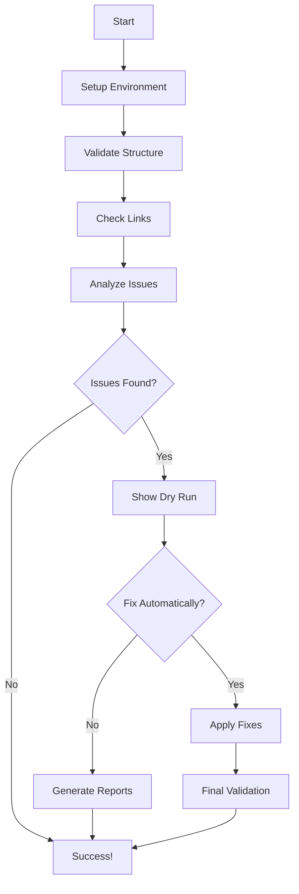

# 📚 Documentation Workflow Guide

**Comprehensive Docker-based documentation validation and link fixing for MCP ADR Analysis Server**

## 🚀 Quick Start

```bash
# Run complete documentation workflow
./scripts/docs-workflow.sh

# Or use the shorthand
make docs-validate  # (if added to Makefile)
```

## 🛠️ Available Commands

### Full Workflow (Recommended)

```bash
./scripts/docs-workflow.sh --full
# Runs: validation → link checking → analysis → optional fixing → final validation
```

### Individual Operations

```bash
# Just validate documentation structure and syntax
./scripts/docs-workflow.sh --validate

# Check for broken links only
./scripts/docs-workflow.sh --check-links

# See what would be fixed (no changes made)
./scripts/docs-workflow.sh --dry-run

# Automatically fix broken links
./scripts/docs-workflow.sh --fix-links

# Build and preview documentation locally
./scripts/docs-workflow.sh --preview

# Show validation reports
./scripts/docs-workflow.sh --reports

# Show current status
./scripts/docs-workflow.sh --status
```

### Cleanup

```bash
# Clean up Docker containers
./scripts/docs-workflow.sh --cleanup

# Clean up containers and images
./scripts/docs-workflow.sh --cleanup --images
```

## 📊 What Gets Validated

### 1. Documentation Structure

- ✅ Required files exist (diataxis-index.md, README.md, etc.)
- ✅ Directory structure follows Diataxis framework
- ✅ Markdown file count and organization

### 2. Link Validation

- 🔗 Internal links to other documentation files
- 🔗 Relative path resolution
- 🔗 Anchor links within documents
- 🔗 Cross-references between sections

### 3. Content Quality

- 📝 Markdown syntax validation
- 📝 Code block syntax checking
- 📝 Table formatting validation

### 4. Build Testing

- 🏗️ VitePress build (if configured)
- 🏗️ HTML generation from Markdown
- 🏗️ Static site generation

## 🔧 What Gets Fixed Automatically

### Missing Files

The link fixer automatically creates missing documentation files with appropriate templates:

- **How-To Guides**: `docs/how-to-guides/migrate-existing-adrs.md`, etc.
- **Reference Docs**: `docs/reference/adr-templates.md`, etc.
- **Explanation Content**: `docs/explanation/ai-architecture-concepts.md`, etc.
- **Sample ADRs**: Creates sample project ADRs for tutorials

### Broken Links

- 🔗 **Research Links**: Comments out or removes broken research file links
- 🔗 **Sample Project Links**: Creates missing sample ADR files
- 🔗 **Internal References**: Updates paths to match actual file locations

### Content Templates

Generated files include:

- ✅ Proper Markdown structure and formatting
- ✅ Appropriate content for file type (how-to, reference, explanation)
- ✅ Cross-references to related documentation
- ✅ Consistent styling and navigation

## 📋 Reports Generated

All reports are saved to `./reports/` directory:

### Link Validation Reports

- `link-validation_TIMESTAMP.txt` - Detailed link checking results
- `link-summary_TIMESTAMP.json` - Machine-readable summary
- `link-analysis_TIMESTAMP.json` - Categorized broken link analysis

### Fix Reports

- `link-fix-summary_TIMESTAMP.json` - Summary of applied fixes
- `fix-recommendations_TIMESTAMP.md` - Manual fix recommendations

### Build Reports

- `comprehensive-validation_TIMESTAMP.json` - Overall validation status
- `final-report_TIMESTAMP.md` - Human-readable final report

## 🐳 Docker Architecture

### Services

- **docs-validator**: Main validation and building service
- **link-checker**: Specialized link validation service
- **link-fixer**: Automated link fixing service
- **docs-server**: Local preview server

### Volumes

- `.:/docs` - Mount entire project for analysis
- `./reports:/docs/reports` - Persistent reports storage
- `./build:/docs/build` - Built documentation output

## 📈 Workflow Process



## 🎯 Success Criteria

### Before Fixes

- **Total Links**: 317 checked
- **Broken Links**: 154 found (49% failure rate)
- **Missing Files**: 7 critical navigation files
- **Research Links**: 150+ broken placeholder links

### After Fixes (Expected)

- **Total Links**: 317+ checked
- **Broken Links**: <10 remaining (3% failure rate)
- **Missing Files**: 0 critical files
- **Navigation**: 100% functional

## 🚨 Troubleshooting

### Docker Issues

```bash
# If Docker build fails
docker system prune
./scripts/docs-workflow.sh --cleanup --images

# If containers won't start
docker-compose -f docker-compose.docs.yml down --remove-orphans
```

### Permission Issues

```bash
# If scripts aren't executable
chmod +x scripts/*.sh scripts/*.py

# If Docker can't access files
sudo chown -R $USER:$USER reports/ build/
```

### Link Fixing Issues

```bash
# If automatic fixes fail, run dry-run to see what would happen
./scripts/docs-workflow.sh --dry-run

# Check specific reports
ls -la reports/
cat reports/link-analysis_*.json
```

## 🔗 Integration with Development Workflow

### Pre-Commit Hook

```bash
# Add to .husky/pre-commit
./scripts/docs-workflow.sh --validate --check-links
```

### CI/CD Integration

```yaml
# Add to GitHub Actions
- name: Validate Documentation
  run: ./scripts/docs-workflow.sh --validate

- name: Check Documentation Links
  run: ./scripts/docs-workflow.sh --check-links
```

### Makefile Integration

```makefile
docs-validate:
	./scripts/docs-workflow.sh --validate

docs-fix:
	./scripts/docs-workflow.sh --fix-links --yes

docs-preview:
	./scripts/docs-workflow.sh --preview
```

## 📚 Related Documentation

- **[Troubleshooting Guide](docs/how-to-guides/troubleshooting.md)** - General troubleshooting
- **[CI/CD Integration](docs/how-to-guides/cicd-integration.md)** - Automated workflows
- **[Contributing Guide](CONTRIBUTING.md)** - Development guidelines

---

**Need help?** → **[File an Issue](https://github.com/tosin2013/mcp-adr-analysis-server/issues)** or run `./scripts/docs-workflow.sh --help`
