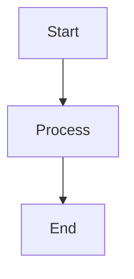

# Docusaurus Quick Start Guide

## 🚀 Quick Setup (5 minutes)

### Option 1: Automated Setup (Recommended)

```bash
cd docs
./setup-docusaurus.sh
```

This script will:
- Clean old VitePress artifacts
- Install Docusaurus dependencies
- Create favicon from logo
- Test the build
- Show next steps

### Option 2: Manual Setup

```bash
cd docs

# Install dependencies
npm install

# Start development server
npm run start

# Build for production
npm run build
```

## 📋 Quick Commands

| Command | Description |
|---------|-------------|
| `npm run start` | Start dev server at http://localhost:3000 |
| `npm run build` | Build production site |
| `npm run serve` | Preview production build |
| `npm run clear` | Clear cache |
| `npm run deploy` | Deploy to GitHub Pages |

## 🌐 Development Server

```bash
npm run start
```

Visit: `http://localhost:3000/mcp-adr-analysis-server/`

The site will auto-reload when you edit markdown files.

## 🏗️ Building for Production

```bash
npm run build
```

Output: `build/` directory (ready for deployment)

## 🚢 Deployment

### Automatic (GitHub Actions)

Push to `main` branch - GitHub Actions will automatically:
1. Build the Docusaurus site
2. Deploy to GitHub Pages
3. Available at: https://tosin2013.github.io/mcp-adr-analysis-server/

### Manual Deployment

```bash
npm run deploy
```

## 📝 Editing Documentation

### File Structure

```
docs/
├── tutorials/           # Learning-oriented guides
├── how-to-guides/      # Problem-solving guides
├── reference/          # Technical reference
├── explanation/        # Understanding-oriented
└── ide-rules/          # IDE integration
```

### Adding a New Page

1. Create markdown file in appropriate directory:
   ```bash
   touch tutorials/my-new-tutorial.md
   ```

2. Add front matter:
   ```yaml
   ---
   id: my-new-tutorial
   title: My New Tutorial
   sidebar_label: New Tutorial
   sidebar_position: 4
   ---
   ```

3. Add to `sidebars.js` if needed:
   ```javascript
   'tutorials/my-new-tutorial',
   ```

### Markdown Features

#### Code Blocks with Syntax Highlighting

```typescript
interface MyInterface {
  name: string;
  value: number;
}
```

#### Admonitions

```markdown
:::note
This is a note
:::

:::tip
This is a tip
:::

:::warning
This is a warning
:::

:::danger
This is dangerous
:::
```

#### Mermaid Diagrams

````markdown

````

#### Tabs

```markdown
import Tabs from '@theme/Tabs';
import TabItem from '@theme/TabItem';

<Tabs>
  <TabItem value="npm" label="npm" default>
    npm install
  </TabItem>
  <TabItem value="yarn" label="Yarn">
    yarn install
  </TabItem>
</Tabs>
```

## 🎨 Customization

### Theme Colors

Edit `src/css/custom.css`:

```css
:root {
  --ifm-color-primary: #646cff;
  /* Change to your brand color */
}
```

### Logo and Images

- Logo: `static/img/logo.png`
- Favicon: `static/img/favicon.ico`
- OG Image: `static/img/og-image.png`

### Navigation

Edit `docusaurus.config.js`:

```javascript
navbar: {
  items: [
    // Add your nav items
  ],
}
```

### Sidebar

Edit `sidebars.js`:

```javascript
{
  type: 'category',
  label: 'My Section',
  items: ['doc1', 'doc2'],
}
```

## 🔍 Search Configuration

### Local Search (Default)

Already configured - works out of the box.

### Algolia Search (Recommended for Production)

1. Sign up at https://docsearch.algolia.com/
2. Get your API keys
3. Update `docusaurus.config.js`:

```javascript
algolia: {
  appId: 'YOUR_APP_ID',
  apiKey: 'YOUR_API_KEY',
  indexName: 'mcp-adr-analysis-server',
}
```

## 🐛 Troubleshooting

### Port Already in Use

```bash
npm run start -- --port 3001
```

### Build Errors

```bash
# Clear cache and rebuild
npm run clear
npm run build
```

### Module Not Found

```bash
# Reinstall dependencies
rm -rf node_modules package-lock.json
npm install
```

### Broken Links

Docusaurus will warn about broken links during build. Fix them by:
- Using relative paths: `/tutorials/my-doc`
- Checking file exists in docs directory
- Updating `onBrokenLinks` in config (not recommended)

## 📚 Resources

- [Docusaurus Docs](https://docusaurus.io/docs)
- [Markdown Features](https://docusaurus.io/docs/markdown-features)
- [Deployment Guide](https://docusaurus.io/docs/deployment)
- [Migration Guide](./DOCUSAURUS_MIGRATION.md)

## ✅ Verification Checklist

After setup, verify:

- [ ] Dev server starts: `npm run start`
- [ ] All pages load correctly
- [ ] Navigation works
- [ ] Search works
- [ ] Mermaid diagrams render
- [ ] Code blocks have syntax highlighting
- [ ] Production build succeeds: `npm run build`
- [ ] GitHub Actions workflow exists: `.github/workflows/deploy-docusaurus.yml`

## 🎉 You're Ready!

Your Docusaurus documentation site is now set up and ready to use. Start the dev server and begin editing your documentation!

```bash
npm run start
```

---

**Need Help?** Check the [full migration guide](./DOCUSAURUS_MIGRATION.md) or [Docusaurus documentation](https://docusaurus.io/docs).
