# 📚 MCP ADR Analysis Server Documentation

**Comprehensive documentation for the MCP ADR Analysis Server - your intelligent architectural decision analysis platform.**

---

## 🚀 Quick Start

```mermaid
graph LR
    A[📥 Install Server] --> B[⚙️ Configure Client]
    B --> C[🔍 Run Analysis]
    C --> D[📋 Generate ADRs]
    D --> E[✅ Deploy]

    style A fill:#e1f5fe
    style B fill:#f3e5f5
    style C fill:#e8f5e8
    style D fill:#fff3e0
    style E fill:#ffebee
```



### **1. Installation**

```bash
npm install -g mcp-adr-analysis-server
```

### **2. Configuration**

```json
{
  "mcpServers": {
    "adr-analysis": {
      "command": "mcp-adr-analysis-server",
      "args": ["--config", "./adr-config.json"]
    }
  }
}
```

### **3. Configure Firecrawl (Optional but Recommended)**

```bash
# Enable web search capabilities for enhanced research
export FIRECRAWL_ENABLED="true"
export FIRECRAWL_API_KEY="fc-your-api-key-here"

# Or use self-hosted Firecrawl
export FIRECRAWL_BASE_URL="https://localhost:3000"
```

### **4. First Analysis**

```bash
# Run comprehensive project analysis
mcp-adr-analysis-server --analyze ./my-project

# Generate your first ADR
mcp-adr-analysis-server --generate-adr --decision "Database Selection"
```

---

## 📖 Documentation Structure

### **🎓 Tutorials** - _Learn by doing_

- **[Getting Started](tutorials/01-first-steps.md)** - Your first MCP analysis (30 min)
- **[Existing Projects](tutorials/02-existing-projects.md)** - Working with established codebases (45 min)
- **[Advanced Techniques](tutorials/03-advanced-analysis.md)** - Security, deployment, performance (60 min)

### **🛠️ How-To Guides** - _Solve specific problems_

- **[Troubleshooting](how-to-guides/troubleshooting.md)** - Fix common issues
- **[MCP Client Compatibility](how-to-guides/mcp-client-compatibility.md)** - Setup for Claude Desktop, Cline, Cursor, Gemini
- **[Security Analysis](how-to-guides/security-analysis.md)** - Comprehensive security scanning
- **[Deployment Readiness](how-to-guides/deployment-readiness.md)** - Production preparation
- **[CI/CD Integration](how-to-guides/cicd-integration.md)** - Automated workflows

### **📚 Reference** - _Technical details_

- **[API Reference](reference/api-reference.md)** - All 59 tools and parameters
- **[Configuration](reference/environment-config.md)** - Environment setup
- **[Client Configuration](reference/mcp-client-config.md)** - MCP client setup
- **[Tool Documentation](reference/analysis-tools.md)** - Individual tool guides

### **💡 Explanation** - _Deep understanding_

- **[MCP Concepts](explanation/mcp-concepts.md)** - Model Context Protocol fundamentals
- **[Server Architecture](explanation/server-architecture.md)** - System design and components
- **[Performance Design](explanation/performance-design.md)** - Optimization strategies
- **[Security Philosophy](explanation/security-philosophy.md)** - Security-first approach

---

## 🎯 Common Use Cases

### **New Project Setup**


### **Existing Project Analysis**


### **Security-First Workflow**


---

## 🔧 Key Features

### **37 Specialized Tools**

- **Analysis Tools** (8) - Project ecosystem, architecture, environment analysis
- **Generation Tools** (6) - ADR creation from PRDs, decisions, and requirements
- **Security Tools** (5) - Content masking, security analysis, validation
- **Validation Tools** (4) - Health scoring, progress tracking, deployment readiness
- **Workflow Tools** (5) - Troubleshooting, development guidance, orchestration
- **Research Tools** (4) - Research integration, knowledge generation
- **File Operations** (3) - File I/O, directory management, caching
- **Configuration Tools** (2) - Output masking, action confirmation

### **Advanced Capabilities**

- **AI-Powered Analysis** - Intelligent architectural pattern recognition
- **Knowledge Graph** - Dynamic learning and relationship mapping
- **Content Security** - Automatic sensitive data masking
- **Multi-Format Support** - TypeScript, Python, Java, Go, and more
- **CI/CD Integration** - Automated validation and deployment workflows
- **Firecrawl Integration** - Web search and research capabilities for enhanced analysis

---

## 📊 Performance Metrics

| Capability               | Performance   | Coverage |
| ------------------------ | ------------- | -------- |
| **Project Analysis**     | 2-5 seconds   | 100%     |
| **ADR Generation**       | 8-15 seconds  | 95%      |
| **Security Scanning**    | 1-3 seconds   | 100%     |
| **Content Masking**      | 0.5-1 seconds | 95%      |
| **Knowledge Graph**      | Real-time     | 90%      |
| **Firecrawl Web Search** | 2-5 seconds   | 85%      |

---

## 🔥 Firecrawl Integration

**Enhanced web research capabilities for comprehensive architectural analysis.**

### **What is Firecrawl?**

Firecrawl provides intelligent web scraping and content extraction, enabling the MCP ADR Analysis Server to research best practices, gather current information, and enhance architectural decision-making with real-time web data.

### **Key Benefits**

- **Real-time Research** - Access current best practices and architectural patterns
- **Enhanced ADRs** - Generate more comprehensive decision records with external context
- **Intelligent Scraping** - Extract relevant content from technical documentation and blogs
- **Fallback Support** - Graceful degradation when web search is unavailable

### **Setup Options**

#### **Option 1: Cloud Service (Recommended)**

```bash
# Get your API key from https://firecrawl.dev
export FIRECRAWL_ENABLED="true"
export FIRECRAWL_API_KEY="fc-your-api-key-here"
```

#### **Option 2: Self-Hosted**

```bash
# Run your own Firecrawl instance
docker run -p 3000:3000 firecrawl/firecrawl

# Configure the server
export FIRECRAWL_ENABLED="true"
export FIRECRAWL_BASE_URL="https://localhost:3000"
```

#### **Option 3: Disabled (Default)**

```bash
# Firecrawl is disabled by default
# Server will work without web search capabilities
```

### **Firecrawl-Enhanced Tools**

- **`llm_web_search`** - Intelligent web search with relevance scoring
- **`llm_cloud_management`** - Cloud provider research and best practices
- **`llm_database_management`** - Database technology research and recommendations

**Learn more**: **[Firecrawl Configuration Guide](reference/environment-config.md#firecrawl-configuration)**

---

## 🆘 Getting Help

### **Quick Support**

- **[Troubleshooting Guide](how-to-guides/troubleshooting.md)** - Common issues and solutions
- **[FAQ](how-to-guides/troubleshooting.md#frequently-asked-questions)** - Frequently asked questions
- **[Community Discussions](https://github.com/tosin2013/mcp-adr-analysis-server/issues)** - Get help from the community

### **Advanced Support**

- **[Security Issues](https://github.com/tosin2013/mcp-adr-analysis-server/security/advisories/new)** - Report security vulnerabilities
- **[Bug Reports](https://github.com/tosin2013/mcp-adr-analysis-server/issues)** - File bug reports
- **[Feature Requests](https://github.com/tosin2013/mcp-adr-analysis-server/issues/new?template=feature_request.md)** - Suggest new features

### **Enterprise Support**

- **[Enterprise Documentation](how-to-guides/large-team-scaling.md)** - Large team scaling
- **[Security Compliance](how-to-guides/security-analysis.md)** - Security and compliance
- **[Custom Integration](how-to-guides/custom-rules.md)** - Custom rules and workflows

---

## 🔗 Related Resources

- **[Main Project README](https://github.com/tosin2013/mcp-adr-analysis-server/blob/main/README.md)** - Project overview and installation
- **[API Documentation](reference/api-reference.md)** - Complete API reference
- **[Configuration Guide](reference/environment-config.md)** - Environment setup
- **[Contributing Guide](https://github.com/tosin2013/mcp-adr-analysis-server/blob/main/CONTRIBUTING.md)** - How to contribute to the project

---

**Ready to get started?** → **[Begin with Tutorials](tutorials/01-first-steps.md)**

**Need immediate help?** → **[Check Troubleshooting](how-to-guides/troubleshooting.md)**
