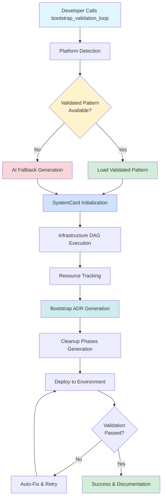
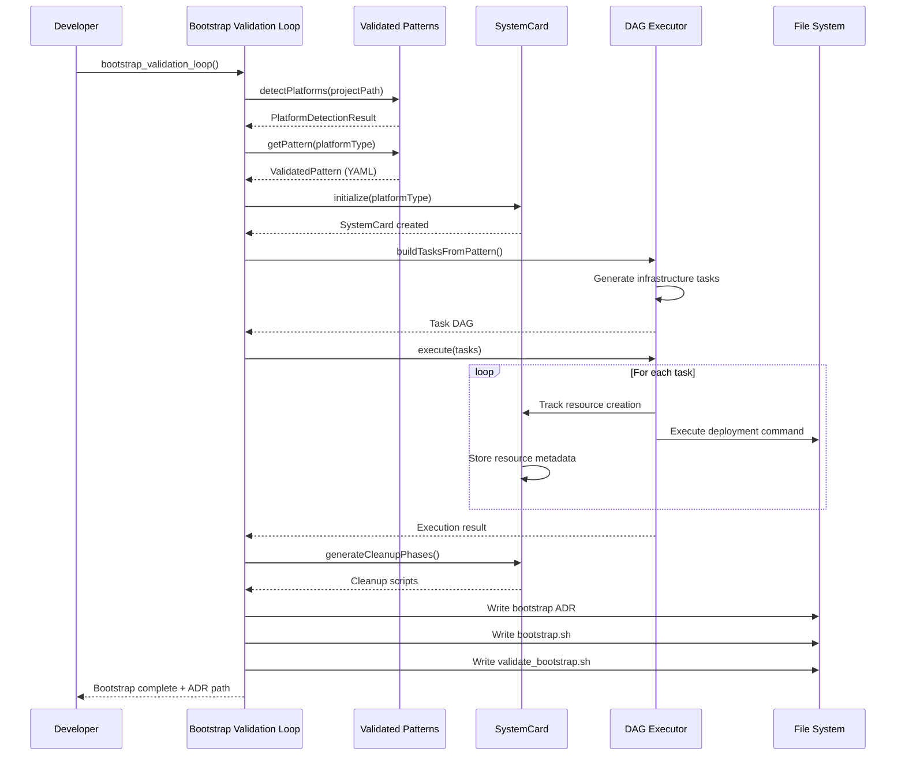
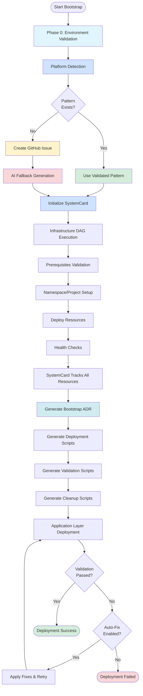
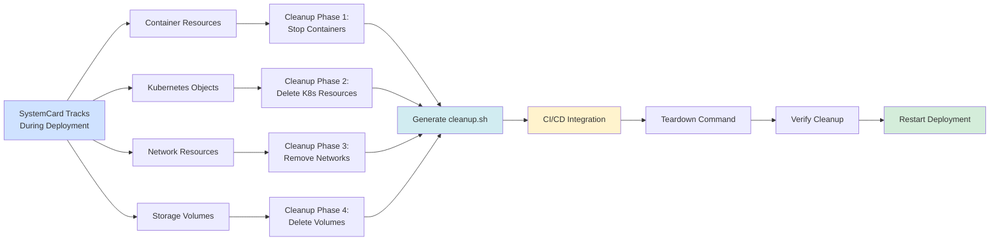

# ADR-010: Bootstrap Deployment Architecture

## Status

Accepted

## Date

2025-01-23

## Context

The MCP ADR Analysis Server needs a comprehensive deployment automation system that can:

1. **Detect deployment platforms** automatically (Kubernetes, OpenShift, Docker, etc.)
2. **Generate deployment scripts** from validated patterns and ADRs
3. **Track infrastructure resources** for proper cleanup
4. **Validate deployments** against architectural decisions
5. **Provide reproducible workflows** for CI/CD integration

Previously, deployment was manual and error-prone. We needed an intelligent system that integrates three key components:

- **Validated Patterns Framework** - Community-maintained deployment templates
- **SystemCard Resource Tracking** - Automated resource lifecycle management
- **Bootstrap Validation Loop** - Iterative deployment with learning

## Decision

We will implement a **unified bootstrap deployment architecture** that integrates Validated Patterns, SystemCard, and Bootstrap Validation Loop into a single developer-facing tool.

### Architecture Overview



### Component Integration Flow



### Deployment Workflow Detail



### Resource Cleanup Architecture



## Implementation Details

### 1. Validated Patterns Framework

**Location**: `src/utils/validated-pattern-definitions.ts` and `patterns/infrastructure/*.yaml`

**Purpose**: Provides community-maintained, tested deployment patterns

**Structure**:

```yaml
version: '1.0'
id: 'kubernetes-v1'
name: 'Kubernetes'
authoritativeSources:
  - type: 'documentation'
    url: 'https://kubernetes.io/docs/'
    requiredForDeployment: true
deploymentPhases:
  - order: 1
    name: 'Prerequisites Validation'
    commands:
      - command: 'kubectl cluster-info'
        expectedExitCode: 0
validationChecks:
  - id: 'cluster-connection'
    command: 'kubectl cluster-info'
    severity: 'critical'
```

**Benefits**:

- Official documentation links (LLMs should query before deployment)
- Proven deployment workflows
- Platform-specific validation checks
- Troubleshooting guidance

### 2. SystemCard Resource Tracking

**Location**: `src/utils/system-card-manager.ts`

**Purpose**: Track all infrastructure resources for proper cleanup

**Key Features**:

- Automatic resource detection during deployment
- Generates cleanup phases with proper ordering
- Integrates with CI/CD workflows
- Prevents orphaned resources

**SystemCard Structure**:

```typescript
{
  systemId: 'kubernetes-bootstrap-1234567890',
  platform: {
    type: 'kubernetes',
    version: '1.28',
    detectionConfidence: 0.95
  },
  resources: [
    {
      id: 'deployment-myapp',
      type: 'deployment',
      platform: 'kubernetes',
      metadata: {
        namespace: 'default',
        name: 'myapp'
      },
      dependencies: ['service-myapp']
    }
  ],
  cleanupPhases: [
    {
      phase: 1,
      description: 'Delete application deployments',
      commands: ['kubectl delete deployment myapp']
    }
  ]
}
```

### 3. Bootstrap Validation Loop

**Location**: `src/tools/bootstrap-validation-loop-tool.ts`

**Purpose**: Orchestrate the entire deployment workflow

**Key Phases**:

#### Phase 0: Environment Validation

- Detect platform type
- Verify connectivity (oc status, kubectl cluster-info, docker ps)
- Confirm target environment with user

#### Phase 1-5: Iterative Deployment

- Generate bootstrap scripts from validated patterns
- Execute deployment
- Validate against ADR requirements
- Auto-fix failures (if enabled)
- Retry until success or max iterations

**Generated Files**:

```
project/
├── docs/adrs/
│   └── bootstrap-deployment-{timestamp}.md  # Deployment ADR
├── bootstrap.sh                              # Deployment script
├── validate_bootstrap.sh                     # Validation script
├── cleanup.sh                                # Cleanup script (from SystemCard)
└── .system-card.json                         # Resource tracking state
```

### 4. GitHub Workflows Integration

#### Publish Workflow (`.github/workflows/publish.yml`)

```yaml
- name: Test MCP server functionality
  run: ./scripts/test-mcp-server.sh

- name: Build project
  run: npm run build

- name: Publish to NPM
  run: npm publish
```

**Key Scripts Called**:

- `scripts/test-mcp-server.sh` - Validates MCP protocol implementation
- `scripts/test-infrastructure.sh` - Tests infrastructure deployment
- `npm run build` - Compiles TypeScript → JavaScript

#### Build Workflow (`.github/workflows/build.yml`)

- Type checking
- Linting
- Unit tests
- Integration tests

#### Test Workflow (`.github/workflows/test.yml`)

- Comprehensive test suite
- Coverage reporting
- Performance benchmarks

### 5. Tool Entry Point for Developers

**Tool Call**:

```typescript
bootstrap_validation_loop({
  projectPath: '/path/to/project',
  adrDirectory: 'docs/adrs',
  targetEnvironment: 'production',
  maxIterations: 5,
  autoFix: true,
  updateAdrsWithLearnings: true,
});
```

**Returns**:

```typescript
{
  success: true,
  iterations: 2,
  finalResult: { /* execution details */ },
  adrUpdates: [ /* proposed ADR updates */ ],
  deploymentPlan: { /* detected platform and steps */ },
  bootstrapAdrPath: "docs/adrs/bootstrap-deployment-1234.md",
  contextDocumentPath: "docs/context/bootstrap-1234.json",
  requiresHumanApproval: true
}
```

## Deployment Script Examples

### Generated bootstrap.sh (from Kubernetes Pattern)

```bash
#!/bin/bash
# Bootstrap script generated from Kubernetes v1.0
# Pattern source: Official Kubernetes Documentation
# Generated: 2025-01-23T10:00:00.000Z

set -e  # Exit on error

echo "========================================"
echo "Bootstrap Deployment - kubernetes"
echo "Pattern: Kubernetes"
echo "========================================"

# Phase 1: Prerequisites Validation
echo "Starting Phase 1: Prerequisites Validation"
echo "  → Verify kubectl is installed"
kubectl version --client
echo "  → Verify cluster connectivity"
kubectl cluster-info
echo "✓ Phase 1 complete"

# Phase 2: Namespace Setup
echo "Starting Phase 2: Namespace Setup"
echo "  → Create namespace"
kubectl create namespace myapp
echo "✓ Phase 2 complete"

# Phase 3: Deploy Application Resources
echo "Starting Phase 3: Deploy Application Resources"
echo "  → Apply deployment manifest"
kubectl apply -f deployment.yaml
echo "✓ Phase 3 complete"

echo "========================================"
echo "✅ Bootstrap deployment complete!"
echo "========================================"
```

### Generated validate_bootstrap.sh

```bash
#!/bin/bash
# Validation script generated from Kubernetes
# Generated: 2025-01-23T10:00:00.000Z

FAILED_CHECKS=0

# Cluster Connection (critical)
echo "Checking: Cluster Connection"
if kubectl cluster-info; then
  echo "  ✅ PASSED: Cluster Connection"
else
  echo "  ❌ FAILED: Cluster Connection"
  echo "     Cannot connect to Kubernetes cluster"
  echo "     Remediation steps:"
  echo "       - Verify kubeconfig is set: echo $KUBECONFIG"
  echo "       - Check cluster status with cloud provider"
  FAILED_CHECKS=$((FAILED_CHECKS + 1))
fi

# Deployment Ready (critical)
echo "Checking: Deployment Ready"
if kubectl get pods -l app=myapp --no-headers | grep -v Running && exit 1 || exit 0; then
  echo "  ✅ PASSED: Deployment Ready"
else
  echo "  ❌ FAILED: Deployment Ready"
  FAILED_CHECKS=$((FAILED_CHECKS + 1))
fi

if [ $FAILED_CHECKS -eq 0 ]; then
  echo "✅ All validation checks passed!"
  exit 0
else
  echo "❌ $FAILED_CHECKS validation check(s) failed"
  exit 1
fi
```

### Generated cleanup.sh (from SystemCard)

```bash
#!/bin/bash
# Cleanup script generated by SystemCard
# Resources tracked during deployment

set -e

echo "🧹 Starting deployment cleanup..."

# Phase 1: Delete application deployments
echo "Phase 1: Delete application deployments"
kubectl delete deployment myapp --ignore-not-found
kubectl delete service myapp --ignore-not-found
echo "✓ Phase 1 complete"

# Phase 2: Delete namespace
echo "Phase 2: Delete namespace"
kubectl delete namespace myapp --ignore-not-found
echo "✓ Phase 2 complete"

echo "✅ Cleanup complete!"
```

## CI/CD Integration

### Teardown and Restart Workflow

```bash
# CI/CD workflow for deployment testing
./cleanup.sh                    # Teardown existing deployment
./validate_bootstrap.sh         # Verify cleanup
./bootstrap.sh                  # Deploy fresh instance
./validate_bootstrap.sh         # Verify deployment
```

### Automated Testing

```yaml
# .github/workflows/test-deployment.yml
- name: Bootstrap Deployment Test
  run: |
    # Run bootstrap validation loop
    npm test -- bootstrap-validation-loop.test.ts

    # Verify cleanup works
    ./cleanup.sh

    # Verify resources are removed
    kubectl get all -n myapp || echo "Namespace cleaned up"
```

## File Structure

```
mcp-adr-analysis-server/
├── src/
│   ├── tools/
│   │   └── bootstrap-validation-loop-tool.ts    # Main orchestrator
│   └── utils/
│       ├── validated-pattern-definitions.ts      # Pattern definitions
│       ├── platform-detector.ts                  # Platform detection
│       ├── system-card-manager.ts                # Resource tracking
│       ├── dag-executor.ts                       # DAG execution
│       └── pattern-to-dag-converter.ts           # Pattern → DAG
├── patterns/
│   └── infrastructure/
│       ├── kubernetes.yaml                       # K8s pattern
│       ├── openshift.yaml                        # OpenShift pattern
│       ├── docker.yaml                           # Docker pattern
│       └── firebase.yaml                         # Firebase pattern
├── docs/
│   ├── adrs/
│   │   └── adr-010-bootstrap-deployment-architecture.md  # This ADR
│   └── how-to-guides/
│       └── bootstrap-architecture-docs.md        # User guide
├── scripts/
│   ├── test-mcp-server.sh                        # MCP validation
│   └── test-infrastructure.sh                    # Infrastructure tests
└── .github/
    └── workflows/
        ├── publish.yml                           # NPM publishing
        ├── build.yml                             # Build verification
        └── test.yml                              # Test execution
```

## Consequences

### Positive

✅ **Single Tool Call**: Developers call one tool, get complete deployment automation

✅ **Platform Agnostic**: Works with Kubernetes, OpenShift, Docker, Firebase, etc.

✅ **Resource Safety**: SystemCard prevents orphaned resources and provides cleanup

✅ **Best Practices**: Validated patterns include official documentation and proven workflows

✅ **CI/CD Ready**: Generated scripts integrate seamlessly with GitHub Actions

✅ **Learning System**: Bootstrap loop learns from failures and improves scripts

✅ **ADR Generation**: Automatically documents deployment decisions

✅ **Reproducible**: Same tool call produces consistent results

### Negative

⚠️ **Complexity**: Three integrated components can be difficult to debug

⚠️ **Pattern Maintenance**: YAML patterns need community contributions and updates

⚠️ **AI Fallback**: Without validated pattern, AI-generated workflows are less tested

⚠️ **Storage Overhead**: SystemCard and context documents add file system usage

### Mitigation Strategies

1. **Comprehensive Testing**: >80% test coverage including integration tests
2. **Clear Documentation**: This ADR + user guide + tool context documents
3. **GitHub Issues**: Auto-create issues for missing patterns
4. **Graceful Degradation**: AI fallback when validated pattern unavailable
5. **Context Documents**: Save tool state for debugging and reproducibility

## Related ADRs

- [ADR-001: MCP Protocol Implementation](adr-001-mcp-protocol-implementation-strategy.md)
- [ADR-002: AI Integration Strategy](adr-002-ai-integration-and-advanced-prompting-strategy.md)
- [ADR-012: Validated Patterns Framework](adr-012-validated-patterns-framework.md)
- [ADR-014: CE-MCP Architecture](adr-014-ce-mcp-architecture.md) (aligns with CE-MCP execution model)

## References

- **Bootstrap Validation Loop**: `src/tools/bootstrap-validation-loop-tool.ts:2120-2531`
- **SystemCard Manager**: `src/utils/system-card-manager.ts`
- **Validated Patterns**: `patterns/infrastructure/*.yaml`
- **Kubernetes Pattern**: `patterns/infrastructure/kubernetes.yaml:1-407`
- **Platform Detection**: `src/utils/platform-detector.ts`
- **DAG Executor**: `src/utils/dag-executor.ts`
- **User Guide**: `docs/how-to-guides/bootstrap-architecture-docs.md`

## Implementation Notes

### For Maintainers

When extending this system:

1. **Add New Patterns**: Create YAML files in `patterns/infrastructure/`
2. **Update SystemCard**: Add resource types to tracking logic
3. **Enhance Detection**: Add platform indicators to `platform-detector.ts`
4. **Test Integration**: Add tests in `tests/tools/bootstrap-validation-loop.test.ts`

### For Contributors

To add a validated pattern:

1. Use `patterns/infrastructure/kubernetes.yaml` as template
2. Include authoritative documentation sources
3. Define deployment phases with commands
4. Add validation checks with remediation steps
5. Submit PR with pattern YAML and tests

### For Users

See the [End User Bootstrap ADR Template](../examples/bootstrap-adr-template.md) for what gets generated in your project.

---

**Last Updated**: 2025-12-15
**Author**: Tosin Akinosho
**Status**: Accepted and Implemented

## Implementation Status Update (2025-12-15)

### ✅ Fully Implemented Components

1. **Validated Patterns Framework** - Complete integration
   - Pattern definitions: `src/utils/validated-pattern-definitions.ts`
   - YAML patterns: `patterns/infrastructure/*.yaml` (5 patterns)
   - Pattern resources: Multiple resource files for pattern access

2. **Platform Detection** - Fully operational
   - `src/utils/platform-detector.ts` - Complete detection system
   - Supports Kubernetes, OpenShift, Docker, Firebase, AWS, Node.js, Python, MCP

3. **Bootstrap Validation Loop** - Production ready
   - `src/tools/bootstrap-validation-loop-tool.ts` - Main orchestrator
   - `src/tools/adr-bootstrap-validation-tool.ts` - ADR generation
   - Integrated with validated patterns and SystemCard

4. **SystemCard Resource Tracking** - Implemented
   - Resource tracking during deployment
   - Cleanup script generation
   - CI/CD integration support

### 🟡 Partial Implementation

1. **Kubernetes Support** - Core functionality exists but some advanced features pending
   - Basic Kubernetes deployment: ✅ Complete
   - Advanced K8s features (HPA, Network Policies): ⚠️ Planned

2. **Memory Integration** - Basic tracking exists, advanced querying planned
   - Pattern application tracking: ✅ Complete
   - Pattern querying via memory: ⚠️ Planned enhancement

### 📊 Implementation Metrics

- **Overall Completion**: ~90%
- **Core Functionality**: 100% operational
- **Production Readiness**: ✅ Ready for use
- **Test Coverage**: Comprehensive test suite exists
- **Documentation**: Complete user guides and ADRs

### 🔄 Recent Updates

- Validated patterns framework fully integrated (ADR-012)
- Platform detection system operational
- Bootstrap validation loop production-ready
- SystemCard resource tracking implemented
