# Bootstrap Deployment Plan - Example

> **📝 Note**: This is an EXAMPLE of what gets generated in YOUR project when you run `bootstrap_validation_loop`.
>
> **Location in your project**: `your-project/docs/adrs/bootstrap-deployment-{timestamp}.md`

---

# Bootstrap Deployment Plan

## Status

PROPOSED - Awaiting human approval

## Context

This ADR documents the automated deployment plan generated for this project.

**Detected Platforms**: kubernetes, docker
**Recommended Platform**: kubernetes
**Confidence**: 92.5%
**Source**: Validated Pattern (kubernetes-v1)
**Generated**: 2025-01-23T10:30:45.123Z

## Architecture Diagram


## Deployment Workflow

```mermaid
sequenceDiagram
    participant D as Developer
    participant B as Bootstrap Tool
    participant K as Kubernetes
    participant S as SystemCard

    D->>B: bootstrap_validation_loop()
    B->>K: kubectl cluster-info
    K-->>B: ✓ Connected

    B->>K: kubectl create namespace myapp
    K-->>B: ✓ Namespace created
    B->>S: Track resource: namespace/myapp

    B->>K: kubectl apply -f deployment.yaml
    K-->>B: ✓ Deployment created
    B->>S: Track resource: deployment/myapp

    B->>K: kubectl apply -f service.yaml
    K-->>B: ✓ Service created
    B->>S: Track resource: service/myapp

    B->>K: kubectl wait --for=condition=available
    K-->>B: ✓ Pods running

    B->>S: Generate cleanup phases
    S-->>B: cleanup.sh created

    B-->>D: ✅ Bootstrap complete<br/>ADR + Scripts generated
```



## Required Files

### deployment.yaml

- **Purpose**: Kubernetes Deployment manifest for application
- **Required**: Yes
- **Secret**: No
- **Can Auto-Generate**: Yes
- **Best Practice**: Use declarative YAML with resource limits
- **Validation**: `kubectl apply --dry-run=client -f deployment.yaml`

### service.yaml

- **Purpose**: Kubernetes Service manifest for network exposure
- **Required**: Yes
- **Secret**: No
- **Can Auto-Generate**: Yes
- **Best Practice**: Use LoadBalancer or Ingress for production
- **Validation**: `kubectl apply --dry-run=client -f service.yaml`

### .env

- **Purpose**: Environment variables for application configuration
- **Required**: Yes
- **Secret**: Yes (🔒 Should be in .gitignore)
- **Can Auto-Generate**: Yes
- **Best Practice**: Use Kubernetes Secrets for production
- **Validation**: `source .env && echo $DATABASE_URL`

### ingress.yaml

- **Purpose**: Ingress resource for HTTP routing
- **Required**: No
- **Secret**: No
- **Can Auto-Generate**: Yes
- **Best Practice**: Use cert-manager for TLS certificates
- **Validation**: `kubectl apply --dry-run=client -f ingress.yaml`

## Environment Variables

- **DATABASE_URL** (Required) 🔒
  - PostgreSQL connection string for application database
  - Default: `postgresql://localhost:5432/myapp`

- **REDIS_URL** (Required) 🔒
  - Redis connection string for caching and sessions
  - Default: `redis://localhost:6379`

- **JWT_SECRET** (Required) 🔒
  - Secret key for JWT token generation
  - **No default - must be set manually**

- **NODE_ENV** (Required)
  - Application environment mode
  - Default: `production`

- **LOG_LEVEL** (Optional)
  - Logging verbosity level
  - Default: `info`

- **PORT** (Optional)
  - Application HTTP port
  - Default: `3000`

## Deployment Steps

### Step 1: Prerequisites Validation

**Command**: `kubectl cluster-info && kubectl version --client`

**Description**: Verify kubectl is installed and cluster is accessible

**Expected Output**: Cluster connection details and kubectl version

**Estimated Time**: 30 seconds

**Troubleshooting**:

- Verify KUBECONFIG environment variable is set
- Check cluster credentials with `kubectl config current-context`
- Ensure VPN connection if using private cluster
- Verify cluster is running with cloud provider console

### Step 2: Namespace Setup

**Command**: `kubectl create namespace myapp && kubectl config set-context --current --namespace=myapp`

**Description**: Create dedicated namespace for application resources

**Expected Output**: Namespace created confirmation

**Estimated Time**: 10 seconds

**Troubleshooting**:

- If namespace exists, use `kubectl get namespace myapp` to verify
- Check RBAC permissions with `kubectl auth can-i create namespace`
- Verify cluster admin access if permission denied

### Step 3: Create Secrets

**Command**: `kubectl create secret generic app-secrets --from-env-file=.env`

**Description**: Create Kubernetes secrets from environment variables

**Expected Output**: Secret created confirmation

**Estimated Time**: 15 seconds

**Troubleshooting**:

- Verify .env file exists and is readable
- Check secret format with `kubectl get secret app-secrets -o yaml`
- Ensure .env file has proper KEY=VALUE format

### Step 4: Deploy Application

**Command**: `kubectl apply -f deployment.yaml && kubectl apply -f service.yaml`

**Description**: Deploy application pods and expose via service

**Expected Output**: Deployment and service created

**Estimated Time**: 2-3 minutes

**Troubleshooting**:

- Check pod status with `kubectl get pods`
- View pod logs with `kubectl logs <pod-name>`
- Describe pod for events: `kubectl describe pod <pod-name>`
- Verify image pull access if ImagePullBackOff error
- Check resource limits if pods are pending

### Step 5: Deploy Ingress (Optional)

**Command**: `kubectl apply -f ingress.yaml`

**Description**: Configure HTTP routing and external access

**Expected Output**: Ingress created confirmation

**Estimated Time**: 1-2 minutes

**Troubleshooting**:

- Verify ingress controller is installed
- Check ingress status with `kubectl get ingress`
- Wait for external IP assignment
- Verify DNS records point to ingress IP

### Step 6: Validation

**Command**: `kubectl wait --for=condition=available --timeout=300s deployment/myapp`

**Description**: Wait for deployment to become ready and healthy

**Expected Output**: Deployment available confirmation

**Estimated Time**: 1-5 minutes

**Troubleshooting**:

- Check deployment status: `kubectl rollout status deployment/myapp`
- View replica status: `kubectl get rs`
- Check pod health: `kubectl get pods -w`
- Review application logs for startup errors

## Validation Checks

- **Cluster Connection** (critical)
  - Command: `kubectl cluster-info`
  - Expected: Successful connection with cluster details

- **Namespace Exists** (critical)
  - Command: `kubectl get namespace myapp`
  - Expected: Namespace found

- **Deployment Ready** (critical)
  - Command: `kubectl get deployment myapp -o jsonpath='{.status.availableReplicas}' | grep -E '[1-9]'`
  - Expected: At least 1 replica available

- **Service Has Endpoints** (error)
  - Command: `kubectl get endpoints myapp -o jsonpath='{.subsets[*].addresses[*].ip}' | grep -q .`
  - Expected: Service has healthy endpoints

- **Pods Running** (critical)
  - Command: `kubectl get pods -l app=myapp --no-headers | grep -v Running && exit 1 || exit 0`
  - Expected: All pods in Running state

## Risks

### Image Pull Failures (high)

- **Likelihood**: Medium
- **Mitigation**: Use image-pull-secret and verify registry access before deployment

### Resource Exhaustion (medium)

- **Likelihood**: Low
- **Mitigation**: Set resource requests/limits in deployment.yaml and monitor cluster capacity

### Database Connection Issues (medium)

- **Likelihood**: Medium
- **Mitigation**: Verify DATABASE_URL is correct and database is accessible from cluster

### DNS Resolution Failures (low)

- **Likelihood**: Low
- **Mitigation**: Check CoreDNS pods are running and service CIDR is correct

## Prerequisites

- Kubernetes cluster (v1.24+) running and accessible
- kubectl CLI installed and configured
- Container registry access for application images
- Database instance accessible from cluster network
- Redis instance accessible from cluster network (optional)
- Ingress controller installed (if using ingress)
- LoadBalancer support or NodePort access (cloud or on-prem)

## Estimated Duration

Total: 10-15 minutes (excluding image pulls)

- Prerequisites: 2 minutes
- Namespace setup: 1 minute
- Secret creation: 1 minute
- Application deployment: 5-8 minutes
- Validation: 2-3 minutes

## Research Sources

This deployment plan was generated using:

- [Official Kubernetes Documentation](https://kubernetes.io/docs/)
- [Kubernetes Best Practices](https://kubernetes.io/docs/concepts/configuration/overview/)
- Validated Pattern: kubernetes-v1 (Community-maintained)
- Platform detection from your project files

## Decision

**Status**: ⏸️ **AWAITING HUMAN APPROVAL**

Please review this deployment plan and:

1. ✅ Verify the recommended platform is appropriate (Kubernetes)
2. ✅ Check that all required files are identified
3. ✅ Review security considerations (environment variables, secrets)
4. ✅ Validate deployment steps make sense for your environment
5. ✅ Ensure prerequisites are met
6. ✅ Approve or provide feedback for modifications

### How to Approve

**Option 1: Run Bootstrap (Recommended)**

```bash
# Generated scripts are in your project root
./bootstrap.sh          # Deploy to your cluster
./validate_bootstrap.sh # Verify deployment
```

**Option 2: Manual Deployment**

If you prefer manual control, follow the deployment steps above in order.

**Option 3: Modify and Re-generate**

If this plan needs changes:

1. Update your validated pattern or ADRs
2. Re-run `bootstrap_validation_loop` tool
3. Review the updated plan

## Consequences

### Positive

✅ **Automated Deployment**: Single script deploys entire application stack

✅ **Validated Approach**: Using community-tested Kubernetes patterns

✅ **Resource Tracking**: SystemCard tracks all created resources for easy cleanup

✅ **Reproducible**: Same deployment every time

✅ **CI/CD Ready**: Scripts integrate with GitHub Actions or other CI/CD

✅ **Production Best Practices**: Includes health checks, resource limits, proper secrets management

### Negative

⚠️ **Initial Setup**: Requires Kubernetes cluster and kubectl configuration

⚠️ **Platform-Specific**: This plan is specific to Kubernetes

⚠️ **Secrets Management**: Manual secret creation required before deployment

⚠️ **Network Dependencies**: Requires cluster network access to databases

### Mitigation

- **Setup Complexity**: Use managed Kubernetes (GKE, EKS, AKS) for easier cluster management
- **Secrets**: Consider using external secret management (Vault, AWS Secrets Manager)
- **Network**: Use Kubernetes NetworkPolicies for secure service communication

## Cleanup Instructions

When you need to tear down this deployment:

```bash
# Option 1: Use generated cleanup script (recommended)
./cleanup.sh

# Option 2: Manual cleanup
kubectl delete all -l app=myapp
kubectl delete secret app-secrets
kubectl delete namespace myapp

# Option 3: CI/CD teardown and restart
./cleanup.sh && ./validate_bootstrap.sh && ./bootstrap.sh
```

**What Gets Deleted**:

- All application pods (tracked by SystemCard)
- Services and endpoints
- Deployments and replica sets
- Secrets (if specified)
- Namespace (if specified)
- Ingress rules (if specified)

**What Persists** (by design):

- Persistent volumes (manual deletion required)
- LoadBalancer external IPs (cloud provider cleanup)
- Database data (external to Kubernetes)

## SystemCard Resource Tracking

The following resources are being tracked for cleanup:

```json
{
  "systemId": "kubernetes-bootstrap-1737628245123",
  "platform": {
    "type": "kubernetes",
    "version": "1.28",
    "detectionConfidence": 0.925
  },
  "resources": [
    {
      "id": "namespace-myapp",
      "type": "namespace",
      "platform": "kubernetes",
      "metadata": { "name": "myapp" }
    },
    {
      "id": "deployment-myapp",
      "type": "deployment",
      "platform": "kubernetes",
      "metadata": {
        "namespace": "myapp",
        "name": "myapp"
      },
      "dependencies": ["service-myapp"]
    },
    {
      "id": "service-myapp",
      "type": "service",
      "platform": "kubernetes",
      "metadata": {
        "namespace": "myapp",
        "name": "myapp"
      }
    }
  ],
  "cleanupPhases": [
    {
      "phase": 1,
      "description": "Delete application deployments and services",
      "commands": [
        "kubectl delete deployment myapp -n myapp",
        "kubectl delete service myapp -n myapp"
      ],
      "estimatedDuration": "30 seconds"
    },
    {
      "phase": 2,
      "description": "Delete namespace",
      "commands": ["kubectl delete namespace myapp"],
      "estimatedDuration": "1 minute"
    }
  ]
}
```

## Next Steps

### After Approval

1. **Run Bootstrap**:
   ```bash
   ./bootstrap.sh
   ```

2. **Verify Deployment**:
   ```bash
   ./validate_bootstrap.sh
   ```

3. **Access Application**:
   ```bash
   # Get service external IP
   kubectl get service myapp

   # Or use port forwarding for local access
   kubectl port-forward service/myapp 8080:80
   ```

4. **Monitor Application**:
   ```bash
   # View pod logs
   kubectl logs -f deployment/myapp

   # Watch pod status
   kubectl get pods -w
   ```

### For CI/CD Integration

Add to your `.github/workflows/deploy.yml`:

```yaml
- name: Deploy to Kubernetes
  run: |
    # Configure kubectl
    echo "${{ secrets.KUBECONFIG }}" > kubeconfig
    export KUBECONFIG=kubeconfig

    # Run bootstrap
    ./bootstrap.sh

    # Validate deployment
    ./validate_bootstrap.sh
```

### For Production

Before deploying to production:

1. ✅ Review all security settings (secrets, RBAC, network policies)
2. ✅ Set up monitoring and logging (Prometheus, Grafana, ELK)
3. ✅ Configure backup and disaster recovery
4. ✅ Set up CI/CD automation
5. ✅ Test rollback procedures
6. ✅ Configure autoscaling (HPA, VPA)
7. ✅ Set up alerting (PagerDuty, Slack)

---

**📝 This ADR was auto-generated by the Bootstrap Validation Loop system using AI-powered deployment intelligence.**

**Tool**: `mcp-adr-analysis-server` v2.1.11
**Pattern**: Validated Pattern kubernetes-v1
**Generated**: 2025-01-23T10:30:45.123Z
**SystemCard**: Active (tracking 3 resources)

**Support**: [GitHub Issues](https://github.com/tosin2013/mcp-adr-analysis-server/issues) | [Documentation](https://github.com/tosin2013/mcp-adr-analysis-server/tree/main/docs)
