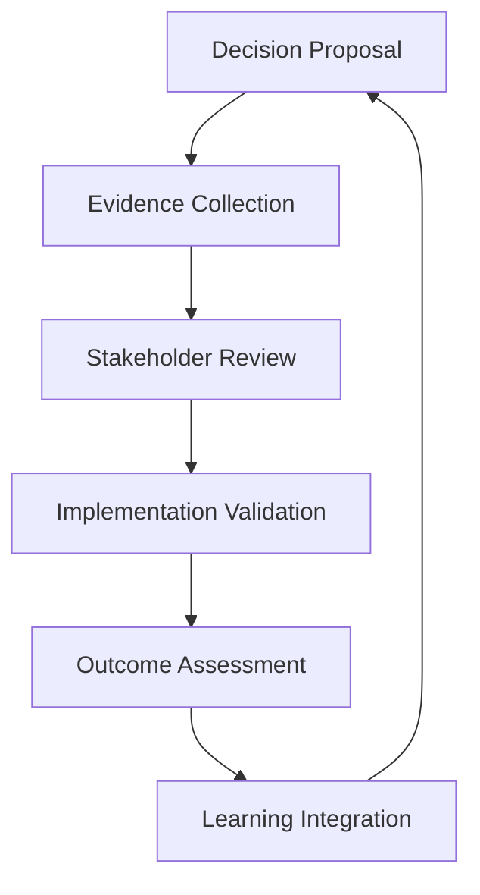
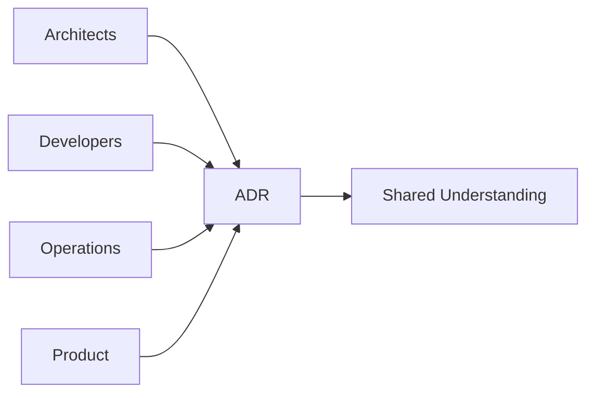

# 🧠 ADR Philosophy and Methodological Pragmatism

**Understanding the philosophical foundations of architectural decision records and their role in systematic software development.**

---

## 🎯 Core Philosophy

### What Are Architectural Decision Records?

Architectural Decision Records (ADRs) are not just documentation—they are **cognitive artifacts** that capture the reasoning process behind significant architectural choices. They serve as:

- **Decision Archaeology**: Preserving the context and rationale for future teams
- **Cognitive Offloading**: Externalizing complex reasoning to reduce mental burden
- **Institutional Memory**: Building organizational knowledge that survives team changes
- **Learning Instruments**: Enabling reflection and improvement of decision-making processes

### The Problem ADRs Solve

Software architecture decisions are often made under uncertainty, with incomplete information, and under time pressure. Without proper documentation:

- **Context Erosion**: The reasoning behind decisions is lost over time
- **Decision Debt**: Poor decisions compound without understanding why they were made
- **Knowledge Silos**: Critical architectural knowledge remains trapped in individual minds
- **Repeated Mistakes**: Teams make the same poor decisions without learning from history

---

## 🔬 Methodological Pragmatism Framework

The MCP ADR Analysis Server is built on **methodological pragmatism**, a philosophical approach developed by Nicholas Rescher that emphasizes systematic, evidence-based reasoning while acknowledging the limitations of both human and artificial intelligence.

### Core Principles

#### 1. Explicit Fallibilism

**Recognition that all knowledge is provisional and subject to revision.**

```typescript
// Example: Confidence scoring in ADR suggestions
interface AdrSuggestion {
  title: string;
  confidence: number; // 0-1 score acknowledging uncertainty
  evidence: string[]; // Explicit evidence basis
  assumptions: string[]; // Acknowledged assumptions
  limitations: string[]; // Known limitations of analysis
}
```

**In Practice:**

- All AI-generated suggestions include confidence scores
- Explicit acknowledgment of analysis limitations
- Regular review and revision of decisions as new information emerges

#### 2. Systematic Verification

**Establishing structured processes for validating knowledge and decisions.**



**Verification Mechanisms:**

- **Code Analysis**: Tree-sitter AST analysis for implementation validation
- **Cross-Reference Checking**: Ensuring decisions align with existing architecture
- **Compliance Validation**: Checking against organizational standards
- **Impact Assessment**: Analyzing consequences of decisions

#### 3. Pragmatic Success Criteria

**Focusing on what works reliably given constraints and context.**

Rather than seeking perfect solutions, methodological pragmatism emphasizes:

- **Workable Solutions**: Decisions that function effectively in practice
- **Context Sensitivity**: Acknowledging that good decisions depend on circumstances
- **Iterative Improvement**: Continuous refinement based on outcomes
- **Resource Constraints**: Realistic assessment of available time, expertise, and resources

#### 4. Cognitive Systematization

**Organizing knowledge into coherent, comprehensive systems.**

```json
{
  "knowledge_organization": {
    "architectural_patterns": {
      "microservices": {
        "contexts": ["high_scalability", "team_autonomy"],
        "trade_offs": ["complexity_vs_scalability"],
        "evidence": ["netflix_case_study", "uber_experience"]
      }
    },
    "decision_frameworks": {
      "database_selection": {
        "criteria": ["consistency", "availability", "partition_tolerance"],
        "evaluation_matrix": "cap_theorem_analysis"
      }
    }
  }
}
```

---

## 🤖 AI and Human Collaboration

### Complementary Strengths

The MCP ADR Analysis Server recognizes that effective architectural decision-making requires collaboration between human expertise and AI capabilities:

#### Human Strengths

- **Domain Knowledge**: Deep understanding of business context and requirements
- **Stakeholder Management**: Navigating organizational politics and relationships
- **Creative Problem Solving**: Generating novel solutions to unique problems
- **Ethical Reasoning**: Considering moral and social implications of decisions

#### AI Strengths

- **Pattern Recognition**: Identifying architectural patterns across large codebases
- **Comprehensive Analysis**: Analyzing vast amounts of code and documentation
- **Consistency Checking**: Ensuring decisions align with established patterns
- **Knowledge Synthesis**: Combining information from multiple sources

### Error Architecture Awareness

The system explicitly acknowledges different types of errors:

#### Human-Cognitive Errors

- **Knowledge Gaps**: Incomplete understanding of technical domains
- **Attention Limitations**: Missing important details due to cognitive load
- **Bias Effects**: Systematic distortions in judgment and decision-making
- **Time Pressure**: Rushed decisions under deadline constraints

#### Artificial-Stochastic Errors

- **Pattern Completion**: Merging incompatible patterns from training data
- **Context Window Limitations**: Losing important context in long analyses
- **Training Data Artifacts**: Reflecting outdated or incorrect practices
- **Hallucination**: Generating plausible but incorrect information

### Mitigation Strategies

```typescript
interface ErrorMitigation {
  humanCognitive: {
    knowledgeGaps: 'collaborative_review' | 'expert_consultation';
    attentionLimits: 'structured_checklists' | 'automated_validation';
    biasEffects: 'diverse_perspectives' | 'devil_advocate_process';
    timePressure: 'decision_templates' | 'incremental_refinement';
  };

  artificialStochastic: {
    patternCompletion: 'confidence_scoring' | 'multiple_alternatives';
    contextLimits: 'hierarchical_analysis' | 'context_summarization';
    trainingArtifacts: 'evidence_validation' | 'source_verification';
    hallucination: 'fact_checking' | 'human_verification';
  };
}
```

---

## 📚 Theoretical Foundations

### Decision Theory Integration

ADRs integrate concepts from multiple decision theory frameworks:

#### Rational Choice Theory

- **Utility Maximization**: Choosing options that maximize expected value
- **Cost-Benefit Analysis**: Systematic evaluation of trade-offs
- **Risk Assessment**: Quantifying and managing uncertainty

#### Bounded Rationality

- **Satisficing**: Finding "good enough" solutions given constraints
- **Cognitive Limitations**: Acknowledging limits of human information processing
- **Heuristic Decision-Making**: Using mental shortcuts for complex decisions

#### Prospect Theory

- **Loss Aversion**: Weighing potential losses more heavily than gains
- **Framing Effects**: How decision presentation affects choices
- **Reference Point Dependence**: Decisions relative to current state

### Knowledge Management Theory

ADRs serve as **boundary objects** that facilitate knowledge sharing across different communities of practice:



#### Communities of Practice

- **Architects**: Focus on system-wide concerns and long-term evolution
- **Developers**: Emphasize implementation feasibility and maintainability
- **Operations**: Prioritize reliability, monitoring, and deployment concerns
- **Product**: Consider user experience and business value

#### Knowledge Translation

ADRs translate between different types of knowledge:

- **Tacit to Explicit**: Making implicit architectural knowledge visible
- **Individual to Organizational**: Scaling personal expertise across teams
- **Technical to Business**: Communicating technical decisions to stakeholders

---

## 🔄 Decision Lifecycle Philosophy

### Temporal Aspects of Decisions

Architectural decisions exist in time and must account for:

#### Decision Timing

- **Irreversible Decisions**: High-cost changes that require careful consideration
- **Reversible Decisions**: Low-cost experiments that can be easily changed
- **Delayed Decisions**: Postponing choices until more information is available

#### Decision Evolution

```json
{
  "decision_lifecycle": {
    "proposed": {
      "characteristics": ["high_uncertainty", "multiple_options"],
      "activities": ["research", "prototyping", "stakeholder_input"]
    },
    "accepted": {
      "characteristics": ["consensus_reached", "implementation_ready"],
      "activities": ["implementation_planning", "communication"]
    },
    "implemented": {
      "characteristics": ["code_changes_made", "system_behavior_changed"],
      "activities": ["monitoring", "validation", "refinement"]
    },
    "validated": {
      "characteristics": ["outcomes_measured", "success_confirmed"],
      "activities": ["documentation_update", "lesson_capture"]
    },
    "deprecated": {
      "characteristics": ["better_alternative_found", "context_changed"],
      "activities": ["migration_planning", "knowledge_preservation"]
    }
  }
}
```

### Learning and Adaptation

The ADR process embodies **double-loop learning**:

#### Single-Loop Learning

- **Error Correction**: Fixing problems within existing frameworks
- **Process Improvement**: Optimizing current decision-making approaches
- **Incremental Enhancement**: Making small improvements to existing decisions

#### Double-Loop Learning

- **Framework Questioning**: Challenging underlying assumptions about architecture
- **Mental Model Revision**: Updating fundamental beliefs about system design
- **Paradigm Shifts**: Adopting entirely new approaches to architectural problems

---

## 🌐 Organizational Philosophy

### ADRs as Organizational Intelligence

ADRs contribute to **organizational learning** by:

#### Knowledge Accumulation

- **Decision Patterns**: Identifying recurring architectural challenges
- **Solution Repertoires**: Building libraries of proven approaches
- **Failure Analysis**: Learning from unsuccessful decisions

#### Capability Development

- **Decision-Making Skills**: Improving team ability to make good architectural choices
- **Architectural Thinking**: Developing systematic approaches to system design
- **Communication Practices**: Enhancing ability to explain and justify decisions

### Cultural Transformation

Implementing ADRs represents a cultural shift toward:

#### Transparency

- **Open Decision-Making**: Making architectural reasoning visible to all stakeholders
- **Accountability**: Clear ownership and responsibility for decisions
- **Learning Culture**: Embracing mistakes as learning opportunities

#### Systematic Thinking

- **Evidence-Based Decisions**: Grounding choices in data and analysis
- **Long-Term Perspective**: Considering future implications of current decisions
- **Holistic View**: Understanding system-wide impacts of local changes

---

## 🔧 Practical Implementation Philosophy

### Tool Design Principles

The MCP ADR Analysis Server embodies several design philosophies:

#### Augmentation, Not Replacement

- **Human-AI Partnership**: AI enhances human decision-making rather than replacing it
- **Cognitive Amplification**: Tools extend human reasoning capabilities
- **Contextual Assistance**: Providing relevant information when and where needed

#### Transparency and Explainability

- **Reasoning Visibility**: Making AI analysis processes understandable
- **Confidence Communication**: Clearly indicating certainty levels
- **Evidence Traceability**: Showing the basis for recommendations

#### Adaptability and Evolution

- **Learning Systems**: Tools that improve based on usage and feedback
- **Customization**: Adapting to organizational contexts and preferences
- **Continuous Improvement**: Regular updates based on new research and practice

### Integration Philosophy

ADRs should integrate seamlessly into existing development workflows:

```yaml
integration_points:
  development:
    - code_reviews: 'architectural_impact_assessment'
    - pull_requests: 'adr_compliance_checking'
    - refactoring: 'decision_update_triggers'

  planning:
    - sprint_planning: 'architectural_debt_consideration'
    - roadmap_planning: 'decision_dependency_analysis'
    - risk_assessment: 'architectural_risk_evaluation'

  operations:
    - incident_response: 'decision_impact_analysis'
    - performance_monitoring: 'architectural_assumption_validation'
    - capacity_planning: 'scalability_decision_review'
```

---

## 🎓 Educational Philosophy

### Teaching Architectural Thinking

ADRs serve as educational tools that help develop:

#### Analytical Skills

- **Problem Decomposition**: Breaking complex architectural challenges into manageable parts
- **Option Generation**: Systematically identifying alternative approaches
- **Trade-off Analysis**: Understanding and evaluating competing concerns

#### Communication Skills

- **Technical Writing**: Clearly explaining complex technical concepts
- **Stakeholder Communication**: Translating technical decisions for different audiences
- **Persuasive Reasoning**: Building compelling cases for architectural choices

#### Reflective Practice

- **Decision Review**: Regularly examining the outcomes of past decisions
- **Pattern Recognition**: Identifying recurring themes in architectural challenges
- **Continuous Learning**: Updating understanding based on new experiences

### Mentorship and Knowledge Transfer

ADRs facilitate knowledge transfer through:

#### Apprenticeship Models

- **Decision Shadowing**: Junior architects observing senior decision-making processes
- **Collaborative Analysis**: Teams working together on architectural challenges
- **Peer Review**: Cross-team examination of architectural decisions

#### Institutional Memory

- **Historical Context**: Understanding how current architecture evolved
- **Lessons Learned**: Capturing insights from both successes and failures
- **Best Practices**: Documenting proven approaches to common problems

---

## 🔮 Future Directions

### Emerging Philosophical Considerations

As software systems become more complex, ADR philosophy must evolve to address:

#### AI-Native Architectures

- **Human-AI Collaboration**: Designing systems where AI is a first-class architectural component
- **Explainable Systems**: Ensuring AI-driven architectural decisions remain understandable
- **Ethical Architecture**: Considering moral implications of AI-powered systems

#### Distributed Decision-Making

- **Federated Architecture**: Coordinating decisions across autonomous teams and systems
- **Emergent Architecture**: Managing systems that evolve through distributed decisions
- **Consensus Mechanisms**: Achieving alignment in large, distributed organizations

#### Sustainability and Responsibility

- **Environmental Impact**: Considering energy and resource implications of architectural decisions
- **Social Responsibility**: Understanding broader societal impacts of system design
- **Long-term Stewardship**: Designing for maintainability and evolution over decades

---

## 📖 Recommended Reading

### Foundational Texts

- **"A Realistic Theory of Science"** by Nicholas Rescher - Methodological pragmatism foundations
- **"The Reflective Practitioner"** by Donald Schön - Reflective practice in professional contexts
- **"Thinking, Fast and Slow"** by Daniel Kahneman - Cognitive biases and decision-making

### Architectural Decision-Making

- **"Architecture Decision Records"** by Michael Nygard - Original ADR concept
- **"Software Architecture in Practice"** by Bass, Clements, and Kazman - Architectural decision frameworks
- **"Building Evolutionary Architectures"** by Ford, Parsons, and Kua - Evolutionary design principles

### Knowledge Management

- **"The Knowledge-Creating Company"** by Nonaka and Takeuchi - Organizational knowledge creation
- **"Communities of Practice"** by Wenger - Social learning theory
- **"The Fifth Discipline"** by Peter Senge - Organizational learning and systems thinking

---

## 🔗 Related Documentation

- **[MCP Concepts](mcp-concepts.md)** - Technical implementation of philosophical principles
- **[Team Collaboration Tutorial](../tutorials/team-collaboration.md)** - Practical application of ADR philosophy
- **[Analysis Tools](../reference/analysis-tools.md)** - Tools implementing methodological pragmatism

---

**Questions about ADR philosophy?** → **[Open an Issue](https://github.com/tosin2013/mcp-adr-analysis-server/issues)**
