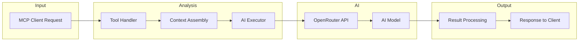
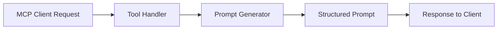
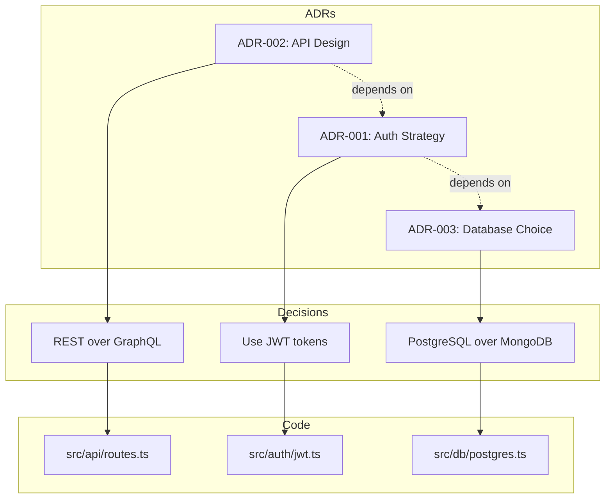
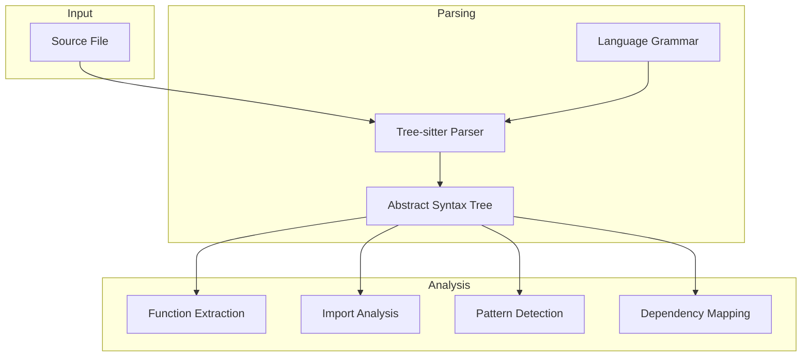
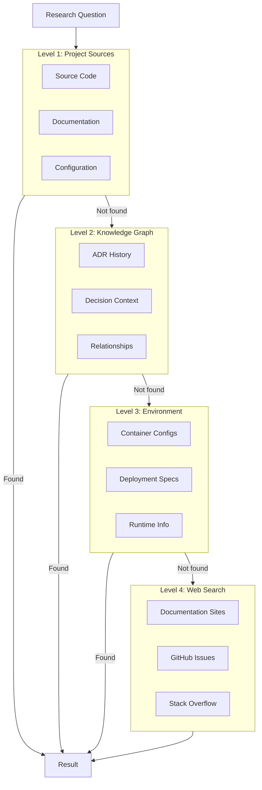

# AI Architecture Concepts

**Understanding the AI integration patterns, execution pipeline, and intelligent analysis capabilities of the MCP ADR Analysis Server.**

---

## Overview

The MCP ADR Analysis Server integrates AI capabilities at multiple levels to provide intelligent architectural analysis. This document explains the core AI concepts, how they interact, and the design decisions behind the architecture.

### Key Concepts

- **Dual Execution Modes**: Full AI mode vs. prompt-only mode for flexibility
- **Knowledge Graph**: Persistent memory of architectural relationships
- **Tree-sitter Integration**: Semantic code understanding for accurate analysis
- **Confidence Scoring**: Quantified reliability of analysis results
- **Cascading Data Sources**: Multi-tier information retrieval strategy

---

## AI Execution Pipeline

The server supports two execution modes, each with distinct characteristics:

### Full Mode (AI-Powered)

When `EXECUTION_MODE=full` and an OpenRouter API key is configured, the server executes AI analysis directly:



**Process Flow:**

1. **Request Reception**: MCP client sends tool invocation via JSON-RPC
2. **Context Assembly**: Relevant project context, ADRs, and code snippets gathered
3. **AI Execution**: Structured prompt sent to OpenRouter with assembled context
4. **Response Processing**: AI response parsed, validated, and formatted
5. **Result Delivery**: Structured result returned to MCP client

### Prompt-Only Mode (Fallback)

When no API key is configured, the server generates prompts for manual AI execution:



This mode allows users to:

- Explore available tools without cost
- Use their preferred AI interface
- Maintain control over AI interactions

---

## OpenRouter Integration

The server uses OpenRouter as its AI gateway, providing access to multiple AI models through a unified API.

### Why OpenRouter?

| Benefit               | Description                                                    |
| --------------------- | -------------------------------------------------------------- |
| **Model Diversity**   | Access Claude, GPT-4, Llama, and other models with one API key |
| **Automatic Routing** | Intelligent model selection based on request type              |
| **Cost Management**   | Unified billing and usage tracking                             |
| **Fallback Support**  | Automatic failover if primary model is unavailable             |

### Configuration

```typescript
// Environment variables
OPENROUTER_API_KEY; // Required for full mode
AI_MODEL; // Model selection (default: anthropic/claude-3-sonnet)
AI_TEMPERATURE; // Response consistency (default: 0.3)
AI_MAX_TOKENS; // Maximum response length (default: 4096)
```

### Request Structure

```typescript
interface AIExecutorRequest {
  prompt: string; // Structured analysis prompt
  context: ProjectContext; // Assembled project context
  parameters: {
    temperature: number;
    maxTokens: number;
    model: string;
  };
}
```

---

## Knowledge Graph Architecture

The Knowledge Graph is a persistent memory system that tracks relationships between architectural artifacts.

### Graph Structure



### Node Types

| Node Type      | Description                   | Properties                            |
| -------------- | ----------------------------- | ------------------------------------- |
| **ADR**        | Architectural Decision Record | title, status, date, context          |
| **CodeFile**   | Source code file              | path, language, functions             |
| **Decision**   | Specific architectural choice | rationale, alternatives, consequences |
| **Technology** | Framework or tool             | name, version, category               |
| **Pattern**    | Architectural pattern         | name, type, implementation            |

### Edge Types

| Edge Type    | Description                | Example                               |
| ------------ | -------------------------- | ------------------------------------- |
| `IMPLEMENTS` | Code implements a decision | `jwt.ts IMPLEMENTS "Use JWT tokens"`  |
| `DEPENDS_ON` | ADR depends on another     | `API Design DEPENDS_ON Auth Strategy` |
| `USES`       | Code uses a technology     | `routes.ts USES Express`              |
| `SUPERSEDES` | ADR replaces another       | `ADR-005 SUPERSEDES ADR-002`          |

### Graph Operations

```typescript
// Add a relationship
await knowledgeGraph.addRelationship({
  from: 'adr-001',
  to: 'src/auth/jwt.ts',
  type: 'IMPLEMENTS',
  metadata: { confidence: 0.95 },
});

// Query related code
const relatedCode = await knowledgeGraph.query({
  from: 'adr-001',
  edgeType: 'IMPLEMENTS',
  depth: 2,
});
```

---

## Tree-sitter Integration

Tree-sitter provides incremental parsing for semantic code understanding.

### Why Tree-sitter?

- **Language-agnostic**: Supports 50+ programming languages
- **Incremental**: Efficient re-parsing on code changes
- **Accurate**: Full AST access for precise analysis
- **Fast**: Written in C with language bindings

### Analysis Capabilities



### Extracted Information

| Element       | Use Case                                    |
| ------------- | ------------------------------------------- |
| **Functions** | Understand code structure, link to ADRs     |
| **Imports**   | Detect dependencies, technology stack       |
| **Classes**   | Identify patterns, architectural boundaries |
| **Comments**  | Extract documentation, inline decisions     |
| **Types**     | Understand data models, contracts           |

### Code Linking

Tree-sitter enables Smart Code Linking - connecting ADR decisions to implementation:

```typescript
// Find code related to an ADR decision
const relatedCode = await findRelatedCode(
  'docs/adrs/001-auth-system.md',
  'We will implement JWT authentication',
  projectPath,
  {
    useTreeSitter: true,
    extractFunctions: true,
    maxResults: 10,
  }
);
```

---

## Confidence Scoring

Every analysis result includes a confidence score (0-1) indicating reliability.

### Scoring Factors

| Factor                   | Weight | Description                          |
| ------------------------ | ------ | ------------------------------------ |
| **Source Quality**       | 30%    | Reliability of information source    |
| **Context Completeness** | 25%    | Amount of relevant context available |
| **Pattern Matching**     | 20%    | Strength of detected patterns        |
| **Consistency**          | 15%    | Agreement across multiple sources    |
| **Recency**              | 10%    | How current the information is       |

### Score Interpretation

| Range          | Meaning             | Recommended Action                        |
| -------------- | ------------------- | ----------------------------------------- |
| **0.9 - 1.0**  | High confidence     | Trust result, proceed with implementation |
| **0.7 - 0.89** | Good confidence     | Review for edge cases                     |
| **0.5 - 0.69** | Moderate confidence | Validate with additional research         |
| **Below 0.5**  | Low confidence      | Manual verification required              |

### Implementation

```typescript
interface AnalysisResult {
  data: any;
  confidence: number;
  factors: {
    sourceQuality: number;
    contextCompleteness: number;
    patternMatching: number;
    consistency: number;
    recency: number;
  };
  recommendations: string[];
}
```

---

## Cascading Data Sources

The `perform_research` tool uses a cascading strategy to find answers:



### Priority Order

1. **Project Files**: Most authoritative, highest confidence
2. **Knowledge Graph**: Architectural context and history
3. **Environment**: Runtime configuration and deployment
4. **Web Search**: External information (lowest confidence, requires Firecrawl)

---

## Design Decisions

### Decision 1: Dual Execution Modes

**Problem**: Users have varying needs - some want immediate results, others prefer control over AI interactions.

**Solution**: Support both full AI execution and prompt-only modes, switching based on configuration.

**Trade-offs**:

- Increased complexity in tool implementation
- Better user flexibility and adoption
- No vendor lock-in for AI provider

### Decision 2: Local Knowledge Graph

**Problem**: AI models lack persistent memory between sessions.

**Solution**: Maintain a local knowledge graph that persists architectural relationships.

**Trade-offs**:

- Additional storage requirements
- Requires periodic synchronization
- Enables offline context and faster responses

### Decision 3: Tree-sitter for Code Analysis

**Problem**: Need accurate code understanding across multiple languages.

**Solution**: Use tree-sitter for AST-based analysis instead of regex patterns.

**Trade-offs**:

- Native module compilation required during install
- More accurate than pattern matching
- Language support limited to tree-sitter grammars

---

## Related Concepts

- **[Architecture Overview](./architecture-overview.md)** - System component architecture
- **[Self-Learning Architecture](./self-learning-architecture.md)** - Adaptive analysis capabilities
- **[Security Philosophy](./security-philosophy.md)** - Content protection approach

---

## Further Reading

- **[Configuration Guide](../configuration.md)** - Environment variable reference
- **[API Reference](../reference/api-reference.md)** - Complete tool documentation
- **[OpenRouter Documentation](https://openrouter.ai/docs)** - AI gateway details

---

**Questions about AI architecture?** → **[Open an Issue](https://github.com/tosin2013/mcp-adr-analysis-server/issues)**
