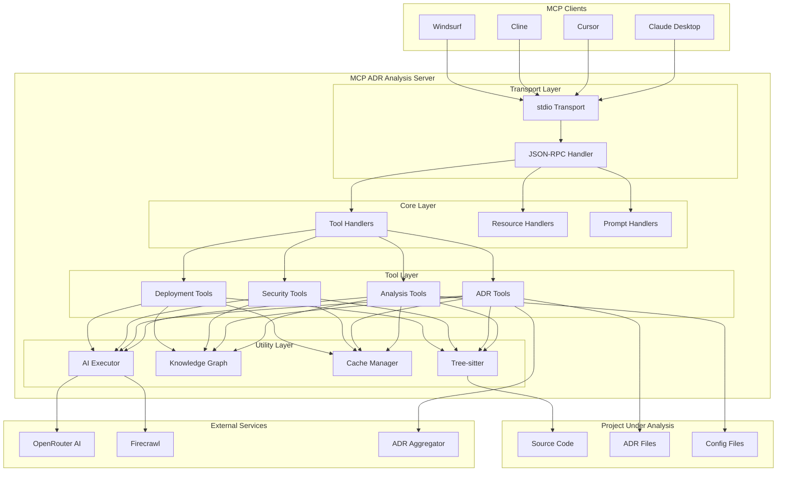
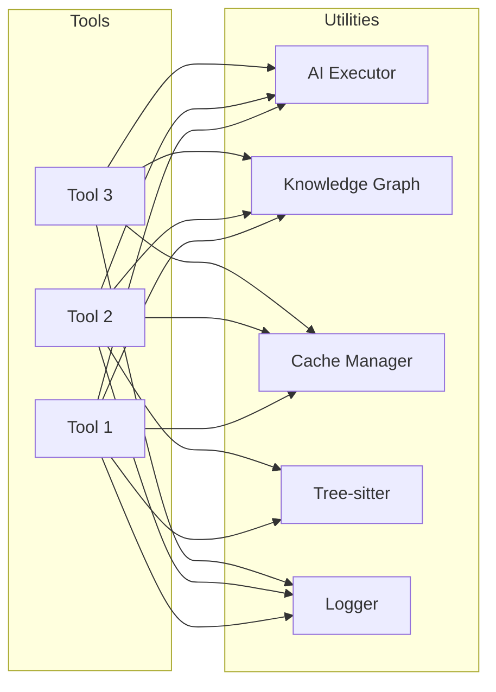
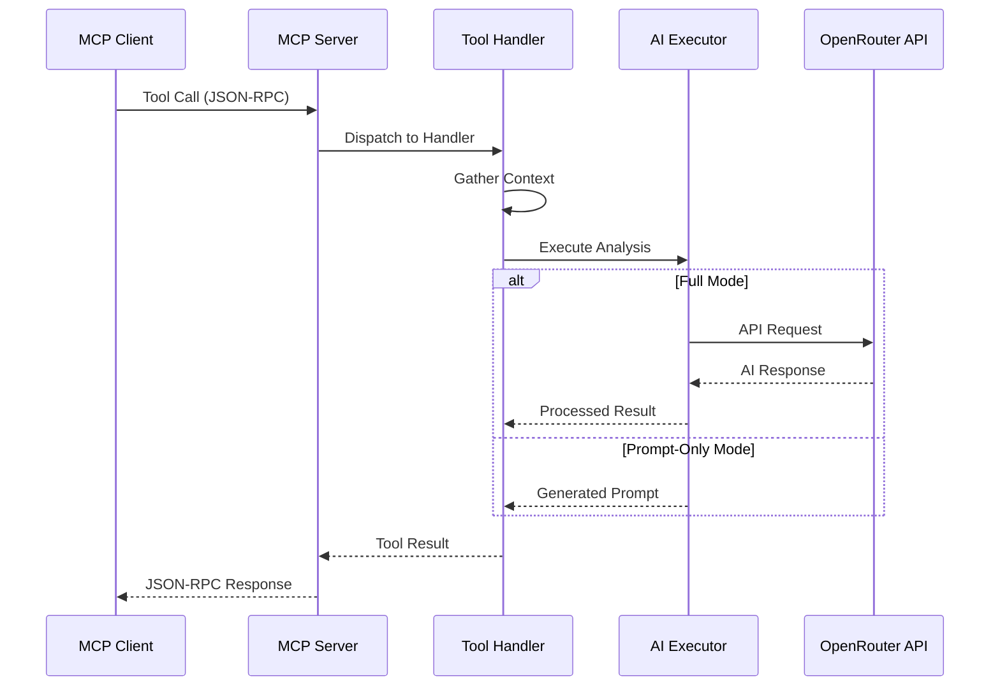
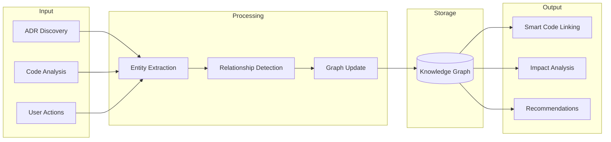
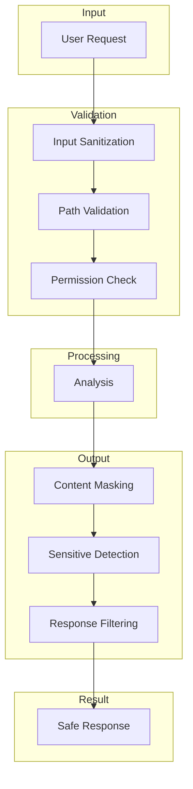

# Architecture Overview

This document provides a comprehensive overview of the MCP ADR Analysis Server architecture, including system components, data flows, and design decisions.

---

## System Architecture

The MCP ADR Analysis Server is built as a Model Context Protocol (MCP) server that provides AI-powered architectural analysis capabilities to MCP clients.



---

## Core Components

### Transport Layer

The server communicates with MCP clients via stdio transport using JSON-RPC 2.0 protocol.

```typescript
// Message flow
Client → [JSON-RPC Request] → Server
Server → [JSON-RPC Response] → Client
```

**Key Characteristics:**

- Bidirectional communication over stdin/stdout
- Stateless request handling
- Support for tool calls, resource reads, and prompt operations

### Tool Layer

The server exposes 73 tools organized by functionality:

| Category           | Tools                                                     | Purpose               |
| ------------------ | --------------------------------------------------------- | --------------------- |
| **Core Analysis**  | `analyze_project_ecosystem`, `get_architectural_context`  | Project understanding |
| **ADR Management** | `suggest_adrs`, `generate_adr_from_decision`              | ADR lifecycle         |
| **Security**       | `analyze_content_security`, `generate_content_masking`    | Content protection    |
| **Deployment**     | `deployment_readiness`, `smart_git_push_v2`               | Release validation    |
| **Research**       | `perform_research`, `generate_research_questions`         | Information gathering |
| **Workflow**       | `tool_chain_orchestrator`, `troubleshoot_guided_workflow` | Process automation    |

### Utility Layer

Shared utilities that tools depend on:



---

## Data Flow

### Analysis Request Flow



### Knowledge Graph Flow



---

## Directory Structure

```
src/
├── index.ts              # MCP server entry point
├── tools/                # Tool implementations (73 tools)
│   ├── adr-suggestion-tool.ts
│   ├── smart-score-tool.ts
│   ├── deployment-readiness-tool.ts
│   ├── content-masking-tool.ts
│   └── ...
├── utils/                # Shared utilities
│   ├── ai-executor.ts           # OpenRouter integration
│   ├── knowledge-graph-manager.ts
│   ├── cache.ts                 # Multi-level caching
│   ├── enhanced-logging.ts
│   └── ...
└── types/                # TypeScript type definitions
```

---

## Design Decisions

### 1. MCP Protocol Compliance

**Decision**: Build as a pure MCP server rather than a standalone CLI tool.

**Rationale**:

- Native integration with AI assistants (Claude, Cursor, Cline)
- Standardized communication protocol
- Ecosystem compatibility with other MCP servers

**Trade-offs**:

- Requires MCP client for full functionality
- Additional protocol overhead vs direct API

### 2. Dual Execution Modes

**Decision**: Support both full AI execution and prompt-only fallback.

**Rationale**:

- Lower barrier to entry (no API key required to try)
- Flexibility for users with their own AI access
- Cost control for users

**Trade-offs**:

- More complex tool implementations
- Two code paths to maintain

### 3. Tree-sitter for Code Analysis

**Decision**: Use tree-sitter for semantic code understanding.

**Rationale**:

- Accurate AST parsing vs regex patterns
- Support for 50+ languages
- Incremental parsing for efficiency

**Trade-offs**:

- Native module compilation during install
- Larger package size
- Build may fail in restricted network environments

### 4. Local-First Architecture

**Decision**: Process everything locally, use external services only when needed.

**Rationale**:

- Privacy: code never leaves the machine unless explicitly synced
- Speed: local analysis is faster than API calls
- Offline capability: core features work without internet

**Trade-offs**:

- Limited to local compute resources
- Some features require external services (AI, web search)

### 5. Multi-Level Caching

**Decision**: Implement caching at multiple levels (memory, disk, session).

**Rationale**:

- Avoid redundant analysis of unchanged code
- Reduce API calls and costs
- Faster repeated operations

**Trade-offs**:

- Cache invalidation complexity
- Disk space usage
- Potential stale data issues

---

## Comparison with Alternatives

| Approach        | Our Design  | Alternative: Standalone CLI | Alternative: Web Service |
| --------------- | ----------- | --------------------------- | ------------------------ |
| **Integration** | Native MCP  | Manual workflow             | API calls                |
| **AI Access**   | Automatic   | User-managed                | Provider-managed         |
| **Privacy**     | Local-first | Local                       | Cloud-based              |
| **Offline**     | Partial     | Full                        | None                     |
| **Setup**       | MCP config  | Direct install              | Account required         |

---

## Extension Points

The architecture supports extension through:

### Adding New Tools

```typescript
// 1. Create tool file in src/tools/
export const myNewTool = {
  name: 'my_new_tool',
  description: 'Does something useful',
  inputSchema: {
    /* JSON Schema */
  },
  handler: async params => {
    /* Implementation */
  },
};

// 2. Register in src/index.ts
server.setRequestHandler(CallToolRequestSchema, async request => {
  // Tool dispatch logic
});
```

### Adding New Utilities

```typescript
// 1. Create utility in src/utils/
export class MyUtility {
  // Shared functionality
}

// 2. Import and use in tools
import { MyUtility } from '../utils/my-utility';
```

### Custom AI Models

```typescript
// Configure via environment variables
AI_MODEL=openai/gpt-4-turbo    # or any OpenRouter-supported model
AI_TEMPERATURE=0.3
AI_MAX_TOKENS=4096
```

---

## Performance Characteristics

| Operation       | Typical Latency | Notes                     |
| --------------- | --------------- | ------------------------- |
| Tool dispatch   | < 10ms          | Local routing             |
| Code parsing    | 50-500ms        | Depends on file size      |
| Cached analysis | < 50ms          | Cache hit                 |
| AI analysis     | 2-10s           | Network + model inference |
| Web search      | 3-15s           | Depends on content        |

### Optimization Strategies

- **Incremental parsing**: Only re-parse changed files
- **Parallel processing**: Analyze multiple files concurrently
- **Smart caching**: Content-addressed cache for reproducibility
- **Lazy loading**: Load utilities on demand

---

## Security Model



**Security Principles**:

- All file paths validated against project root
- Automatic detection and masking of secrets
- No execution of arbitrary code from analyzed projects
- API keys stored in environment, never logged

---

## Related Documentation

- **[AI Architecture Concepts](./ai-architecture-concepts.md)** - AI integration details
- **[Self-Learning Architecture](./self-learning-architecture.md)** - Adaptive capabilities
- **[Security Philosophy](./security-philosophy.md)** - Security approach
- **[Configuration Guide](../configuration.md)** - Environment setup

---

## Further Reading

- **[First Steps Tutorial](../tutorials/01-first-steps.md)** - Getting started guide
- **[API Reference](../reference/api-reference.md)** - Complete tool documentation
- **[MCP Specification](https://modelcontextprotocol.io/)** - Protocol details

---

**Questions about the architecture?** → **[Open an Issue](https://github.com/tosin2013/mcp-adr-analysis-server/issues)**
