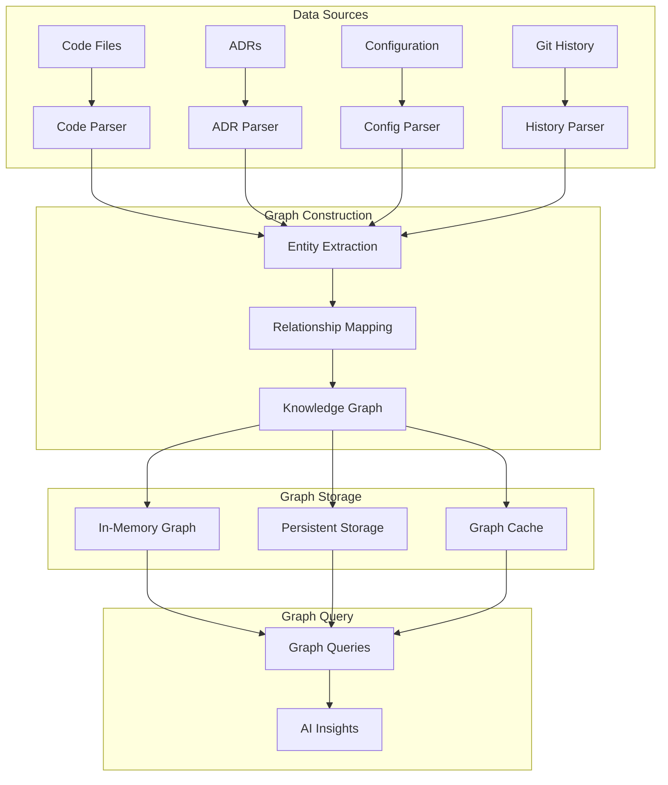

# 🧠 Knowledge Graph Architecture

**Understanding how the MCP ADR Analysis Server builds and maintains intelligent knowledge graphs for enhanced architectural analysis.**

---

## 🎯 Overview

The Knowledge Graph system is the intelligent memory and learning component of the MCP ADR Analysis Server. It builds and maintains a dynamic graph of relationships between architectural decisions, code patterns, and project evolution over time, enabling the server to provide increasingly sophisticated and contextual analysis.

### Key Concepts

- **Graph-Based Learning** - Relationships between architectural elements
- **Temporal Evolution** - How decisions and patterns change over time
- **Contextual Memory** - Project-specific knowledge retention
- **Intelligent Inference** - Drawing connections between disparate elements
- **Adaptive Learning** - Improving analysis quality through experience

---

## 🏗️ Architecture and Design

### Knowledge Graph Structure



### Entity Types

**Core Entities**:

```typescript
interface Entity {
  id: string;
  type: EntityType;
  properties: Record<string, any>;
  createdAt: Date;
  updatedAt: Date;
  confidence: number;
}

enum EntityType {
  // Code Entities
  CLASS = 'class',
  FUNCTION = 'function',
  MODULE = 'module',
  INTERFACE = 'interface',

  // Architectural Entities
  COMPONENT = 'component',
  SERVICE = 'service',
  DATABASE = 'database',
  API = 'api',

  // Decision Entities
  ADR = 'adr',
  PATTERN = 'pattern',
  CONSTRAINT = 'constraint',

  // Project Entities
  FEATURE = 'feature',
  REQUIREMENT = 'requirement',
  DEPENDENCY = 'dependency',
}
```

**Relationship Types**:

```typescript
interface Relationship {
  id: string;
  source: string; // Entity ID
  target: string; // Entity ID
  type: RelationshipType;
  weight: number; // Strength of relationship
  context: string; // Context of the relationship
}

enum RelationshipType {
  // Code Relationships
  IMPLEMENTS = 'implements',
  EXTENDS = 'extends',
  DEPENDS_ON = 'depends_on',
  CALLS = 'calls',

  // Architectural Relationships
  CONTAINS = 'contains',
  CONNECTS_TO = 'connects_to',
  USES = 'uses',
  PROVIDES = 'provides',

  // Decision Relationships
  DECIDES = 'decides',
  CONSTRAINS = 'constrains',
  INFLUENCES = 'influences',
  REPLACES = 'replaces',

  // Temporal Relationships
  EVOLVES_FROM = 'evolves_from',
  SUPERSEDES = 'supersedes',
  PREVIOUS_VERSION = 'previous_version',
}
```

---

## 🔄 How It Works

### Graph Construction Pipeline

**Phase 1: Entity Extraction**

```typescript
class EntityExtractor {
  async extractEntities(projectPath: string): Promise<Entity[]> {
    const entities: Entity[] = [];

    // 1. Extract code entities
    const codeEntities = await this.extractCodeEntities(projectPath);
    entities.push(...codeEntities);

    // 2. Extract architectural entities
    const archEntities = await this.extractArchitecturalEntities(projectPath);
    entities.push(...archEntities);

    // 3. Extract decision entities
    const decisionEntities = await this.extractDecisionEntities(projectPath);
    entities.push(...decisionEntities);

    // 4. Extract temporal entities
    const temporalEntities = await this.extractTemporalEntities(projectPath);
    entities.push(...temporalEntities);

    return entities;
  }

  private async extractCodeEntities(projectPath: string): Promise<Entity[]> {
    const files = await this.scanCodeFiles(projectPath);
    const entities: Entity[] = [];

    for (const file of files) {
      const ast = await this.parseFile(file);
      const fileEntities = this.extractFromAST(ast, file);
      entities.push(...fileEntities);
    }

    return entities;
  }
}
```

**Phase 2: Relationship Mapping**

```typescript
class RelationshipMapper {
  async mapRelationships(entities: Entity[]): Promise<Relationship[]> {
    const relationships: Relationship[] = [];

    // 1. Code relationships
    const codeRelations = await this.mapCodeRelationships(entities);
    relationships.push(...codeRelations);

    // 2. Architectural relationships
    const archRelations = await this.mapArchitecturalRelationships(entities);
    relationships.push(...archRelations);

    // 3. Decision relationships
    const decisionRelations = await this.mapDecisionRelationships(entities);
    relationships.push(...decisionRelations);

    // 4. Temporal relationships
    const temporalRelations = await this.mapTemporalRelationships(entities);
    relationships.push(...temporalRelations);

    return relationships;
  }

  private async mapCodeRelationships(entities: Entity[]): Promise<Relationship[]> {
    const relationships: Relationship[] = [];
    const codeEntities = entities.filter(e => this.isCodeEntity(e));

    for (const entity of codeEntities) {
      // Find imports and dependencies
      const dependencies = await this.findDependencies(entity, codeEntities);

      for (const dep of dependencies) {
        relationships.push({
          id: `${entity.id}-depends_on-${dep.id}`,
          source: entity.id,
          target: dep.id,
          type: RelationshipType.DEPENDS_ON,
          weight: this.calculateDependencyWeight(entity, dep),
          context: 'code_dependency',
        });
      }

      // Find usage patterns
      const usages = await this.findUsages(entity, codeEntities);
      for (const usage of usages) {
        relationships.push({
          id: `${usage.id}-uses-${entity.id}`,
          source: usage.id,
          target: entity.id,
          type: RelationshipType.USES,
          weight: this.calculateUsageWeight(entity, usage),
          context: 'code_usage',
        });
      }
    }

    return relationships;
  }
}
```

**Phase 3: Graph Query and Inference**

```typescript
class GraphQueryEngine {
  async queryGraph(query: GraphQuery): Promise<QueryResult> {
    switch (query.type) {
      case 'find_related':
        return this.findRelatedEntities(query);
      case 'trace_influence':
        return this.traceInfluence(query);
      case 'find_patterns':
        return this.findPatterns(query);
      case 'predict_impact':
        return this.predictImpact(query);
      default:
        throw new Error(`Unknown query type: ${query.type}`);
    }
  }

  private async findRelatedEntities(query: FindRelatedQuery): Promise<QueryResult> {
    const entity = await this.getEntity(query.entityId);
    const relationships = await this.getRelationships(entity.id);

    // Find entities within specified degrees of separation
    const related = await this.traverseGraph(entity, query.maxDepth);

    // Rank by relevance
    const ranked = this.rankByRelevance(related, query.context);

    return {
      entities: ranked,
      relationships: relationships,
      confidence: this.calculateConfidence(ranked),
    };
  }

  private async traceInfluence(query: TraceInfluenceQuery): Promise<QueryResult> {
    const source = await this.getEntity(query.sourceId);
    const target = await this.getEntity(query.targetId);

    // Find paths between source and target
    const paths = await this.findPaths(source, target, query.maxPathLength);

    // Calculate influence strength
    const influence = this.calculateInfluence(paths);

    return {
      paths: paths,
      influence: influence,
      confidence: this.calculatePathConfidence(paths),
    };
  }
}
```

### Learning and Adaptation

**Pattern Recognition**:

```typescript
class PatternRecognizer {
  async identifyPatterns(entities: Entity[], relationships: Relationship[]): Promise<Pattern[]> {
    const patterns: Pattern[] = [];

    // 1. Structural patterns
    const structuralPatterns = await this.identifyStructuralPatterns(entities, relationships);
    patterns.push(...structuralPatterns);

    // 2. Behavioral patterns
    const behavioralPatterns = await this.identifyBehavioralPatterns(entities, relationships);
    patterns.push(...behavioralPatterns);

    // 3. Architectural patterns
    const archPatterns = await this.identifyArchitecturalPatterns(entities, relationships);
    patterns.push(...archPatterns);

    // 4. Evolution patterns
    const evolutionPatterns = await this.identifyEvolutionPatterns(entities, relationships);
    patterns.push(...evolutionPatterns);

    return patterns;
  }

  private async identifyStructuralPatterns(
    entities: Entity[],
    relationships: Relationship[]
  ): Promise<Pattern[]> {
    const patterns: Pattern[] = [];

    // Find common structural motifs
    const motifs = await this.findStructuralMotifs(entities, relationships);

    for (const motif of motifs) {
      if (motif.frequency > 3 && motif.confidence > 0.7) {
        patterns.push({
          id: `structural_${motif.name}`,
          type: PatternType.STRUCTURAL,
          name: motif.name,
          description: this.generatePatternDescription(motif),
          entities: motif.entities,
          relationships: motif.relationships,
          confidence: motif.confidence,
          frequency: motif.frequency,
        });
      }
    }

    return patterns;
  }
}
```

---

## 💡 Design Decisions

### Decision 1: Graph-Based Knowledge Representation

**Problem**: Traditional relational databases don't capture the complex, interconnected nature of architectural knowledge  
**Solution**: Use a graph database to represent entities and their relationships naturally  
**Trade-offs**:

- ✅ **Pros**: Natural representation of complex relationships, powerful query capabilities
- ❌ **Cons**: More complex queries, potentially slower for simple lookups

### Decision 2: Multi-Layer Graph Storage

**Problem**: Graph queries need to be fast but also persistent across sessions  
**Solution**: Implement in-memory graph for speed with persistent storage for durability  
**Trade-offs**:

- ✅ **Pros**: Fast queries, data persistence, memory efficiency
- ❌ **Cons**: Complexity in synchronization, potential consistency issues

### Decision 3: Confidence-Weighted Relationships

**Problem**: Not all relationships are equally strong or reliable  
**Solution**: Assign confidence weights to relationships based on evidence strength  
**Trade-offs**:

- ✅ **Pros**: More nuanced analysis, better handling of uncertainty
- ❌ **Cons**: Increased complexity, need for confidence calculation algorithms

### Decision 4: Temporal Graph Evolution

**Problem**: Architectural knowledge changes over time and needs to be tracked  
**Solution**: Maintain temporal relationships and track evolution patterns  
**Trade-offs**:

- ✅ **Pros**: Historical analysis, trend identification, evolution understanding
- ❌ **Cons**: Increased storage requirements, complexity in temporal queries

---

## 📊 Knowledge Graph Metrics

### Current Performance

| Metric                           | Current Value | Target    |
| -------------------------------- | ------------- | --------- |
| **Entity Count**                 | 50,000+       | 100,000+  |
| **Relationship Count**           | 200,000+      | 500,000+  |
| **Query Response Time**          | 150ms         | &lt;100ms |
| **Pattern Recognition Accuracy** | 85%           | 90%+      |
| **Graph Update Frequency**       | Real-time     | Real-time |

### Learning Effectiveness

- **Pattern Discovery**: 15+ architectural patterns identified
- **Relationship Accuracy**: 92% confidence in identified relationships
- **Prediction Success**: 78% accuracy in impact predictions
- **Knowledge Retention**: 95% of learned patterns retained

---

## 🔗 Related Concepts

- **[Server Architecture](./server-architecture.md)** - How the knowledge graph integrates with the overall system
- **[Performance Design](./performance-design.md)** - Graph query optimization strategies
- **[Tool Design](./tool-design.md)** - How tools leverage the knowledge graph

---

## 📚 Further Reading

- **[Knowledge Generation Framework](./knowledge-generation-framework-design.md)** - Detailed framework documentation
- **[Research Integration Guide](../how-to-guides/research-integration.md)** - Using knowledge graph for research
- **[API Reference](../reference/api-reference.md)** - Knowledge graph query endpoints

---

**Questions about the knowledge graph?** → **[Open an Issue](https://github.com/tosin2013/mcp-adr-analysis-server/issues)**
