# 💡 Understanding Model Context Protocol (MCP)

**Purpose**: This document explains the fundamental concepts behind MCP and how the ADR Analysis Server leverages these concepts for architectural analysis.

---

## 🧠 What is Model Context Protocol?

**Model Context Protocol (MCP)** is a standardized way for AI assistants to interact with external tools, data sources, and services. Think of it as a "universal translator" that allows AI models to:

- **Access Real Data** - Read files, databases, APIs, and other external sources
- **Execute Actions** - Run commands, modify files, trigger workflows
- **Maintain Context** - Remember information across conversations and sessions
- **Extend Capabilities** - Add specialized skills beyond what the AI was trained on

### The Problem MCP Solves

Before MCP, AI assistants were limited to:
- ❌ Only information from their training data (which becomes outdated)
- ❌ No ability to access real-time data or current files
- ❌ No way to take actions in the real world
- ❌ Each integration required custom, one-off solutions

With MCP, AI assistants can:
- ✅ Access current, real-time information
- ✅ Interact with your actual project files and data
- ✅ Execute specialized analysis and automation tools
- ✅ Use standardized, reusable integrations

---

## 🏗️ MCP Architecture

```mermaid
graph TB
    subgraph "Your Environment"
        User[👤 You]
        AI[🤖 AI Assistant<br/>Claude, ChatGPT, etc.]
    end
    
    subgraph "MCP Layer"
        Client[📱 MCP Client<br/>Desktop app, IDE, etc.]
        Protocol[🔌 MCP Protocol<br/>JSON-RPC over stdio]
    end
    
    subgraph "MCP Server"
        Server[🏗️ ADR Analysis Server]
        Tools[🛠️ Tools<br/>37 analysis functions]
        Resources[📚 Resources<br/>Dynamic content]
        Prompts[💭 Prompts<br/>AI templates]
    end
    
    subgraph "Your Project"
        Files[📁 Files]
        Code[💻 Code]
        Docs[📄 Documentation]
        ADRs[📋 ADRs]
    end
    
    User --> AI
    AI --> Client
    Client --> Protocol
    Protocol --> Server
    Server --> Tools
    Server --> Resources
    Server --> Prompts
    Tools --> Files
    Tools --> Code
    Tools --> Docs
    Tools --> ADRs
```



### Key Components

1. **MCP Client** - The application that connects your AI assistant to MCP servers
2. **MCP Protocol** - Standardized communication format (JSON-RPC)
3. **MCP Server** - Specialized service that provides tools and data (like our ADR Analysis Server)
4. **Tools** - Functions the AI can call to perform specific tasks
5. **Resources** - Dynamic content the AI can access (files, data, etc.)
6. **Prompts** - Templates that help the AI understand how to use the tools effectively

---

## 🛠️ How Tools Work

### Tool Execution Flow


### Tool Categories in ADR Analysis Server

#### **Analysis Tools** (Understanding)
- `analyze_project_ecosystem` - Comprehensive project analysis
- `discover_existing_adrs` - Find and catalog existing decisions
- `analyze_content_security` - Scan for sensitive information

#### **Generation Tools** (Creating)
- `generate_adrs_from_prd` - Create ADRs from requirements
- `generate_adr_todo` - Extract implementation tasks
- `suggest_adrs` - Recommend missing decisions

#### **Validation Tools** (Checking)
- `compare_adr_progress` - Track implementation progress
- `validate_rules` - Check code compliance
- `deployment_readiness` - Verify deployment preparation

#### **Management Tools** (Organizing)
- `manage_cache` - Handle server cache
- `smart_git_push` - Secure version control
- `troubleshoot_guided_workflow` - Systematic problem solving

---

## 📚 Resources: Dynamic Content Access

Resources in MCP are like "live documents" that the AI can read. Unlike static files, resources are generated dynamically based on your current project state.

### Our Key Resources

#### **Architectural Knowledge Graph**
```
adr://architectural_knowledge_graph?projectPath=/your/project
```
A comprehensive map of your project's:
- Technology stack and dependencies
- Architectural patterns and designs
- Decision relationships and impacts
- Implementation status and progress

#### **Analysis Report**
```
adr://analysis_report?projectPath=/your/project&focusAreas=security,performance
```
Real-time analysis including:
- Current architectural state
- Identified issues and risks
- Recommendations and next steps
- Progress metrics and trends

#### **ADR List**
```
adr://adr_list?adrDirectory=docs/adrs
```
Live catalog of architectural decisions:
- All current ADRs with metadata
- Decision status and implementation progress
- Cross-references and dependencies
- Search and filtering capabilities

### Why Resources Matter

Resources enable the AI to:
- **Stay Current** - Always work with up-to-date project information
- **Understand Context** - See the full picture of your architecture
- **Make Connections** - Identify relationships between decisions and code
- **Track Progress** - Monitor changes and implementation status

---

## 💭 Prompts: AI Guidance Templates

Prompts in MCP are specialized templates that help the AI understand how to use tools effectively for specific tasks.

### Prompt Categories

#### **Analysis Prompts**
Help the AI conduct thorough architectural analysis:
- Project ecosystem evaluation templates
- Security assessment guidelines
- Performance analysis frameworks

#### **Generation Prompts** 
Guide the AI in creating high-quality content:
- ADR writing standards and templates
- Documentation structure patterns
- Code generation guidelines

#### **Validation Prompts**
Ensure the AI performs comprehensive checks:
- Deployment readiness checklists
- Rule compliance verification
- Progress tracking methodologies

### How Prompts Enhance AI Performance

Without prompts, AI might:
- Miss important architectural considerations
- Generate inconsistent documentation formats
- Overlook security or compliance requirements
- Fail to follow established best practices

With specialized prompts, AI:
- ✅ Follows proven architectural analysis methodologies
- ✅ Generates consistent, professional documentation
- ✅ Applies comprehensive security and compliance checks
- ✅ Adheres to industry standards and best practices

---

## 🔄 The AI-MCP Workflow

### Typical Analysis Session

1. **Initial Discovery**
   ```
   AI asks: "What kind of project are we working with?"
   → Calls analyze_project_ecosystem
   → Gets comprehensive project understanding
   ```

2. **Context Building**
   ```
   AI reads: adr://architectural_knowledge_graph
   → Understands existing decisions and patterns
   → Identifies relationships and dependencies
   ```

3. **Gap Analysis**
   ```
   AI calls: suggest_adrs
   → Identifies missing architectural decisions
   → Prioritizes based on project needs and risks
   ```

4. **Documentation Generation**
   ```
   AI calls: generate_adr_from_decision
   → Creates professional ADR documents
   → Follows established templates and standards
   ```

5. **Implementation Planning**
   ```
   AI calls: generate_adr_todo
   → Extracts actionable implementation tasks
   → Creates prioritized development roadmap
   ```

6. **Progress Tracking**
   ```
   AI calls: compare_adr_progress
   → Monitors implementation against decisions
   → Identifies blockers and next steps
   ```

### Benefits of This Workflow

- **Systematic** - Follows proven architectural analysis methodologies
- **Consistent** - Uses standardized templates and formats
- **Comprehensive** - Covers all aspects of architectural decision-making
- **Actionable** - Produces concrete next steps and implementation plans
- **Traceable** - Maintains clear connection between decisions and implementation

---

## 🎯 Why MCP ADR Analysis Server is Powerful

### Traditional Approach (Without MCP)
```
You → Generic AI → Generic responses based on training data
```
- Limited to AI's training knowledge
- No access to your actual project
- Generic advice that may not apply
- No ability to generate actual files or track progress

### MCP-Enhanced Approach
```
You → AI + MCP → Specialized tools → Your actual project → Tailored analysis
```
- Works with your real project files and structure
- Applies specialized architectural analysis techniques
- Generates actual ADR documents and implementation plans
- Tracks real progress and provides ongoing guidance

### Key Advantages

1. **Real-Time Analysis** - Always works with current project state
2. **Specialized Knowledge** - Applies architectural best practices and methodologies
3. **Actionable Outputs** - Generates actual files, documentation, and plans
4. **Continuous Learning** - Builds knowledge graph that improves over time
5. **Integration-Ready** - Works with your existing tools and workflows

---

## 🚀 Advanced MCP Concepts

### Conversational Context

MCP enables AI to maintain context across multiple interactions:

```json
{
  "conversationContext": {
    "projectType": "microservices",
    "previousDecisions": ["database-selection", "api-gateway"],
    "currentPhase": "security-review",
    "constraints": ["budget-limited", "timeline-aggressive"]
  }
}
```

This context helps the AI:
- Remember previous decisions and their rationale
- Understand project constraints and priorities
- Provide consistent recommendations across sessions
- Build on previous analysis rather than starting fresh

### Knowledge Graph Integration

The server builds a persistent knowledge graph that captures:


This enables:
- **Learning from Experience** - Each analysis improves future recommendations
- **Relationship Discovery** - Understanding how decisions impact each other
- **Progress Tracking** - Monitoring implementation across time
- **Pattern Recognition** - Identifying recurring issues and solutions

### Advanced AI Techniques

The server employs sophisticated prompting techniques:

#### **Automatic Prompt Engineering (APE)**
- Generates optimized prompts for better analysis results
- Adapts prompting strategies based on project characteristics
- Continuously improves prompt effectiveness through feedback

#### **Knowledge Generation**
- Builds comprehensive understanding of project context
- Synthesizes information from multiple sources
- Creates structured knowledge representations

#### **Reflexion Framework**
- Self-corrects analysis through iterative refinement
- Validates findings against multiple criteria
- Improves accuracy through reflection and revision

---

## 🎓 Implications for Architecture Work

### How MCP Changes Architecture Analysis

**Before MCP:**
- Manual analysis of project structure and decisions
- Generic architectural advice from documentation
- Disconnected tools and processes
- Inconsistent documentation and tracking

**With MCP:**
- Automated, comprehensive project analysis
- Tailored recommendations based on actual project state
- Integrated workflow from analysis to implementation
- Consistent, professional documentation and tracking

### Best Practices for MCP-Enhanced Architecture Work

1. **Start with Comprehensive Analysis**
   - Use `analyze_project_ecosystem` to build complete understanding
   - Enable enhanced mode for maximum insight

2. **Leverage Continuous Context**
   - Include conversation context in tool calls
   - Build on previous analysis rather than starting fresh

3. **Follow the Full Workflow**
   - Discovery → Analysis → Decision → Documentation → Implementation → Tracking

4. **Use Specialized Tools for Specific Needs**
   - Security analysis for sensitive projects
   - Deployment readiness for production systems
   - Performance analysis for high-scale applications

5. **Maintain the Knowledge Graph**
   - Regular analysis updates keep the knowledge current
   - Progressive refinement improves accuracy over time

---

## 🔮 The Future of AI-Assisted Architecture

MCP represents a fundamental shift toward AI assistants that can:

- **Work with Real Data** - Not just trained knowledge
- **Take Real Actions** - Generate files, run analysis, track progress
- **Maintain Real Context** - Remember and build on previous work
- **Provide Real Value** - Actionable insights and implementation guidance

The ADR Analysis Server demonstrates this future by providing AI assistants with:
- Deep architectural analysis capabilities
- Professional documentation generation
- Implementation tracking and guidance
- Continuous learning and improvement

This enables a new level of AI-human collaboration where the AI becomes a true architectural partner, not just a conversational interface to static knowledge.

---

**Related Reading:**
- **[Tutorial: Your First MCP Analysis](../tutorials/01-first-steps.md)** - Hands-on introduction to using MCP
- **[API Reference](../reference/api-reference.md)** - Complete tool documentation
- **[Architecture Overview](architecture-decisions.md)** - Design decisions behind the server
