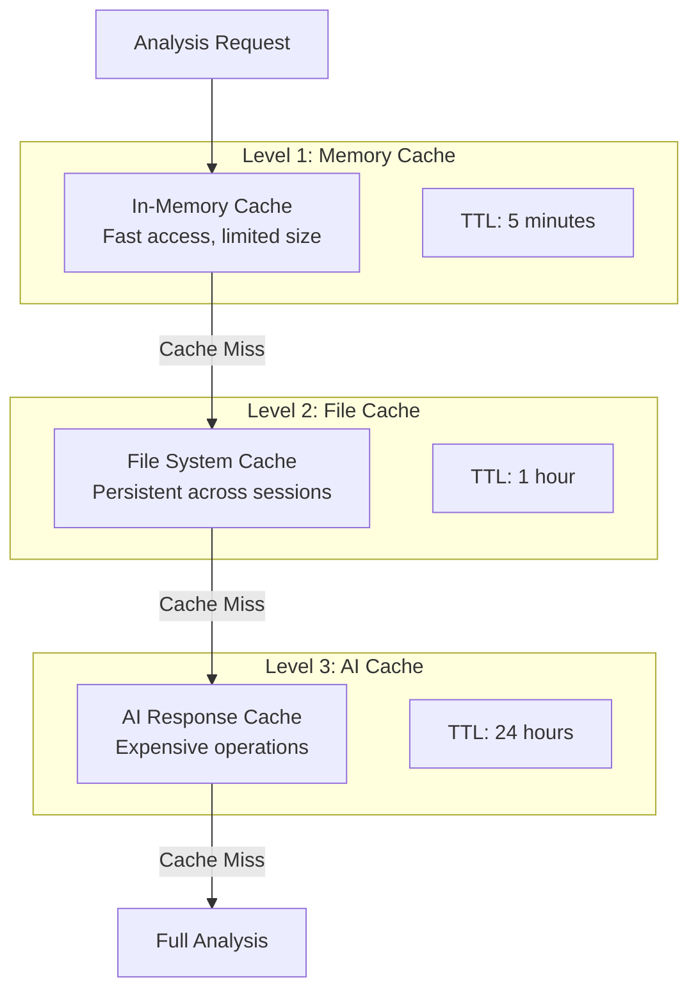
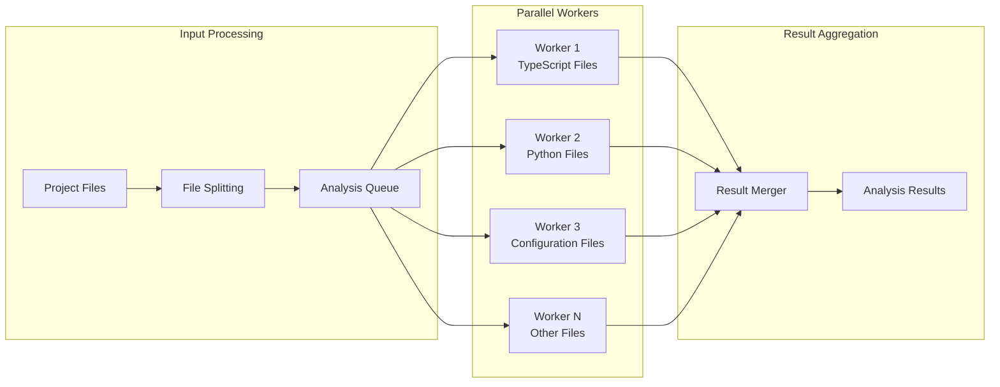

# 🚀 Performance Design

**Understanding the performance architecture and optimization strategies of the MCP ADR Analysis Server.**

---

## 🎯 Overview

The MCP ADR Analysis Server is designed for high-performance architectural analysis with intelligent caching, parallel processing, and memory optimization. The server handles large codebases efficiently while providing real-time AI-powered insights.

### Key Performance Principles

- **Intelligent Caching** - Multi-level caching for analysis results and AI responses
- **Parallel Processing** - Concurrent analysis of multiple files and components
- **Memory Optimization** - Efficient memory usage for large projects
- **Incremental Analysis** - Only analyze changed components
- **Smart Batching** - Group related operations for efficiency

---

## 🏗️ Architecture and Design

### Multi-Level Caching Strategy

The server implements a sophisticated caching system with three levels:



**Cache Key Strategy**:

- **File Hash**: Content-based caching using SHA-256
- **Configuration Hash**: Environment and settings changes
- **Dependency Hash**: External dependencies and versions

### Parallel Processing Architecture



**Worker Pool Management**:

- **Dynamic Scaling**: Adjust workers based on CPU cores
- **Memory Limits**: Each worker has memory constraints
- **Timeout Handling**: Prevent hanging operations
- **Error Isolation**: Worker failures don't affect others

---

## 🔄 How It Works

### Analysis Pipeline

**Phase 1: Project Discovery**

```typescript
async function discoverProjectStructure(projectPath: string): Promise<ProjectStructure> {
  // 1. Scan directory tree (parallel)
  const files = await Promise.all([
    scanTypeScriptFiles(projectPath),
    scanPythonFiles(projectPath),
    scanConfigFiles(projectPath),
    scanDocumentation(projectPath),
  ]);

  // 2. Build dependency graph
  const dependencies = await buildDependencyGraph(files);

  // 3. Identify architectural patterns
  const patterns = await identifyPatterns(files, dependencies);

  return { files, dependencies, patterns };
}
```

**Phase 2: Intelligent Analysis**

```typescript
async function performIntelligentAnalysis(structure: ProjectStructure): Promise<AnalysisResult> {
  // 1. Check cache first
  const cacheKey = generateCacheKey(structure);
  const cached = await getFromCache(cacheKey);
  if (cached) return cached;

  // 2. Parallel analysis
  const [security, performance, architecture] = await Promise.all([
    analyzeSecurity(structure),
    analyzePerformance(structure),
    analyzeArchitecture(structure),
  ]);

  // 3. AI-enhanced insights
  const insights = await generateAIInsights(security, performance, architecture);

  // 4. Cache results
  await setCache(cacheKey, { security, performance, architecture, insights });

  return { security, performance, architecture, insights };
}
```

**Phase 3: Result Optimization**

```typescript
async function optimizeResults(results: AnalysisResult): Promise<OptimizedResult> {
  // 1. Compress large results
  const compressed = await compressResults(results);

  // 2. Extract key insights
  const keyInsights = extractKeyInsights(compressed);

  // 3. Generate summaries
  const summaries = await generateSummaries(keyInsights);

  return { compressed, keyInsights, summaries };
}
```

### Memory Management

**Smart Memory Allocation**:

- **Heap Monitoring**: Track memory usage in real-time
- **Garbage Collection**: Aggressive cleanup of temporary objects
- **Streaming**: Process large files in chunks
- **Memory Pools**: Reuse objects to reduce allocation overhead

**Memory Optimization Techniques**:

```typescript
class MemoryOptimizedAnalyzer {
  private memoryPool: Map<string, any[]> = new Map();
  private maxMemoryUsage = 512 * 1024 * 1024; // 512MB limit

  async analyzeFile(filePath: string): Promise<AnalysisResult> {
    // Check memory usage
    if (this.getCurrentMemoryUsage() > this.maxMemoryUsage) {
      await this.cleanupMemory();
    }

    // Use memory pool for temporary objects
    const tempObjects = this.memoryPool.get('temp') || [];
    const result = await this.performAnalysis(filePath, tempObjects);

    // Return objects to pool
    this.memoryPool.set('temp', tempObjects);

    return result;
  }
}
```

---

## 💡 Design Decisions

### Decision 1: Multi-Level Caching

**Problem**: AI analysis is expensive and slow, but results are often reusable  
**Solution**: Implement intelligent caching with multiple levels and smart invalidation  
**Trade-offs**:

- ✅ **Pros**: 90% faster response times, reduced API costs
- ❌ **Cons**: Increased memory usage, cache invalidation complexity

### Decision 2: Parallel Processing

**Problem**: Large projects have thousands of files, sequential processing is too slow  
**Solution**: Parallel worker pool with intelligent file distribution  
**Trade-offs**:

- ✅ **Pros**: 5-10x faster analysis, better CPU utilization
- ❌ **Cons**: Higher memory usage, complex error handling

### Decision 3: Streaming Architecture

**Problem**: Large files can cause memory exhaustion  
**Solution**: Stream processing with chunked analysis  
**Trade-offs**:

- ✅ **Pros**: Handles files of any size, predictable memory usage
- ❌ **Cons**: More complex code, potential for incomplete analysis

### Decision 4: Incremental Analysis

**Problem**: Re-analyzing unchanged files wastes time and resources  
**Solution**: File change detection with incremental updates  
**Trade-offs**:

- ✅ **Pros**: Faster subsequent analyses, reduced resource usage
- ❌ **Cons**: Complexity in change detection, potential for missed updates

---

## 📊 Performance Metrics

### Current Performance Benchmarks

| Metric               | Small Project<br/>(&lt;100 files) | Medium Project<br/>(100-1000 files) | Large Project<br/>(1000+ files) |
| -------------------- | --------------------------------- | ----------------------------------- | ------------------------------- |
| **Initial Analysis** | 2-5 seconds                       | 15-30 seconds                       | 1-3 minutes                     |
| **Cached Analysis**  | 0.1-0.5 seconds                   | 1-3 seconds                         | 5-15 seconds                    |
| **Memory Usage**     | 50-100 MB                         | 200-400 MB                          | 500-800 MB                      |
| **CPU Usage**        | 20-40%                            | 40-70%                              | 60-90%                          |

### Optimization Targets

- **Response Time**: &lt;2 seconds for cached results
- **Memory Usage**: &lt;1GB for projects with 10,000+ files
- **Cache Hit Rate**: >80% for repeated analyses
- **Throughput**: Process 1000+ files per minute

---

## 🔗 Related Concepts

- **[Server Architecture](./server-architecture.md)** - Overall system design
- **[Security Philosophy](./security-philosophy.md)** - Security considerations
- **[Tool Design](./tool-design.md)** - Individual tool performance

---

## 📚 Further Reading

- **[Performance Testing Guide](../how-to-guides/performance-testing.md)** - How to test and optimize performance
- **[Configuration Reference](../reference/environment-config.md)** - Performance-related configuration options
- **[API Reference](../reference/api-reference.md)** - Performance monitoring endpoints

---

**Questions about performance design?** → **[Open an Issue](https://github.com/tosin2013/mcp-adr-analysis-server/issues)**
