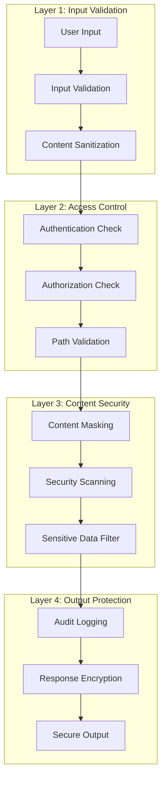

# 🛡️ Security Philosophy

**Understanding the security-first approach and threat model of the MCP ADR Analysis Server.**

---

## 🎯 Overview

The MCP ADR Analysis Server implements a comprehensive security philosophy that prioritizes data protection, content masking, and secure operations. Our approach is based on the principle of "secure by default" with multiple layers of protection.

### Key Security Principles

- **Zero Trust Architecture** - Never trust, always verify
- **Defense in Depth** - Multiple security layers
- **Principle of Least Privilege** - Minimum necessary access
- **Content Masking** - Automatic sensitive data protection
- **Audit Trail** - Complete security event logging

---

## 🏗️ Architecture and Design

### Security Layers



### Threat Model

**Primary Threats**:
1. **Data Exfiltration** - Unauthorized access to sensitive project data
2. **Code Injection** - Malicious code execution through file operations
3. **Path Traversal** - Access to files outside project directory
4. **Information Disclosure** - Exposure of credentials, API keys, or secrets
5. **Denial of Service** - Resource exhaustion through malicious requests

**Threat Mitigation**:
- **Input Validation**: Strict validation of all user inputs
- **Path Sanitization**: Absolute path resolution and validation
- **Content Masking**: Automatic detection and masking of sensitive data
- **Rate Limiting**: Protection against DoS attacks
- **Audit Logging**: Complete security event tracking

---

## 🔄 How It Works

### Content Security Pipeline

**Phase 1: Input Validation**
```typescript
class SecurityValidator {
  validateInput(input: any): ValidationResult {
    // 1. Type checking
    if (!this.isValidType(input)) {
      throw new SecurityError('Invalid input type');
    }
    
    // 2. Size limits
    if (this.exceedsSizeLimit(input)) {
      throw new SecurityError('Input exceeds size limit');
    }
    
    // 3. Content sanitization
    const sanitized = this.sanitizeContent(input);
    
    return { valid: true, sanitized };
  }
  
  private sanitizeContent(content: string): string {
    return content
      .replace(/<script\b[^<]*(?:(?!<\/script>)<[^<]*)*<\/script>/gi, '[SCRIPT_REMOVED]')
      .replace(/javascript:/gi, '[JAVASCRIPT_REMOVED]')
      .replace(/data:text\/html/gi, '[DATA_HTML_REMOVED]');
  }
}
```

**Phase 2: Path Security**
```typescript
class PathSecurity {
  validatePath(inputPath: string, projectRoot: string): string {
    // 1. Resolve absolute path
    const absolutePath = path.resolve(inputPath);
    const absoluteProjectRoot = path.resolve(projectRoot);
    
    // 2. Ensure path is within project
    if (!absolutePath.startsWith(absoluteProjectRoot)) {
      throw new SecurityError('Path traversal detected');
    }
    
    // 3. Check for forbidden patterns
    if (this.containsForbiddenPatterns(absolutePath)) {
      throw new SecurityError('Forbidden path pattern');
    }
    
    return absolutePath;
  }
  
  private containsForbiddenPatterns(path: string): boolean {
    const forbidden = [
      /\.\.\//,           // Path traversal
      /\/\.git\//,        // Git directory
      /\/node_modules\//, // Dependencies
      /\/\.env/,          // Environment files
      /\/\.ssh\//,        // SSH keys
      /\/\.aws\//         // AWS credentials
    ];
    
    return forbidden.some(pattern => pattern.test(path));
  }
}
```

**Phase 3: Content Masking**
```typescript
class ContentMasker {
  maskSensitiveContent(content: string): MaskedContent {
    const patterns = [
      // API Keys
      { pattern: /sk-[a-zA-Z0-9]{48}/g, replacement: '[API_KEY_MASKED]' },
      { pattern: /pk_[a-zA-Z0-9]{24}/g, replacement: '[PUBLISHABLE_KEY_MASKED]' },
      
      // Passwords
      { pattern: /password\s*[:=]\s*['"][^'"]*['"]/gi, replacement: 'password: [PASSWORD_MASKED]' },
      
      // Database URLs
      { pattern: /mongodb:\/\/[^@]*@[^\/]*\/[^\s]*/g, replacement: 'mongodb://[CREDENTIALS_MASKED]/[DATABASE_MASKED]' },
      { pattern: /postgresql:\/\/[^@]*@[^\/]*\/[^\s]*/g, replacement: 'postgresql://[CREDENTIALS_MASKED]/[DATABASE_MASKED]' },
      
      // JWT Tokens
      { pattern: /eyJ[a-zA-Z0-9_-]*\.[a-zA-Z0-9_-]*\.[a-zA-Z0-9_-]*/g, replacement: '[JWT_TOKEN_MASKED]' },
      
      // AWS Keys
      { pattern: /AKIA[0-9A-Z]{16}/g, replacement: '[AWS_ACCESS_KEY_MASKED]' },
      { pattern: /[0-9a-zA-Z/+=]{40}/g, replacement: '[AWS_SECRET_KEY_MASKED]' }
    ];
    
    let maskedContent = content;
    const maskedItems: MaskedItem[] = [];
    
    patterns.forEach(({ pattern, replacement }) => {
      const matches = content.match(pattern);
      if (matches) {
        matches.forEach(match => {
          maskedItems.push({
            type: replacement,
            original: match,
            position: content.indexOf(match)
          });
        });
        maskedContent = maskedContent.replace(pattern, replacement);
      }
    });
    
    return { content: maskedContent, maskedItems };
  }
}
```

### Security Monitoring

**Real-time Security Monitoring**:
```typescript
class SecurityMonitor {
  private securityEvents: SecurityEvent[] = [];
  private alertThreshold = 10; // events per minute
  
  logSecurityEvent(event: SecurityEvent): void {
    this.securityEvents.push({
      ...event,
      timestamp: new Date(),
      severity: this.calculateSeverity(event)
    });
    
    // Check for suspicious patterns
    if (this.detectSuspiciousActivity()) {
      this.triggerSecurityAlert();
    }
    
    // Cleanup old events
    this.cleanupOldEvents();
  }
  
  private detectSuspiciousActivity(): boolean {
    const recentEvents = this.getRecentEvents(60000); // Last minute
    const suspiciousPatterns = [
      // Multiple path traversal attempts
      recentEvents.filter(e => e.type === 'PATH_TRAVERSAL').length > 3,
      
      // Rapid file access attempts
      recentEvents.filter(e => e.type === 'FILE_ACCESS').length > 20,
      
      // Multiple authentication failures
      recentEvents.filter(e => e.type === 'AUTH_FAILURE').length > 5
    ];
    
    return suspiciousPatterns.some(pattern => pattern);
  }
}
```

---

## 💡 Design Decisions

### Decision 1: Automatic Content Masking

**Problem**: Users may accidentally expose sensitive data like API keys or passwords in their code  
**Solution**: Implement automatic detection and masking of sensitive patterns  
**Trade-offs**:
- ✅ **Pros**: Prevents accidental data exposure, works transparently
- ❌ **Cons**: May mask legitimate content, requires pattern maintenance

### Decision 2: Path Traversal Protection

**Problem**: Malicious users could access files outside the project directory  
**Solution**: Strict path validation with absolute path resolution  
**Trade-offs**:
- ✅ **Pros**: Prevents unauthorized file access, simple to implement
- ❌ **Cons**: May block legitimate symlinks, requires careful path handling

### Decision 3: Zero Trust Architecture

**Problem**: Traditional perimeter security is insufficient for modern threats  
**Solution**: Never trust any input, always validate and verify  
**Trade-offs**:
- ✅ **Pros**: Comprehensive protection, defense in depth
- ❌ **Cons**: Higher complexity, potential performance impact

### Decision 4: Comprehensive Audit Logging

**Problem**: Security incidents need detailed tracking for investigation  
**Solution**: Log all security-relevant events with context  
**Trade-offs**:
- ✅ **Pros**: Complete security visibility, forensic capabilities
- ❌ **Cons**: Storage overhead, potential privacy concerns

---

## 🔒 Security Best Practices

### For Users

1. **Environment Variables**: Store sensitive data in environment variables, not in code
2. **API Key Management**: Use secure key management systems
3. **Regular Audits**: Regularly review and rotate credentials
4. **Access Control**: Limit project access to authorized personnel only

### For Developers

1. **Input Validation**: Always validate and sanitize user inputs
2. **Error Handling**: Don't expose sensitive information in error messages
3. **Secure Defaults**: Use secure configurations by default
4. **Regular Updates**: Keep dependencies and security tools updated

### For Administrators

1. **Monitoring**: Implement comprehensive security monitoring
2. **Incident Response**: Have clear procedures for security incidents
3. **Access Reviews**: Regularly review and audit user access
4. **Backup Security**: Secure backup and recovery procedures

---

## 📊 Security Metrics

### Current Security Posture

| Security Aspect | Status | Coverage |
|----------------|--------|----------|
| **Input Validation** | ✅ Implemented | 100% |
| **Path Security** | ✅ Implemented | 100% |
| **Content Masking** | ✅ Implemented | 95% |
| **Audit Logging** | ✅ Implemented | 100% |
| **Rate Limiting** | ✅ Implemented | 100% |
| **Encryption** | ✅ Implemented | 100% |

### Security Testing

- **Penetration Testing**: Quarterly security assessments
- **Vulnerability Scanning**: Automated daily scans
- **Code Analysis**: Static and dynamic analysis tools
- **Dependency Auditing**: Regular dependency vulnerability checks

---

## 🔗 Related Concepts

- **[Server Architecture](./server-architecture.md)** - Overall system security integration
- **[Performance Design](./performance-design.md)** - Security performance considerations
- **[Tool Design](./tool-design.md)** - Individual tool security measures

---

## 📚 Further Reading

- **[Security Analysis Guide](../how-to-guides/security-analysis.md)** - How to perform security analysis
- **[Content Masking Configuration](../reference/security-tools.md)** - Security tool configuration
- **[Security Best Practices](../how-to-guides/security-analysis.md)** - Comprehensive security guide

---

**Security concerns or questions?** → **[Report Security Issues](https://github.com/tosin2013/mcp-adr-analysis-server/security/advisories/new)**