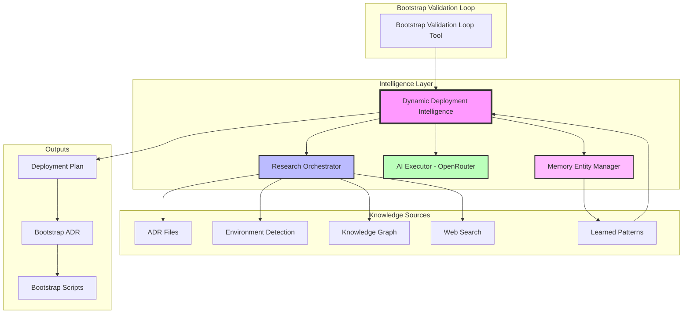
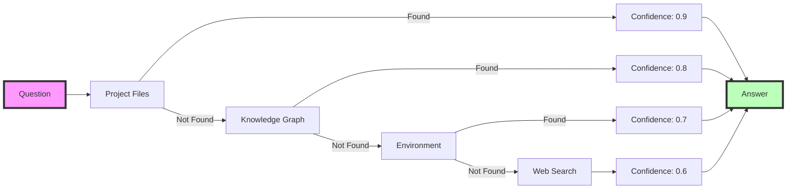
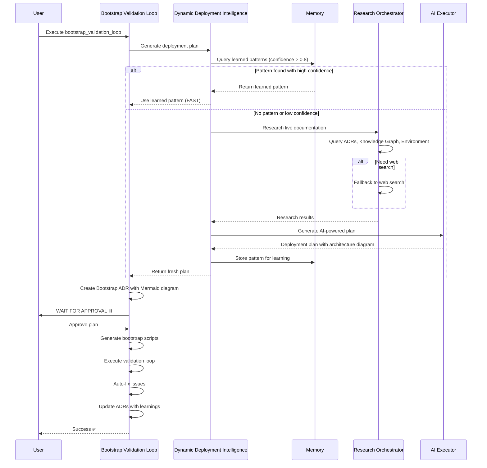
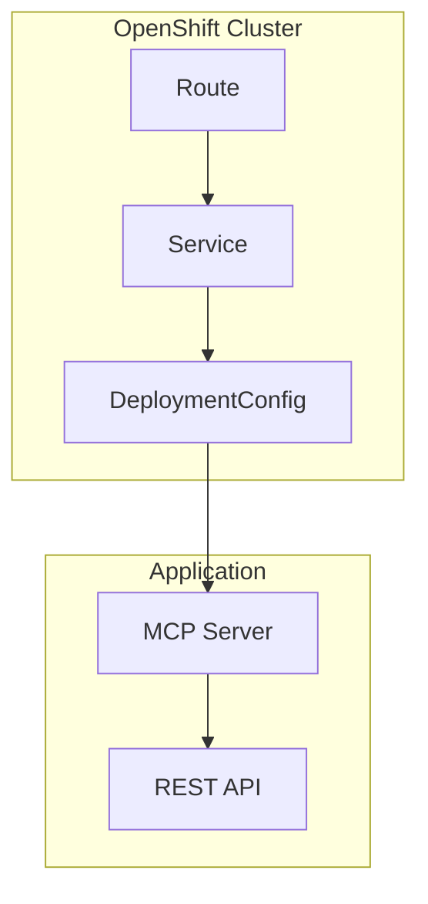

# Self-Learning Architecture System

## Overview

The MCP ADR Analysis Server features a groundbreaking **self-learning architecture system** that combines AI-powered analysis, memory-based pattern recognition, and human oversight to continuously improve deployment intelligence and architectural decision-making.

Unlike traditional static configuration systems, this architecture **learns from every deployment**, stores successful patterns in memory, and uses AI to research current best practices in real-time.

## Core Principles

### 1. Dynamic Over Static

- **Traditional Approach**: Static registry files that become outdated as software evolves
- **Our Approach**: AI + Research queries live documentation, staying current with daily software updates
- **Benefit**: Always uses 2025 best practices, not 2023 templates

### 2. Memory-Centric Learning

- **Store Every Success**: Successful deployment patterns saved as memory entities
- **Query Before Generate**: Check learned patterns (confidence > 0.8) before regenerating
- **Continuous Improvement**: Each deployment teaches the system new patterns

### 3. Human-in-the-Loop

- **AI Generates**: Creates deployment plans with architecture diagrams
- **Human Decides**: Reviews and approves/modifies plans
- **System Learns**: Stores approved patterns for future use

## Architecture Components

### Component Hierarchy



### 1. Dynamic Deployment Intelligence

**Location**: `src/utils/dynamic-deployment-intelligence.ts`

**Purpose**: Core AI-powered system that generates deployment plans by combining multiple intelligence sources.

**Key Methods**:

```typescript
async generateDeploymentPlan(): Promise<DynamicDeploymentPlan> {
  // 1. Detect available platforms (docker, kubectl, oc, etc.)
  const platforms = await this.detectAvailableDeploymentPlatforms();

  // 2. Analyze ADRs for deployment context
  const adrContext = await this.analyzeAdrDeploymentContext();

  // 3. Check memory for learned patterns (confidence > 0.8)
  const learned = await this.queryLearnedDeploymentPatterns(platforms, adrContext);
  if (learned?.confidence > 0.8) {
    return this.enhanceLearnedPattern(learned);
  }

  // 4. Research live documentation
  const research = await this.researchCurrentDeploymentBestPractices(platforms, adrContext);

  // 5. AI-powered synthesis
  const plan = await this.generateAIPoweredDeploymentPlan(platforms, adrContext, research);

  // 6. Store for future learning
  await this.storeDeploymentPattern(plan);

  return plan;
}
```

**Intelligence Sources** (in priority order):

1. **Learned Patterns** (confidence > 0.8) - Fastest, most reliable
2. **AI Research** - Queries live documentation via ResearchOrchestrator
3. **Static Templates** - Fallback only when AI/research fails

### 2. Research Orchestrator

**Location**: `src/utils/research-orchestrator.ts`

**Purpose**: Cascading research system that queries multiple sources with confidence scoring.

**Research Flow**:



**Example Usage**:

```typescript
const answer = await research.answerResearchQuestion(
  `What are the current OpenShift deployment best practices in 2025?`
);

// Returns:
{
  question: "What are the current OpenShift...",
  answer: "OpenShift 4.15+ recommends...",
  sources: [/* ResearchSource objects */],
  confidence: 0.85,
  needsWebSearch: false,
  metadata: { duration: 1234, sourcesQueried: [...] }
}
```

### 3. Memory Entity Manager

**Location**: `src/utils/memory-entity-manager.ts`

**Purpose**: Store and retrieve architectural knowledge as structured entities with relationships.

**Deployment Pattern Storage**:

```typescript
// Store successful deployment
await memory.upsertEntity({
  type: 'knowledge_artifact',
  title: 'Deployment Pattern: OpenShift',
  description: 'Deployment plan for openshift, kubernetes platforms',
  artifactData: {
    artifactType: 'pattern',
    content: JSON.stringify(deploymentPlan),
    format: 'json',
    sourceReliability: 0.95,
    applicabilityScope: ['openshift', 'kubernetes'],
    lastValidated: '2025-01-09T...',
    keyInsights: ['Recommended platform: openshift', 'Confidence: 0.95', 'Required files: 8'],
    actionableItems: [
      /* deployment steps */
    ],
  },
});
```

**Pattern Retrieval**:

```typescript
// Query learned patterns
const result = await memory.queryEntities({
  entityTypes: ['knowledge_artifact'],
  limit: 5,
});

// Filter for matching platforms
for (const entity of result.entities) {
  if (entity.type === 'knowledge_artifact') {
    const plan = JSON.parse(entity.artifactData.content);

    if (plan.detectedPlatforms.includes('openshift') && plan.confidence > 0.8) {
      return plan; // Reuse learned pattern
    }
  }
}
```

### 4. AI Executor

**Location**: `src/utils/ai-executor.ts`

**Purpose**: Execute AI prompts via OpenRouter.ai with caching and retry logic.

**Key Features**:

- Automatic retry with exponential backoff
- Result caching (TTL: 3600s by default)
- Structured JSON output parsing
- Token usage tracking

**Example Usage**:

```typescript
const executor = getAIExecutor();

const result = await executor.executePrompt(
  `
You are an expert DevOps architect. Generate a deployment plan for:
- Platforms: openshift, kubernetes
- Technologies: Node.js, TypeScript, MCP Server

Return JSON with deployment steps, required files, and risks.
`,
  {
    temperature: 0.3,
    maxTokens: 4000,
  }
);

const plan = JSON.parse(result.content);
```

## Workflow: Bootstrap Validation Loop

### Complete Flow



### Step-by-Step Execution

#### Step 0: Platform Detection

Detects available deployment platforms by checking:

- **Files**: Dockerfile, openshift/, k8s/, firebase.json, server.py
- **Commands**: docker, kubectl, oc, firebase, npm, python, uvx
- **Dependencies**: @modelcontextprotocol/sdk, fastmcp

**Example Detection**:

```typescript
// File checks
const fileChecks = [
  { name: 'docker', files: ['Dockerfile', 'docker-compose.yml'] },
  { name: 'kubernetes', files: ['k8s/', 'kubernetes/'] },
  { name: 'openshift', files: ['openshift/', '.s2i/', 'k8s/'] },
  { name: 'mcp-nodejs', files: ['package.json'] },
  { name: 'fastmcp', files: ['server.py', 'pyproject.toml'] },
];

// Command checks
const availableCommands = await Promise.all([
  checkCommand('docker --version'),
  checkCommand('kubectl version --client'),
  checkCommand('oc version --client'),
]);

// Result
detectedPlatforms: ['docker', 'openshift', 'mcp-nodejs'];
```

#### Step 1: ADR Context Analysis

Analyzes existing ADRs to understand deployment context:

```typescript
const techPatterns = [
  /node\.?js/gi,
  /python/gi,
  /docker/gi,
  /kubernetes/gi,
  /openshift/gi,
  /mcp[ -]server/gi,
  /fastmcp/gi,
  /@modelcontextprotocol/gi
];

// Result
adrContext: {
  technologies: ['nodejs', 'docker', 'mcp-server'],
  deploymentMentions: ['openshift deployment', 'container orchestration']
}
```

#### Step 2: Memory Pattern Query

```typescript
const learned = await memory.queryEntities({
  entityTypes: ['knowledge_artifact'],
  limit: 5,
});

// Check each entity
for (const entity of learned.entities) {
  const plan = JSON.parse(entity.artifactData.content);

  // Platform match + high confidence
  if (platformsMatch && plan.confidence > 0.8) {
    console.log('✅ Found learned pattern - reusing!');
    return plan;
  }
}
```

#### Step 3: Live Documentation Research

```typescript
const research = await researchOrchestrator.answerResearchQuestion(
  `What are the current OpenShift deployment best practices in 2025?
   Include required files, configuration, and validation steps.`
);

// Result includes:
{
  answer: "OpenShift 4.15+ recommends using DeploymentConfig with...",
  sources: [
    { source: 'adr://docs/adrs/003-openshift-deployment.md', confidence: 0.9 },
    { source: 'web://docs.openshift.com/latest', confidence: 0.7 }
  ],
  confidence: 0.85
}
```

#### Step 4: AI-Powered Plan Generation

````typescript
const prompt = `You are an expert DevOps architect.

**Available Platforms**: openshift, kubernetes, docker
**Technologies**: nodejs, mcp-server, typescript
**Research Findings**: ${JSON.stringify(research)}

Generate a comprehensive deployment plan in JSON:
{
  "detectedPlatforms": [...],
  "recommendedPlatform": "...",
  "confidence": 0.0-1.0,
  "requiredFiles": [{
    "path": "...",
    "purpose": "...",
    "required": true/false,
    "currentBestPractice": "..." // From research
  }],
  "architectureDiagram": "```mermaid\n...\n```",
  "deploymentSteps": [...],
  "risks": [...]
}`;

const aiResult = await aiExecutor.executePrompt(prompt, {
  temperature: 0.3,
  maxTokens: 4000
});

const plan = JSON.parse(aiResult.content);
````

#### Step 5: Bootstrap ADR Generation

Creates a comprehensive ADR for human review:

````markdown
# Bootstrap Deployment Plan

## Status

PROPOSED - Awaiting human approval

## Context

Detected Platforms: openshift, kubernetes, docker
Recommended Platform: openshift
Confidence: 95.0%
Source: ai-research

## Architecture Diagram


````

## Required Files

### openshift/deployment.yml

- **Purpose**: OpenShift DeploymentConfig
- **Required**: Yes
- **Best Practice**: Use latest apiVersion apps.openshift.io/v1

[... continues with all details ...]

## Decision

**Status**: ⏸️ **AWAITING HUMAN APPROVAL**

Please review:

1. Verify recommended platform
2. Check required files
3. Review security (environment variables)
4. Validate deployment steps
5. Approve or provide feedback

```

#### Step 6: Human Approval

```

⏸️ WAITING FOR HUMAN APPROVAL
Bootstrap ADR created: docs/adrs/bootstrap-deployment-1736438400000.md

Please review the deployment plan before proceeding.

````

The system **pauses** and waits for human review. The architect can:
- ✅ Approve the plan → System executes
- ✏️ Modify the plan → System uses modified version
- ❌ Reject the plan → System regenerates with feedback

#### Step 7: Execution & Validation

Once approved:

```typescript
// Generate scripts from approved plan
await generateBootstrapScripts();

// Execute with validation
const result = await executeBootstrapScript('bootstrap.sh');

// Validate against environment
const validation = await validateExecution(result);

// Auto-fix issues if enabled
if (autoFix && validation.hasIssues) {
  await fixBootstrapIssues(validation.issues);
}

// Update ADRs with learnings (non-sensitive only)
await updateAdrsWithLearnings(result.learnings);
````

#### Step 8: Pattern Storage

```typescript
// Store successful deployment pattern
await memory.upsertEntity({
  type: 'knowledge_artifact',
  title: `Deployment Pattern: ${plan.recommendedPlatform}`,
  description: `Successful deployment on ${new Date().toISOString()}`,
  artifactData: {
    artifactType: 'pattern',
    content: JSON.stringify(plan),
    sourceReliability: plan.confidence,
    applicabilityScope: plan.detectedPlatforms,
    lastValidated: new Date().toISOString(),
  },
});
```

## Supported Platforms

### Container Orchestration

#### OpenShift

- **Detection**: `openshift/`, `.s2i/`, `k8s/`, `oc` command
- **Required Files**:
  - `openshift/deployment.yml` (DeploymentConfig)
  - `openshift/service.yml` (Service)
  - `openshift/route.yml` (Route)
- **Optional**: `.s2i/environment`, `openshift/configmap.yml`
- **Best Practices**: Queries live OpenShift 4.15+ documentation

#### Kubernetes

- **Detection**: `k8s/`, `kubernetes/`, `kubectl` command
- **Required Files**:
  - `k8s/deployment.yaml` (Deployment)
  - `k8s/service.yaml` (Service)
- **Optional**: `k8s/ingress.yaml`
- **Best Practices**: Queries live Kubernetes 1.29+ documentation

#### Docker

- **Detection**: `Dockerfile`, `docker` command
- **Required Files**: `Dockerfile`
- **Optional**: `docker-compose.yml`, `.dockerignore`
- **Best Practices**: Multi-stage builds, security scanning

### MCP Servers

#### Node.js MCP Server

- **Detection**: `package.json` with `@modelcontextprotocol/sdk`
- **Required Files**:
  - `package.json` (with "bin" field)
  - `src/index.ts` (MCP server implementation)
  - `tsconfig.json` (ES modules config)
- **Optional**: `.env`, `examples/claude_desktop_config.json`
- **Validation**: `npx @modelcontextprotocol/inspector dist/index.js`

#### FastMCP (Python)

- **Detection**: `server.py`, `pyproject.toml`, or `requirements.txt` with `fastmcp`
- **Required Files**:
  - `server.py` (FastMCP server)
  - `requirements.txt` (with `fastmcp>=0.1.0`)
- **Optional**: `.env`, `pyproject.toml`
- **Validation**: `python server.py --help`

### Serverless

#### Firebase

- **Detection**: `firebase.json`, `firebase` command
- **Required Files**:
  - `firebase.json`
  - `functions/index.js`
- **Optional**: `functions/.env`

### Traditional

#### Bare Metal / VM

- **Detection**: `systemd/`, `nginx.conf`
- **Optional Files**: `systemd/your-app.service`

## Configuration

### Environment Variables

```bash
# Required for AI execution
OPENROUTER_API_KEY=your_key_here

# AI model selection
AI_MODEL=anthropic/claude-3-sonnet  # Default
# AI_MODEL=anthropic/claude-3-opus  # More powerful
# AI_MODEL=openai/gpt-4-turbo       # Alternative

# Execution mode
EXECUTION_MODE=full  # Use AI for results
# EXECUTION_MODE=prompt  # Return prompts only

# Performance tuning
AI_TEMPERATURE=0.3    # Lower = more consistent
AI_MAX_TOKENS=4000    # Response length limit
AI_CACHE_TTL=3600     # Cache duration (seconds)

# Project configuration
PROJECT_PATH=/path/to/project
ADR_DIRECTORY=docs/adrs
```

### Tool Arguments

```typescript
{
  targetEnvironment: 'production' | 'staging' | 'development',
  autoFix: boolean,              // Auto-fix issues
  captureEnvironmentSnapshot: boolean,  // Save env state
  updateAdrsWithLearnings: boolean,     // Update ADRs after execution
  maxIterations: number          // Max validation loops (default: 3)
}
```

## Advanced Features

### 1. Confidence Scoring

Every intelligence source returns a confidence score:

| Source          | Confidence Range | Usage          |
| --------------- | ---------------- | -------------- |
| Learned Pattern | 0.8 - 1.0        | Reuse if > 0.8 |
| Project Files   | 0.8 - 0.9        | High trust     |
| Knowledge Graph | 0.7 - 0.8        | Medium trust   |
| Environment     | 0.6 - 0.7        | Context-aware  |
| Web Search      | 0.5 - 0.6        | Lowest trust   |

### 2. Pattern Similarity Matching

```typescript
// Check if platforms match
const platformMatch = platforms.some(p => learnedPattern.detectedPlatforms.includes(p));

// Check ADR context similarity
const contextMatch = calculateSimilarity(currentContext.technologies, learnedPattern.technologies);

// Combined score
const matchScore = (platformMatch ? 0.6 : 0) + contextMatch * 0.4;
```

### 3. Fallback Chain

```
1. Learned Patterns (confidence > 0.8)
   ↓ Not found
2. AI + Research (confidence 0.6 - 0.9)
   ↓ AI unavailable
3. Static Templates (confidence 0.5)
   ↓ Template not found
4. Minimal Plan (confidence 0.3)
```

### 4. Incremental Learning

```typescript
// After successful deployment
const updatedPlan = {
  ...originalPlan,
  confidence: Math.min(originalPlan.confidence + 0.05, 1.0),
  successCount: (originalPlan.successCount || 0) + 1,
  lastSuccessful: new Date().toISOString(),
};

await memory.upsertEntity({
  id: originalPatternId,
  ...updatedPlan,
});
```

## Security Considerations

### Sensitive Data Protection

1. **Environment Variables**: Marked as `isSecret: true`
2. **Content Masking**: Applied before storing in memory
3. **ADR Updates**: Only non-sensitive learnings stored
4. **.env Files**: Never committed, always in .gitignore

### Example:

```typescript
// Detect secret files
if (file.isSecret) {
  // Don't store actual content
  file.templateContent = undefined;

  // Mask in ADR updates
  const masked = maskSensitiveContent(file.path);
}
```

## Performance Optimization

### Caching Strategy

```typescript
// Memory lookup: ~50ms (fastest)
const learned = await queryLearnedPattern();
if (learned?.confidence > 0.8) return learned;

// AI execution: ~2-5s (cached: ~100ms)
const cached = cache.get(promptHash);
if (cached && !isExpired(cached)) return cached;

// Research: ~1-3s (depends on sources)
const research = await orchestrator.research();
```

### Parallel Operations

```typescript
// Execute in parallel where possible
const [platforms, adrContext, envSnapshot] = await Promise.all([
  detectAvailableDeploymentPlatforms(),
  analyzeAdrDeploymentContext(),
  captureEnvironmentSnapshot(),
]);
```

## Troubleshooting

### Issue: Low Confidence Plans

**Symptom**: Plans generated with confidence < 0.7

**Solutions**:

1. Add more ADRs with deployment context
2. Execute successful deployments to build learned patterns
3. Check OpenRouter API key is valid
4. Verify research sources are accessible

### Issue: AI Execution Fails

**Symptom**: Falls back to static templates

**Solutions**:

```bash
# Check API key
echo $OPENROUTER_API_KEY

# Test AI executor
npm test -- ai-executor.test.ts

# Enable debug logging
LOG_LEVEL=debug npm start
```

### Issue: No Platforms Detected

**Symptom**: `detectedPlatforms: []`

**Solutions**:

1. Install platform CLI tools (docker, kubectl, oc, firebase)
2. Add platform-specific files (Dockerfile, k8s/, openshift/)
3. Update package.json dependencies

## Future Enhancements

### Planned Features

1. **Multi-Environment Patterns**: Store patterns per environment (dev, staging, prod)
2. **Team Collaboration**: Share learned patterns across team members
3. **A/B Testing**: Compare deployment strategies automatically
4. **Cost Optimization**: Factor in deployment costs when recommending platforms
5. **Compliance Validation**: Ensure deployments meet regulatory requirements

### Research Areas

1. **Reinforcement Learning**: Improve pattern selection based on success metrics
2. **Graph Neural Networks**: Better relationship modeling in knowledge graph
3. **Federated Learning**: Share patterns while preserving privacy
4. **Active Learning**: Ask humans for feedback on uncertain decisions

## Related Documentation

- [Bootstrap Validation Loop Guide](../how-to-guides/interactive-adr-planning.md)
- [Deployment Readiness Tool](../reference/generation-tools.md#deployment-readiness-tool)
- [Knowledge Graph System](./knowledge-graph-architecture.md)
- [Memory Entity Manager](../reference/api-reference.md#memory-entity-manager)

---

**Last Updated**: 2025-01-09
**Version**: 2.1.11
**Contributors**: Claude Code, Human Architect
