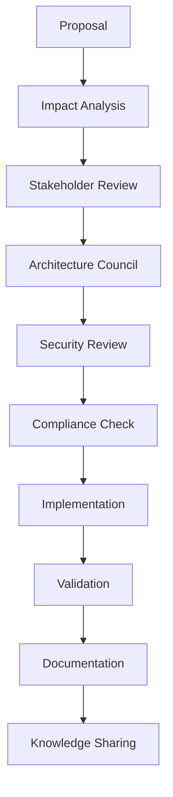

# 🏢 How-To: Large Team Scaling

**Scale MCP ADR Analysis Server for enterprise teams with hundreds of developers across multiple projects and repositories.**

**When to use this guide**: Managing ADRs for 50+ developers, multiple product teams, distributed organizations, or enterprise-scale architectural governance.

---

## 🎯 Quick Enterprise Setup

### Multi-Repository Architecture

**Most Common Use Case**: Coordinate architectural decisions across multiple repositories and teams.

```yaml
# .github/workflows/enterprise-adr-sync.yml
name: Enterprise ADR Synchronization

on:
  schedule:
    - cron: '0 */6 * * *' # Every 6 hours
  workflow_dispatch:

jobs:
  sync-adrs:
    runs-on: ubuntu-latest
    strategy:
      matrix:
        repository:
          - frontend-platform
          - backend-services
          - mobile-apps
          - infrastructure
          - data-platform
    steps:
      - name: Sync ADRs Across Repositories
        env:
          GITHUB_TOKEN: ${{ secrets.ENTERPRISE_GITHUB_TOKEN }}
          OPENROUTER_API_KEY: ${{ secrets.OPENROUTER_API_KEY }}
        run: |
          echo "🔄 Syncing ADRs for ${{ matrix.repository }}"
          # Cross-repository ADR synchronization
```

### Federated ADR Governance

```json
{
  "enterprise_adr_config": {
    "governance_model": "federated",
    "organization_level": {
      "required_adrs": ["security-standards", "data-governance", "compliance-framework"],
      "approval_authority": ["architecture-council", "security-team"]
    },
    "team_level": {
      "autonomy_scope": ["technology-choices", "implementation-patterns", "local-architecture"],
      "escalation_triggers": [
        "cross-team-impact",
        "security-implications",
        "compliance-requirements"
      ]
    }
  }
}
```

---

## 🏗️ Enterprise Architecture Patterns

### 1. Hub-and-Spoke ADR Management

**Central Architecture Team + Autonomous Product Teams**

```yaml
# Enterprise ADR structure
enterprise_structure:
  central_hub:
    path: 'enterprise-adrs/'
    scope: 'organization-wide'
    owners: ['architecture-council']

  product_spokes:
    - name: 'ecommerce-platform'
      path: 'products/ecommerce/adrs/'
      owners: ['ecommerce-architects']

    - name: 'payment-services'
      path: 'products/payments/adrs/'
      owners: ['payments-team']

    - name: 'user-platform'
      path: 'products/users/adrs/'
      owners: ['user-platform-team']
```

**Implementation:**

```bash
#!/bin/bash
# scripts/enterprise-adr-setup.sh

echo "🏢 Setting up enterprise ADR structure..."

# Create central hub
mkdir -p enterprise-adrs/{security,compliance,architecture,data}

# Create product spokes
for product in ecommerce payments users analytics; do
  mkdir -p "products/$product/adrs"

  # Copy enterprise templates
  cp enterprise-adrs/templates/* "products/$product/adrs/"

  echo "✅ Created ADR structure for $product"
done

echo "🎯 Enterprise ADR structure ready"
```

### 2. Matrix Organization Support

**Cross-Functional Teams + Domain Expertise**

```json
{
  "matrix_organization": {
    "functional_teams": {
      "security": {
        "repositories": ["all"],
        "adr_types": ["security-*", "*-compliance", "*-privacy"],
        "review_authority": "mandatory"
      },
      "platform": {
        "repositories": ["infrastructure", "platform-*"],
        "adr_types": ["infrastructure-*", "platform-*"],
        "review_authority": "advisory"
      },
      "data": {
        "repositories": ["data-*", "*-analytics"],
        "adr_types": ["data-*", "*-analytics", "*-ml"],
        "review_authority": "mandatory"
      }
    },
    "product_teams": {
      "autonomy_level": "high",
      "escalation_matrix": {
        "security_impact": "security-team",
        "platform_impact": "platform-team",
        "data_impact": "data-team"
      }
    }
  }
}
```

### 3. Geographic Distribution

**Multi-Region Teams with Time Zone Considerations**

```yaml
# .github/workflows/global-adr-coordination.yml
name: Global ADR Coordination

on:
  pull_request:
    paths: ['**/adrs/**']

jobs:
  coordinate-reviews:
    runs-on: ubuntu-latest
    steps:
      - name: Determine Review Regions
        id: regions
        run: |
          # Determine which regions need to review based on impact
          echo "regions=us-east,eu-west,asia-pacific" >> $GITHUB_OUTPUT

      - name: Schedule Async Reviews
        run: |
          echo "📅 Scheduling reviews across time zones..."
          # 24-hour review window for global teams

      - name: Notify Regional Teams
        run: |
          echo "🌍 Notifying regional architecture teams..."
          # Region-specific notifications
```

---

## 📊 Enterprise Metrics and Governance

### 1. Organization-Wide ADR Dashboard

```yaml
# .github/workflows/enterprise-dashboard.yml
name: Enterprise ADR Dashboard

on:
  schedule:
    - cron: '0 8 * * 1' # Monday mornings
  workflow_dispatch:

jobs:
  generate-dashboard:
    runs-on: ubuntu-latest
    steps:
      - name: Collect Cross-Repository Metrics
        env:
          GITHUB_TOKEN: ${{ secrets.ENTERPRISE_GITHUB_TOKEN }}
        run: |
          echo "📊 Collecting enterprise ADR metrics..."

          # Metrics to collect:
          # - ADR coverage per team/repository
          # - Decision implementation rates
          # - Cross-team impact analysis
          # - Compliance adherence scores

      - name: Generate Executive Summary
        run: |
          echo "📈 Generating executive dashboard..."
          # High-level metrics for leadership

      - name: Update Confluence/SharePoint
        run: |
          echo "📋 Updating enterprise documentation..."
          # Push to enterprise documentation platform
```

### 2. Compliance and Audit Tracking

```json
{
  "compliance_framework": {
    "regulations": ["SOX", "GDPR", "HIPAA", "PCI-DSS"],
    "audit_requirements": {
      "decision_traceability": "mandatory",
      "approval_workflows": "documented",
      "change_impact_analysis": "required",
      "retention_period": "7_years"
    },
    "automated_checks": {
      "security_decisions": "all_changes",
      "data_decisions": "data_related_changes",
      "financial_decisions": "payment_related_changes"
    }
  }
}
```

### 3. Performance at Scale

```yaml
# Enterprise performance configuration
performance_config:
  analysis_optimization:
    batch_processing: true
    parallel_repositories: 10
    cache_strategy: 'distributed'

  resource_management:
    memory_limit: '8GB'
    cpu_cores: 4
    timeout_minutes: 30

  scaling_thresholds:
    repositories: 100
    developers: 500
    adrs_per_month: 1000
```

---

## 🔄 Workflow Orchestration

### 1. Enterprise ADR Lifecycle



**Implementation:**

```yaml
# .github/workflows/enterprise-adr-lifecycle.yml
name: Enterprise ADR Lifecycle

on:
  pull_request:
    paths: ['**/adrs/**']

jobs:
  impact-analysis:
    runs-on: ubuntu-latest
    steps:
      - name: Analyze Cross-Team Impact
        run: |
          echo "🔍 Analyzing impact across teams..."
          # Identify affected teams and systems

  stakeholder-review:
    needs: impact-analysis
    runs-on: ubuntu-latest
    steps:
      - name: Notify Stakeholders
        run: |
          echo "👥 Notifying relevant stakeholders..."
          # Auto-assign reviewers based on impact

  architecture-council:
    needs: stakeholder-review
    if: contains(github.event.pull_request.labels.*.name, 'architecture-council-review')
    runs-on: ubuntu-latest
    steps:
      - name: Schedule Council Review
        run: |
          echo "🏛️ Scheduling architecture council review..."

  security-review:
    needs: stakeholder-review
    if: contains(github.event.pull_request.labels.*.name, 'security-impact')
    runs-on: ubuntu-latest
    steps:
      - name: Security Team Review
        run: |
          echo "🔒 Initiating security review..."

  compliance-check:
    needs: [architecture-council, security-review]
    runs-on: ubuntu-latest
    steps:
      - name: Compliance Validation
        run: |
          echo "📋 Validating compliance requirements..."
```

### 2. Automated Escalation

```yaml
# Escalation rules for enterprise teams
escalation_rules:
  time_based:
    - trigger: 'no_response_24h'
      action: 'notify_manager'
    - trigger: 'no_response_48h'
      action: 'escalate_to_director'

  impact_based:
    - trigger: 'high_impact_decision'
      action: 'require_architecture_council'
    - trigger: 'security_implications'
      action: 'require_security_team'
    - trigger: 'compliance_risk'
      action: 'require_legal_review'

  complexity_based:
    - trigger: 'cross_team_dependencies > 3'
      action: 'schedule_design_review'
    - trigger: 'technical_debt_impact > high'
      action: 'require_tech_lead_approval'
```

### 3. Knowledge Management Integration

```yaml
# Integration with enterprise knowledge systems
knowledge_integration:
  confluence:
    auto_publish: true
    spaces: ['Architecture', 'Engineering', 'Security']

  sharepoint:
    document_library: 'Architecture Decisions'
    approval_workflow: true

  slack:
    channels: ['#architecture', '#engineering-leads']
    notifications: ['new_adr', 'decision_approved', 'implementation_complete']

  teams:
    channels: ['Architecture Council', 'Security Team']
    meeting_integration: true
```

---

## 🚀 Technology and Tool Integration

### 1. Enterprise Tool Stack

```yaml
# Enterprise integration configuration
enterprise_tools:
  identity_management:
    provider: 'Azure AD / Okta'
    sso_integration: true
    rbac_mapping: true

  project_management:
    jira_integration:
      project_keys: ['ARCH', 'SEC', 'PLAT']
      issue_linking: true

  communication:
    slack_enterprise:
      workspace_integration: true
      channel_automation: true

  documentation:
    confluence_integration:
      space_automation: true
      template_management: true

  monitoring:
    datadog_integration:
      custom_metrics: true
      dashboard_automation: true
```

### 2. API Gateway for Enterprise Access

```typescript
// Enterprise API gateway configuration
interface EnterpriseConfig {
  authentication: {
    provider: 'enterprise-sso';
    tokenValidation: 'jwt';
    roleBasedAccess: true;
  };

  rateLimit: {
    perUser: 1000;
    perTeam: 10000;
    perOrganization: 100000;
  };

  audit: {
    logAllRequests: true;
    retentionPeriod: '7years';
    complianceReporting: true;
  };
}
```

### 3. Multi-Tenant Architecture

```yaml
# Multi-tenant configuration for large organizations
multi_tenant_config:
  tenant_isolation:
    data_separation: 'strict'
    resource_quotas: 'per_tenant'

  tenant_management:
    auto_provisioning: true
    billing_integration: true
    usage_analytics: true

  customization:
    branding: 'per_tenant'
    workflows: 'configurable'
    integrations: 'tenant_specific'
```

---

## 📈 Scaling Strategies

### 1. Horizontal Scaling

```yaml
# Kubernetes deployment for enterprise scale
apiVersion: apps/v1
kind: Deployment
metadata:
  name: mcp-adr-analysis-enterprise
spec:
  replicas: 10
  selector:
    matchLabels:
      app: mcp-adr-analysis
  template:
    spec:
      containers:
        - name: mcp-adr-server
          image: mcp-adr-analysis:enterprise
          resources:
            requests:
              memory: '2Gi'
              cpu: '1000m'
            limits:
              memory: '4Gi'
              cpu: '2000m'
          env:
            - name: EXECUTION_MODE
              value: 'full'
            - name: CACHE_STRATEGY
              value: 'distributed'
```

### 2. Performance Optimization

```typescript
// Enterprise performance configuration
interface PerformanceConfig {
  caching: {
    strategy: 'distributed-redis';
    ttl: 3600; // 1 hour
    maxSize: '10GB';
  };

  processing: {
    batchSize: 100;
    parallelWorkers: 8;
    queueManagement: 'priority-based';
  };

  optimization: {
    lazyLoading: true;
    incrementalAnalysis: true;
    resultCaching: true;
  };
}
```

### 3. Disaster Recovery

```yaml
# Enterprise disaster recovery
disaster_recovery:
  backup_strategy:
    frequency: 'hourly'
    retention: '30_days'
    cross_region: true

  failover:
    automatic: true
    rto: '15_minutes' # Recovery Time Objective
    rpo: '5_minutes' # Recovery Point Objective

  monitoring:
    health_checks: 'continuous'
    alerting: 'multi_channel'
    escalation: 'automated'
```

---

## 🔒 Enterprise Security and Compliance

### 1. Security Architecture

```yaml
# Enterprise security configuration
security_architecture:
  network_security:
    vpc_isolation: true
    private_subnets: true
    waf_protection: true

  data_protection:
    encryption_at_rest: 'AES-256'
    encryption_in_transit: 'TLS-1.3'
    key_management: 'enterprise-hsm'

  access_control:
    zero_trust: true
    mfa_required: true
    session_management: 'enterprise-grade'
```

### 2. Compliance Automation

```yaml
# .github/workflows/compliance-automation.yml
name: Compliance Automation

on:
  schedule:
    - cron: '0 2 * * *' # Daily compliance checks

jobs:
  sox-compliance:
    if: contains(github.repository.topics, 'sox-regulated')
    runs-on: ubuntu-latest
    steps:
      - name: SOX Compliance Check
        run: |
          echo "📋 Running SOX compliance validation..."

  gdpr-compliance:
    if: contains(github.repository.topics, 'gdpr-applicable')
    runs-on: ubuntu-latest
    steps:
      - name: GDPR Compliance Check
        run: |
          echo "🇪🇺 Running GDPR compliance validation..."

  hipaa-compliance:
    if: contains(github.repository.topics, 'hipaa-regulated')
    runs-on: ubuntu-latest
    steps:
      - name: HIPAA Compliance Check
        run: |
          echo "🏥 Running HIPAA compliance validation..."
```

---

## 📚 Enterprise Best Practices

### 1. Governance Framework

- **Clear Authority**: Define decision-making authority at each level
- **Escalation Paths**: Establish clear escalation procedures
- **Accountability**: Assign ownership for architectural decisions
- **Transparency**: Ensure decisions are visible across the organization

### 2. Change Management

- **Impact Assessment**: Analyze cross-team and system impacts
- **Stakeholder Engagement**: Involve all affected parties
- **Communication**: Maintain clear communication channels
- **Training**: Provide ongoing training and support

### 3. Quality Assurance

- **Standardization**: Establish organization-wide standards
- **Automation**: Automate compliance and quality checks
- **Monitoring**: Continuous monitoring of decision outcomes
- **Improvement**: Regular process improvement cycles

---

## 🔗 Related Documentation

- **[Team Collaboration](../tutorials/team-collaboration.md)** - Multi-team collaboration patterns
- **[CI/CD Integration](cicd-integration.md)** - Enterprise CI/CD workflows
- **[Security Analysis](security-analysis.md)** - Enterprise security practices

---

**Need help scaling for your enterprise?** → **[File an Issue](https://github.com/tosin2013/mcp-adr-analysis-server/issues)** or **[Contact Enterprise Support](mailto:enterprise@mcp-adr-analysis.com)**
