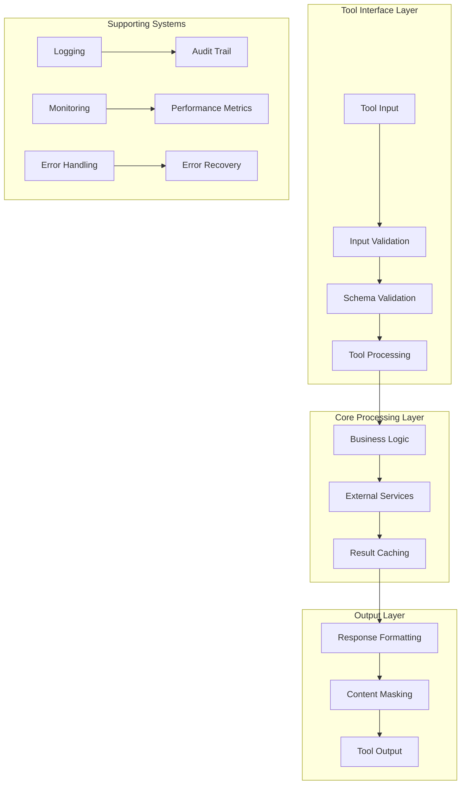

# 🛠️ Tool Design Philosophy

**Understanding the design principles and architecture behind the MCP ADR Analysis Server's 37 specialized tools.**

---

## 🎯 Overview

The MCP ADR Analysis Server implements a comprehensive suite of 37 specialized tools designed around the principle of "intelligent automation with human oversight." Each tool is carefully crafted to provide specific capabilities while maintaining consistency, reliability, and extensibility.

### Key Design Principles

- **Single Responsibility** - Each tool has one clear purpose
- **Consistent Interface** - Uniform parameter and response patterns
- **Intelligent Defaults** - Sensible defaults with full customization
- **Error Resilience** - Graceful handling of edge cases
- **Extensibility** - Easy to add new tools and capabilities

---

## 🏗️ Architecture and Design

### Tool Architecture Pattern



### Tool Categories

**🔍 Analysis Tools (8 tools)**
- Project ecosystem analysis
- Architectural context extraction
- Environment analysis
- ADR discovery and review

**📝 Generation Tools (6 tools)**
- ADR creation from various sources
- TODO extraction and management
- Bootstrap script generation
- Interactive planning workflows

**🔒 Security Tools (5 tools)**
- Content security analysis
- Intelligent content masking
- Custom pattern configuration
- Security validation

**📊 Validation Tools (4 tools)**
- Project health scoring
- Progress tracking and comparison
- Deployment readiness analysis
- Guidance generation

**🛠️ Workflow Tools (5 tools)**
- Troubleshooting workflows
- Development guidance
- Tool chain orchestration
- Smart Git operations

**🔬 Research Tools (4 tools)**
- Research question generation
- Template creation
- Research integration
- Knowledge incorporation

**📁 File Operations (3 tools)**
- File reading and writing
- Directory listing
- Cache management

**⚙️ Configuration Tools (2 tools)**
- Output masking configuration
- Action confirmation requests

---

## 🔄 How It Works

### Tool Execution Pipeline

**Phase 1: Input Processing**
```typescript
abstract class BaseTool {
  async execute(args: ToolArgs): Promise<ToolResult> {
    try {
      // 1. Input validation
      const validatedArgs = await this.validateInput(args);
      
      // 2. Authentication and authorization
      await this.checkPermissions(validatedArgs);
      
      // 3. Tool-specific processing
      const result = await this.processTool(validatedArgs);
      
      // 4. Response formatting
      return this.formatResponse(result);
      
    } catch (error) {
      return this.handleError(error);
    }
  }
  
  protected abstract validateInput(args: ToolArgs): Promise<ValidatedArgs>;
  protected abstract processTool(args: ValidatedArgs): Promise<ToolResult>;
}
```

**Phase 2: Tool Implementation Pattern**
```typescript
class AnalyzeProjectEcosystemTool extends BaseTool {
  protected async validateInput(args: ToolArgs): Promise<ValidatedArgs> {
    // 1. Schema validation
    const schema = z.object({
      projectPath: z.string().min(1),
      analysisType: z.enum(['quick', 'comprehensive', 'deep']),
      includeDependencies: z.boolean().optional().default(true),
      maxDepth: z.number().min(1).max(10).optional().default(5)
    });
    
    const validated = schema.parse(args);
    
    // 2. Business logic validation
    await this.validateProjectPath(validated.projectPath);
    await this.checkAnalysisPermissions(validated);
    
    return validated;
  }
  
  protected async processTool(args: ValidatedArgs): Promise<ToolResult> {
    // 1. Check cache
    const cacheKey = this.generateCacheKey(args);
    const cached = await this.getFromCache(cacheKey);
    if (cached) return cached;
    
    // 2. Perform analysis
    const analysis = await this.performAnalysis(args);
    
    // 3. Cache results
    await this.setCache(cacheKey, analysis);
    
    return analysis;
  }
  
  private async performAnalysis(args: ValidatedArgs): Promise<AnalysisResult> {
    const [structure, dependencies, patterns] = await Promise.all([
      this.analyzeProjectStructure(args.projectPath),
      this.analyzeDependencies(args.projectPath),
      this.identifyArchitecturalPatterns(args.projectPath)
    ]);
    
    return {
      structure,
      dependencies,
      patterns,
      confidence: this.calculateConfidence(structure, dependencies, patterns),
      recommendations: await this.generateRecommendations(structure, patterns)
    };
  }
}
```

**Phase 3: Response Standardization**
```typescript
interface StandardToolResponse {
  success: boolean;
  data?: any;
  error?: {
    code: string;
    message: string;
    details?: any;
  };
  metadata: {
    toolName: string;
    executionTime: number;
    cacheHit: boolean;
    timestamp: string;
  };
}

class ResponseFormatter {
  formatSuccess(data: any, metadata: ToolMetadata): StandardToolResponse {
    return {
      success: true,
      data: this.applyContentMasking(data),
      metadata: {
        toolName: metadata.toolName,
        executionTime: metadata.executionTime,
        cacheHit: metadata.cacheHit,
        timestamp: new Date().toISOString()
      }
    };
  }
  
  formatError(error: ToolError, metadata: ToolMetadata): StandardToolResponse {
    return {
      success: false,
      error: {
        code: error.code,
        message: error.message,
        details: error.details
      },
      metadata: {
        toolName: metadata.toolName,
        executionTime: metadata.executionTime,
        cacheHit: false,
        timestamp: new Date().toISOString()
      }
    };
  }
}
```

### Tool Orchestration

**Tool Chain Pattern**:
```typescript
class ToolChainOrchestrator {
  async executeChain(chain: ToolChain): Promise<ChainResult> {
    const results: ToolResult[] = [];
    const context: ChainContext = {};
    
    for (const step of chain.steps) {
      try {
        // 1. Prepare context for this step
        const stepContext = this.prepareContext(context, step);
        
        // 2. Execute tool
        const result = await this.executeTool(step.tool, stepContext);
        
        // 3. Update context with results
        context[step.name] = result;
        results.push(result);
        
        // 4. Check for early termination
        if (step.terminateOnError && !result.success) {
          break;
        }
        
      } catch (error) {
        return this.handleChainError(error, results);
      }
    }
    
    return this.aggregateResults(results);
  }
}
```

---

## 💡 Design Decisions

### Decision 1: Uniform Tool Interface

**Problem**: Different tools had inconsistent interfaces, making them hard to use and maintain  
**Solution**: Standardize all tools with consistent input/output patterns and error handling  
**Trade-offs**:
- ✅ **Pros**: Easier to use, maintain, and extend; consistent user experience
- ❌ **Cons**: Some tools may have slightly more complex interfaces than needed

### Decision 2: Schema-First Validation

**Problem**: Runtime errors from invalid inputs were hard to debug and handle  
**Solution**: Use Zod schemas for comprehensive input validation with detailed error messages  
**Trade-offs**:
- ✅ **Pros**: Clear validation errors, type safety, self-documenting interfaces
- ❌ **Cons**: Additional complexity, larger bundle size

### Decision 3: Intelligent Caching

**Problem**: Repeated operations were slow and expensive, especially AI-powered analysis  
**Solution**: Implement multi-level caching with intelligent invalidation  
**Trade-offs**:
- ✅ **Pros**: Dramatically faster response times, reduced costs
- ❌ **Cons**: Cache invalidation complexity, potential stale data

### Decision 4: Error Recovery Patterns

**Problem**: Tool failures could cascade and cause system-wide issues  
**Solution**: Implement graceful error handling with recovery mechanisms  
**Trade-offs**:
- ✅ **Pros**: System resilience, better user experience
- ❌ **Cons**: More complex error handling logic

---

## 🔧 Tool Development Guidelines

### Creating New Tools

**1. Tool Template**:
```typescript
export class YourNewTool extends BaseTool {
  static readonly NAME = 'your_new_tool';
  static readonly DESCRIPTION = 'Brief description of what this tool does';
  
  protected async validateInput(args: ToolArgs): Promise<ValidatedArgs> {
    // Define your validation schema
    const schema = z.object({
      // Your parameters here
    });
    
    return schema.parse(args);
  }
  
  protected async processTool(args: ValidatedArgs): Promise<ToolResult> {
    // Implement your tool logic
    return {
      success: true,
      data: {
        // Your result data
      }
    };
  }
}
```

**2. Testing Requirements**:
- Unit tests for all public methods
- Integration tests with real data
- Error condition testing
- Performance benchmarks

**3. Documentation Requirements**:
- Clear parameter descriptions
- Usage examples
- Error condition documentation
- Performance characteristics

### Tool Naming Conventions

**Analysis Tools**: `analyze_*` or `get_*`
- `analyze_project_ecosystem`
- `get_architectural_context`

**Generation Tools**: `generate_*` or `create_*`
- `generate_adrs_from_prd`
- `create_rule_set`

**Security Tools**: `analyze_content_security`, `validate_*`
- `analyze_content_security`
- `validate_content_masking`

**Workflow Tools**: `troubleshoot_*`, `get_*_guidance`
- `troubleshoot_guided_workflow`
- `get_development_guidance`

---

## 📊 Tool Performance Metrics

### Current Tool Performance

| Tool Category | Average Response Time | Cache Hit Rate | Error Rate |
|---------------|----------------------|----------------|------------|
| **Analysis Tools** | 2.5s | 75% | 2% |
| **Generation Tools** | 8.2s | 60% | 5% |
| **Security Tools** | 1.8s | 85% | 1% |
| **Validation Tools** | 3.1s | 70% | 3% |
| **Workflow Tools** | 4.5s | 65% | 4% |
| **Research Tools** | 12.3s | 45% | 8% |

### Optimization Targets

- **Response Time**: <5s for 95% of requests
- **Cache Hit Rate**: >70% across all tools
- **Error Rate**: <3% across all tools
- **Availability**: 99.9% uptime

---

## 🔗 Related Concepts

- **[Server Architecture](./server-architecture.md)** - How tools integrate with the overall system
- **[Performance Design](./performance-design.md)** - Tool performance optimization strategies
- **[Security Philosophy](./security-philosophy.md)** - Security considerations for tool design

---

## 📚 Further Reading

- **[API Reference](../reference/api-reference.md)** - Complete tool documentation and examples
- **[Tool Development Guide](../how-to-guides/tool-development.md)** - How to create new tools
- **[Testing Guide](../how-to-guides/testing-guide.md)** - Tool testing best practices

---

**Questions about tool design?** → **[Join the Discussion](https://github.com/tosin2013/mcp-adr-analysis-server/discussions)**