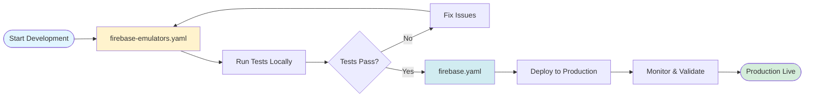

# Firebase Patterns Comparison

**Date**: 2025-01-23
**Status**: Active

## Overview

The MCP ADR Analysis Server now includes **two complementary Firebase validated patterns** that work together to provide a complete development-to-production workflow:

1. **firebase.yaml** - Production Firebase deployment
2. **firebase-emulators.yaml** - Local testing with Firebase emulators ⭐ **(NEW)**

---

## Pattern Comparison

| Aspect           | firebase.yaml                             | firebase-emulators.yaml                      |
| ---------------- | ----------------------------------------- | -------------------------------------------- |
| **Pattern ID**   | `firebase-v1`                             | `firebase-emulators-v1`                      |
| **Strategy**     | `serverless`                              | `emulator-first`                             |
| **Primary Use**  | Production deployment                     | Local testing & development                  |
| **When to Use**  | Deploying to production Firebase          | Testing before production                    |
| **Key Features** | Cloud Functions, Firestore, Auth, Hosting | Local emulator suite, security rules testing |
| **Environment**  | Google Cloud / Firebase                   | Local development machine                    |
| **Dependencies** | Firebase CLI, Node.js                     | Firebase CLI, Node.js, **Java 11+**          |
| **Cost**         | Production Firebase pricing               | **FREE** (local emulators)                   |

---

## Workflow Integration

### Recommended Development Flow



### Step-by-Step Process

1. **Local Development** (Use `firebase-emulators.yaml`)

   ```bash
   # Start emulators
   firebase emulators:start --project=demo-project

   # Run tests against emulators
   npm test

   # Test security rules locally
   firebase emulators:exec "npm run test:rules"
   ```

2. **Production Deployment** (Use `firebase.yaml`)
   ```bash
   # After local tests pass, deploy to production
   firebase deploy --only firestore:rules
   firebase deploy --only functions
   firebase deploy --only hosting
   ```

---

## Key Differences

### firebase-emulators.yaml (Local Testing)

**Purpose**: Test Firebase services locally without touching production

**Advantages**:

- ✅ **FREE** - No production costs during development
- ✅ **Fast** - Instant feedback, no network latency
- ✅ **Safe** - Cannot affect production data
- ✅ **Offline** - Work without internet connection
- ✅ **Reproducible** - Consistent test environment
- ✅ **Security Rules Testing** - Test rules before deployment

**Key Components**:

- Emulator Suite (Auth, Firestore, Functions, Storage, etc.)
- Emulator UI (http://localhost:4000)
- Security rules unit testing
- Test data import/export
- CI/CD integration

**Configuration Files**:

```json
// firebase.json - Emulator ports configuration
{
  "emulators": {
    "auth": { "port": 9099 },
    "firestore": { "port": 8080 },
    "functions": { "port": 5001 },
    "ui": { "enabled": true, "port": 4000 }
  }
}
```

**Authoritative Source**:

- 🎓 **Emulators Codelab**: https://github.com/firebase/emulators-codelab
- Step-by-step hands-on tutorial
- Learn emulator-first workflow
- Best practices and examples

---

### firebase.yaml (Production Deployment)

**Purpose**: Deploy Firebase services to production Google Cloud infrastructure

**Advantages**:

- ✅ **Production-grade** - Real Firebase infrastructure
- ✅ **Scalable** - Handles production traffic
- ✅ **Monitored** - Firebase Console monitoring
- ✅ **Global CDN** - Firebase Hosting with CDN
- ✅ **Backup & Recovery** - Production data safety

**Key Components**:

- Cloud Functions deployment
- Firestore/Realtime Database deployment
- Firebase Authentication setup
- Firebase Hosting deployment
- Storage rules deployment

**Configuration Files**:

```json
// firebase.json - Production configuration
{
  "firestore": {
    "rules": "firestore.rules",
    "indexes": "firestore.indexes.json"
  },
  "functions": {
    "source": "functions"
  },
  "hosting": {
    "public": "public"
  }
}
```

---

## Detection Logic

The bootstrap validation loop tool will detect which pattern to use based on:

### Emulator Pattern Detection

**Triggers**: `firebase-emulators.yaml`

- Project has `firebase.json` with emulator configuration
- Running in development environment
- `--project=demo-project` flag detected
- Emulator ports specified in firebase.json
- Test files present (e.g., `tests/`, `*.test.js`)

### Production Pattern Detection

**Triggers**: `firebase.yaml`

- Project has `firebase.json` without emulator config (or emulators disabled)
- Running in production/staging environment
- Real Firebase project ID in `.firebaserc`
- Production deployment command detected

---

## Best Practices

### Development Workflow

1. **Always start with emulators** (firebase-emulators.yaml)

   ```bash
   # Initial setup
   firebase init emulators
   firebase emulators:start
   ```

2. **Write tests against emulators**

   ```javascript
   // Use emulator ports in tests
   const firebaseConfig = {
     // ... config
   };

   if (process.env.NODE_ENV === 'test') {
     firebase.firestore().useEmulator('localhost', 8080);
     firebase.auth().useEmulator('http://localhost:9099');
   }
   ```

3. **Test security rules locally**

   ```javascript
   // tests/firestore.rules.test.js
   import { assertSucceeds, assertFails } from '@firebase/rules-unit-testing';

   test('user can read their own data', async () => {
     await assertSucceeds(userDb.collection('users').doc('user1').get());
   });
   ```

4. **Deploy to production only after tests pass**

   ```bash
   # All tests pass locally?
   npm test

   # Deploy to production
   firebase deploy
   ```

### CI/CD Integration

**Use emulators in CI/CD pipeline**:

```yaml
# .github/workflows/firebase-test.yml
name: Firebase Tests

on: [push, pull_request]

jobs:
  test:
    runs-on: ubuntu-latest
    steps:
      - uses: actions/checkout@v3
      - uses: actions/setup-node@v3
      - uses: actions/setup-java@v3 # Required for emulators
        with:
          java-version: '11'

      - name: Install dependencies
        run: npm ci

      - name: Run tests with emulators
        run: firebase emulators:exec --project=demo-project "npm test"
```

---

## Common Scenarios

### Scenario 1: New Firebase Project

**Use both patterns in sequence**:

```bash
# 1. Initialize project
firebase init

# 2. Start local development (firebase-emulators.yaml)
firebase emulators:start --project=demo-project

# 3. Write code and tests

# 4. Test locally
npm test

# 5. Deploy to production (firebase.yaml)
firebase deploy
```

### Scenario 2: Existing Firebase Project

**Add emulator testing**:

```bash
# 1. Add emulator support
firebase init emulators

# 2. Export production data for testing (optional)
firebase firestore:export ./emulator-data

# 3. Start emulators with production data
firebase emulators:start --import=./emulator-data
```

### Scenario 3: Team Development

**Share emulator configuration**:

```bash
# Commit to version control
git add firebase.json .firebaserc
git commit -m "Add Firebase emulator configuration"

# Team members can now run
firebase emulators:start
```

---

## Troubleshooting

### Issue: "Which pattern should I use?"

**Answer**: Use **both**!

- Use `firebase-emulators.yaml` during development (local testing)
- Use `firebase.yaml` for production deployment

### Issue: "Emulators won't start"

**Check**:

1. Java 11+ installed: `java -version`
2. No port conflicts: `lsof -i :8080`
3. Firebase CLI updated: `npm install -g firebase-tools@latest`

### Issue: "Tests pass locally but fail in production"

**Causes**:

- Security rules differences between emulator and production
- Network latency issues (emulators are instant, production has latency)
- Environment-specific configuration

**Solution**:

- Test security rules thoroughly in emulators
- Use realistic test data
- Test with production-like network conditions

---

## Migration Guide

### From Production-Only to Emulator-First

**Before** (production-only):

```bash
# Write code
vim functions/index.js

# Deploy and pray 🙏
firebase deploy

# Debug in production (bad!)
firebase functions:log
```

**After** (emulator-first):

```bash
# Write code
vim functions/index.js

# Test locally first ✅
firebase emulators:start
npm test

# Deploy with confidence
firebase deploy
```

### Adding Emulators to Existing Project

1. **Initialize emulators**:

   ```bash
   firebase init emulators
   ```

2. **Update firebase.json**:

   ```json
   {
     "emulators": {
       "auth": { "port": 9099 },
       "firestore": { "port": 8080 },
       "functions": { "port": 5001 },
       "ui": { "enabled": true }
     }
   }
   ```

3. **Write tests**:

   ```javascript
   // tests/functions.test.js
   import * as functions from '../functions';

   describe('Cloud Functions', () => {
     test('onCreate trigger works', async () => {
       // Test against emulators
     });
   });
   ```

4. **Run tests locally**:
   ```bash
   firebase emulators:exec "npm test"
   ```

---

## Pattern Selection Matrix

| Your Situation          | Use Pattern               | Reason                    |
| ----------------------- | ------------------------- | ------------------------- |
| Writing new code        | `firebase-emulators.yaml` | Test locally first        |
| Running tests           | `firebase-emulators.yaml` | Free, fast, safe          |
| Testing security rules  | `firebase-emulators.yaml` | Test before production    |
| CI/CD pipeline          | `firebase-emulators.yaml` | Automated testing         |
| Deploying to staging    | `firebase.yaml`           | Real Firebase environment |
| Deploying to production | `firebase.yaml`           | Production deployment     |
| Team collaboration      | Both                      | Local dev + production    |

---

## Resources

### Firebase Emulators (firebase-emulators.yaml)

- 📚 [Emulator Suite Documentation](https://firebase.google.com/docs/emulator-suite)
- 🎓 [Emulators Codelab](https://github.com/firebase/emulators-codelab) ⭐
- 🔧 [Security Rules Unit Testing](https://firebase.google.com/docs/rules/unit-tests)

### Production Firebase (firebase.yaml)

- 📚 [Firebase Documentation](https://firebase.google.com/docs)
- 🎓 [Firebase Codelabs](https://firebase.google.com/codelabs)
- 🚀 [Cloud Functions Documentation](https://firebase.google.com/docs/functions)

---

## Conclusion

**Use both patterns for a complete Firebase development workflow**:

1. 🧪 **Develop & Test Locally** → `firebase-emulators.yaml`
   - Fast iteration
   - Free testing
   - Safe experimentation

2. 🚀 **Deploy to Production** → `firebase.yaml`
   - Proven code
   - Tested security rules
   - Confident deployment

**Result**: Faster development, fewer production bugs, lower costs! 🎉

---

**Last Updated**: 2025-01-23
**Patterns Location**: `patterns/infrastructure/`
**Status**: Active and maintained
