```mermaid
flowchart TD
    Start([Start Deployment]) --> Detect[Detect Platform from ADRs]
    Detect --> LoadADR[Read Technology Decisions]
    LoadADR --> GenScripts[Generate Deploy Scripts]
    GenScripts --> Phase1[Prerequisites Validation]
    Phase1 --> Phase2[Infrastructure Setup]
    Phase2 --> Phase3[Database Deployment]
    Phase3 --> Phase4[Application Deployment]
    Phase4 --> Validate{Validation<br/>Passed?}
    Validate -->|No| Fix[Auto-fix Issues]
    Fix --> Phase4
    Validate -->|Yes| Success([✅ Deployment Success])

    style Start fill:#e1f5ff
    style Success fill:#d4edda
    style Fix fill:#f8d7da
```

```mermaid
flowchart TD
    Start([Check Deployment Readiness]) --> Tests[Run All Tests]

    Tests --> Unit[Unit Tests]
    Tests --> Integration[Integration Tests]
    Tests --> E2E[End-to-End Tests]

    Unit --> Coverage{Test Coverage<br/>≥80%?}
    Integration --> Coverage
    E2E --> Coverage

    Coverage -->|No| Block1[❌ BLOCKED<br/>Insufficient Coverage]
    Coverage -->|Yes| Failures{Test<br/>Failures?}

    Failures -->|Yes| Block2[❌ BLOCKED<br/>0 failures]
    Failures -->|No| Quality[Code Quality Checks]

    Quality --> ADR[ADR Compliance Check]
    ADR --> Ready[✅ READY TO DEPLOY]

    Block1 --> Report[Generate Detailed<br/>Failure Report]
    Block2 --> Report

    style Start fill:#e1f5ff
    style Ready fill:#d4edda
    style Block1 fill:#f8d7da
    style Block2 fill:#f8d7da
```

```mermaid
graph TB
    subgraph "Test Pyramid"
        E2E[End-to-End Tests<br/>10% of tests]
        Integration[Integration Tests<br/>30% of tests]
        Unit[Unit Tests<br/>60% of tests]
    end

    E2E --> Integration
    Integration --> Unit

    Unit --> Coverage{Coverage<br/>≥80%?}
    Coverage -->|Yes| Pass[✅ Tests Pass]
    Coverage -->|No| Fail[❌ Blocked]

    style E2E fill:#fff3cd
    style Integration fill:#cfe2ff
    style Unit fill:#e1f5ff
    style Pass fill:#d4edda
    style Fail fill:#f8d7da
```

# Mermaid Diagrams Reference

## Overview

The MCP ADR Analysis Server automatically generates mermaid diagrams in ADRs and tool outputs to help visualize workflows, architectures, and processes. This reference documents all available diagram types and when they are used.

## Diagram Utility Module

**Location**: `src/utils/mermaid-diagrams.ts`

**Purpose**: Provides standardized mermaid diagram generation for consistent visual documentation across all tools.

## Available Diagram Types

### 1. Interactive ADR Planning Workflow

**Used by**: `interactive_adr_planning_tool`

**Purpose**: Show the 7-phase ADR planning process with current phase highlighted

**Example Output**:


**When Generated**:
- When completing the interactive ADR planning session
- In the final ADR document generated from the planning process

**Code Example**:
```typescript
import { MermaidDiagrams, WorkflowPhase } from '../utils/mermaid-diagrams.js';

const phases: WorkflowPhase[] = [
  { id: 'problem_definition', name: 'Problem\nDefinition', order: 1, status: 'completed' },
  { id: 'research_analysis', name: 'Research &\nAnalysis', order: 2, status: 'in_progress' },
  // ... more phases
];

const diagram = MermaidDiagrams.generateInteractiveADRWorkflow(phases, 'research_analysis');
```

---

### 2. Deployment Sequence Diagram

**Used by**: `deployment_guidance_tool`, `bootstrap_validation_loop_tool`

**Purpose**: Show the sequence of interactions from ADRs to deployed environment

**Example Output**:


**When Generated**:
- In deployment guidance documents
- In bootstrap ADRs
- In deployment documentation

**Code Example**:
```typescript
import { MermaidDiagrams, DeploymentStep } from '../utils/mermaid-diagrams.js';

const steps: DeploymentStep[] = [
  { phase: '1', participant: 'User', target: 'Tool', action: 'Generate deployment guidance' },
  { phase: '1', participant: 'Tool', target: 'ADR', action: 'Read architectural decisions' },
  // ... more steps
];

const diagram = MermaidDiagrams.generateDeploymentSequence(steps, 'production');
```

---

### 3. Deployment Workflow Diagram

**Used by**: `deployment_guidance_tool`, `bootstrap_validation_loop_tool`

**Purpose**: Show the complete deployment workflow with validation and retry logic

**Example Output**:



**When Generated**:
- In deployment guidance documents
- In bootstrap deployment plans
- In deployment ADRs

**Code Example**:
```typescript
const diagram = MermaidDiagrams.generateDeploymentWorkflow('kubernetes', [
  'Prerequisites Validation',
  'Infrastructure Setup',
  'Database Deployment',
  'Application Deployment'
]);
```

---

### 4. Implicit Decision Detection Flow

**Used by**: `adr_suggestion_tool`

**Purpose**: Visualize how the tool detects implicit architectural decisions in code

**Example Output**:


**When Generated**:
- In ADR suggestion reports
- In implicit decision analysis outputs
- In code analysis documentation

**Code Example**:
```typescript
const diagram = MermaidDiagrams.generateImplicitDecisionFlow();
```

---

### 5. Code Change Analysis Flow

**Used by**: `adr_suggestion_tool`

**Purpose**: Show the sequence of analyzing code changes for architectural impact

**Example Output**:


**When Generated**:
- In code change analysis reports
- In ADR suggestions based on commits
- In architectural impact assessments

**Code Example**:
```typescript
const diagram = MermaidDiagrams.generateCodeChangeAnalysisFlow();
```

---

### 6. Deployment Readiness Validation Flow

**Used by**: `deployment_readiness_tool`

**Purpose**: Show the zero-tolerance validation process with all gates

**Example Output**:



**When Generated**:
- In deployment readiness reports
- In deployment blocking messages
- In CI/CD validation outputs

**Code Example**:
```typescript
const diagram = MermaidDiagrams.generateDeploymentReadinessFlow(true); // strict mode
```

---

### 7. Test Validation Pyramid

**Used by**: `deployment_readiness_tool`

**Purpose**: Show the test coverage distribution and requirements

**Example Output**:



**When Generated**:
- In deployment readiness reports
- In test validation outputs
- In quality assurance documentation

**Code Example**:
```typescript
const diagram = MermaidDiagrams.generateTestValidationPyramid();
```

---

### 8. Tool Orchestration Flow

**Used by**: `tool_chain_orchestrator`

**Purpose**: Show how AI chains multiple tools together with dependencies and retry logic

**Example Output**:


**When Generated**:
- In tool orchestration plans
- In AI workflow outputs
- In tool chain documentation

**Code Example**:
```typescript
const tools = [
  { name: 'analyze_project_ecosystem', order: 1 },
  { name: 'suggest_adrs', order: 2, depends: ['analyze_project_ecosystem'] },
  { name: 'generate_adr_from_decision', order: 3, depends: ['suggest_adrs'] }
];

const diagram = MermaidDiagrams.generateToolOrchestrationFlow(tools);
```

---

## Styling Standards

All diagrams use consistent color schemes:

### Status Colors
- **Start/Input**: `#e1f5ff` (light blue)
- **In Progress**: `#fff3cd` (yellow)
- **Success**: `#d4edda` (green)
- **Error/Blocked**: `#f8d7da` (red)
- **Warning**: `#fff3cd` (yellow)
- **Info**: `#d1ecf1` (light cyan)
- **Pending**: `#f8f9fa` (light gray)

### Example Styling:
```mermaid
style Start fill:#e1f5ff
style Success fill:#d4edda
style Error fill:#f8d7da
```

## Helper Functions

### sanitizeMermaidLabel

Sanitizes text for use in mermaid diagram labels.

```typescript
import { MermaidDiagrams } from '../utils/mermaid-diagrams.js';

const label = MermaidDiagrams.sanitizeMermaidLabel('User [Admin] -> "Action"');
// Returns: 'User (Admin) -> 'Action''
```

### generateStateFlow

Generate a simple state diagram from a list of states.

```typescript
const states = [
  { id: 'idle', label: 'Idle State', type: 'start' },
  { id: 'processing', label: 'Processing' },
  { id: 'complete', label: 'Complete', type: 'end' }
];

const diagram = MermaidDiagrams.generateStateFlow(states);
```

## Usage Guidelines

### For Tool Developers

**When to add diagrams**:
- Multi-step workflows that benefit from visualization
- Complex decision trees or validation flows
- Sequence interactions between components
- State transitions and lifecycle management

**How to add diagrams**:

1. Import the module:
```typescript
import { MermaidDiagrams } from '../utils/mermaid-diagrams.js';
```

2. Generate diagram in your tool output:
```typescript
const diagram = MermaidDiagrams.generateDeploymentWorkflow('kubernetes', phases);
return {
  content: [{
    type: 'text',
    text: `# My Tool Output\n\n${diagram}\n\n## Details...`
  }]
};
```

3. Test the diagram renders correctly in your tool's output

### For AI Prompts

When tools use AI execution mode, include diagram generation instructions in prompts:

```typescript
const prompt = `
Generate deployment guidance with the following mermaid diagram:

${MermaidDiagrams.generateDeploymentSequence(steps, environment)}

Use this diagram in your output to visualize the deployment flow.
`;
```

### For End Users

Diagrams appear automatically in:
- Generated ADRs
- Tool outputs
- Documentation
- Reports

They are rendered as mermaid code blocks that GitHub, GitLab, and many markdown viewers support natively.

## Testing Diagrams

### Manual Testing

1. Generate a tool output with a diagram
2. Copy the mermaid code block
3. Paste into [Mermaid Live Editor](https://mermaid.live/)
4. Verify it renders correctly

### Automated Testing

```typescript
import { MermaidDiagrams } from '../utils/mermaid-diagrams.js';

// Test that diagram starts with mermaid code block
const diagram = MermaidDiagrams.generateImplicitDecisionFlow();
expect(diagram).toMatch(/^```mermaid/);
expect(diagram).toMatch(/```$/);
```

## Troubleshooting

### Diagram doesn't render

**Problem**: Mermaid code block shows as plain text

**Solutions**:
- Ensure your markdown viewer supports mermaid
- Check code block uses triple backticks with `mermaid` language tag
- Verify mermaid syntax is valid

### Syntax errors in diagram

**Problem**: "Syntax error in graph" message

**Solutions**:
- Use `sanitizeMermaidLabel()` for user-provided text
- Avoid special characters in node IDs
- Check arrow syntax (`-->`, `->`, `-->>`)
- Verify graph type matches syntax (graph/flowchart/sequenceDiagram)

### Diagram too complex

**Problem**: Diagram is hard to read with many nodes

**Solutions**:
- Break into multiple focused diagrams
- Use subgraphs to group related nodes
- Simplify by hiding implementation details
- Use collapsible sections for detailed flows

## Contributing

### Adding New Diagram Types

1. Add generator function to `src/utils/mermaid-diagrams.ts`
2. Add TypeScript types for parameters
3. Add to `MermaidDiagrams` export object
4. Document in this reference
5. Add tests
6. Update tools to use the new diagram type

### Example:

```typescript
export function generateMyNewDiagram(data: MyData): string {
  return `\`\`\`mermaid
graph TD
    Start --> End
\`\`\`
`;
}

// Add to exports
export const MermaidDiagrams = {
  // ... existing
  generateMyNewDiagram,
};
```

## Tools Using Mermaid Diagrams

The following MCP tools now automatically generate mermaid diagrams in their outputs:

### ✅ Production Tools with Diagrams

1. **interactive_adr_planning_tool** (`src/tools/interactive-adr-planning-tool.ts`)
   - Generates: Interactive ADR workflow, detailed planning flow
   - When: During ADR generation from planning session
   - Benefit: Shows users the 7-phase planning process they completed

2. **deployment_guidance_tool** (`src/tools/deployment-guidance-tool.ts`)
   - Generates: Deployment sequence diagram, deployment workflow diagram (via AI prompt templates)
   - When: When generating deployment guidance from ADRs
   - Benefit: AI-generated guidance includes visual deployment flows

3. **adr_suggestion_tool** (`src/tools/adr-suggestion-tool.ts`)
   - Generates: Implicit decision detection flow, code change analysis flow
   - When: When suggesting ADRs based on code analysis
   - Benefit: Shows how the tool detects architectural decisions

4. **deployment_readiness_tool** (`src/tools/deployment-readiness-tool.ts`)
   - Generates: Deployment readiness validation flow, test validation pyramid
   - When: When checking deployment readiness (especially when blocking deployment)
   - Benefit: Visualizes zero-tolerance validation gates

5. **bootstrap_validation_loop_tool** (`src/tools/bootstrap-validation-loop-tool.ts`)
   - Generates: Architecture overview, component integration, deployment workflow, resource cleanup (via ADR-010)
   - When: When bootstrapping deployment for a project
   - Benefit: End users see complete deployment architecture and workflow

6. **tool_chain_orchestrator** (`src/tools/tool-chain-orchestrator.ts`)
   - Generates: Tool orchestration flow
   - When: When AI generates a tool execution plan
   - Benefit: Shows how tools are chained together with dependencies

### 📊 Coverage Statistics

- **Total diagram types**: 8 generator functions
- **Tools with diagrams**: 6 out of ~25 tools
- **ADR-generating tools covered**: 6 out of 6 major ADR tools (100%)
- **Lines of diagram code**: 528 lines in mermaid-diagrams.ts

## Related Documentation

- [Bootstrap Deployment Architecture ADR](../adrs/adr-010-bootstrap-deployment-architecture.md)
- [Interactive ADR Planning Tool](../how-to-guides/interactive-adr-planning.md)
- [Deployment Readiness Guide](../how-to-guides/deployment-readiness.md)
- [Tool Chain Orchestrator](../how-to-guides/tool-orchestration.md)

---

**Last Updated**: 2025-01-23
**Module**: `src/utils/mermaid-diagrams.ts`
**Status**: Active and maintained
**Maintainer Note**: Diagrams are automatically included in tool outputs. No additional configuration needed.
