# 🎓 Tutorial 1: Your First MCP ADR Analysis

**Learning Goal**: By the end of this tutorial, you'll understand MCP basics and have created your first architectural decision record.

**Prerequisites**:

- Node.js ≥20.0.0 installed
- Basic understanding of software architecture
- Text editor or IDE

**Time Required**: 30 minutes

---

## 📚 What You'll Learn

1. **MCP Fundamentals** - What is Model Context Protocol and how it works
2. **Server Setup** - Installing and configuring the MCP ADR Analysis Server
3. **First Analysis** - Running your first project analysis
4. **Creating ADRs** - Generating your first architectural decision record
5. **Next Steps** - Where to go from here

---

## 🔧 Step 1: Understanding MCP

**Model Context Protocol (MCP)** connects AI assistants to external tools and data sources. Think of it as a bridge that lets your AI assistant:

- **Access Files** - Read and write files in your project
- **Run Analysis** - Execute specialized analysis tools
- **Generate Content** - Create documents, code, and recommendations
- **Maintain Context** - Remember information across conversations

### How MCP ADR Analysis Server Fits In

```mermaid
graph TB
    You[👤 You] --> AI[🤖 AI Assistant]
    AI --> MCP[📡 MCP Protocol]
    MCP --> Server[🏗️ ADR Analysis Server]
    Server --> Project[📁 Your Project]
    Server --> Analysis[📊 Architecture Analysis]
    Server --> ADRs[📋 Generated ADRs]
```



The MCP ADR Analysis Server specializes in:

- **Project Analysis** - Understanding your codebase and architecture
- **Decision Discovery** - Finding architectural decisions that need documentation
- **ADR Generation** - Creating professional architectural decision records
- **Progress Tracking** - Monitoring implementation of architectural decisions

---

## 🚀 Step 2: Installation and Setup

### Install the Server

```bash
# Global installation (recommended for learning)
npm install -g mcp-adr-analysis-server

# Verify installation
mcp-adr-analysis-server --version
```

You should see output like: `MCP ADR Analysis Server v2.1.0`

### Configure Your MCP Client

Add this configuration to your MCP client (e.g., Claude Desktop):

```json
{
  "mcpServers": {
    "adr-analysis": {
      "command": "mcp-adr-analysis-server",
      "env": {
        "PROJECT_PATH": "/path/to/your/project",
        "OPENROUTER_API_KEY": "your_openrouter_api_key_here",
        "EXECUTION_MODE": "full",
        "AI_MODEL": "anthropic/claude-3-sonnet",
        "ADR_DIRECTORY": "docs/adrs",
        "LOG_LEVEL": "ERROR"
      }
    }
  }
}
```

**Important Configuration Notes**:

- Replace `/path/to/your/project` with your actual project path
- Get your OpenRouter API key from [https://openrouter.ai/keys](https://openrouter.ai/keys)
- `EXECUTION_MODE: "full"` enables AI-powered analysis (use `"prompt-only"` for basic mode)
- `AI_MODEL` specifies which AI model to use (optional, defaults to claude-3-sonnet)
- `LOG_LEVEL: "ERROR"` reduces console output (use "INFO" or "DEBUG" for more details)

### Test the Connection

In your MCP client, try this simple command:

```
analyze_project_ecosystem
```

If you see detailed analysis output, you're ready to proceed! 🎉

### Initialize the Memory System

**Important**: To enable the intelligent memory features (pattern recognition, relationship inference, etc.), you need to load your ADRs into the memory system first:

```json
{
  "tool": "memory_loading",
  "parameters": {
    "action": "load_adrs",
    "forceReload": true
  }
}
```

This command will:

- Discover all ADRs in your configured directory
- Transform them into memory entities
- Build relationship graphs between decisions
- Enable intelligent pattern recognition
- Populate the `.mcp-adr-memory` directory

After running this, your memory system will be actively learning from your architectural decisions and providing intelligent insights!

**Note**: The server works in two modes:

- **`EXECUTION_MODE: "full"`** - AI-powered analysis with intelligent insights (requires OpenRouter API key)
- **`EXECUTION_MODE: "prompt-only"`** - Basic analysis with structured prompts for manual AI use

For the full learning experience, we recommend using "full" mode with an OpenRouter API key.

---

## 🔍 Step 3: Your First Project Analysis

Let's analyze a project to understand what the server can do. The MCP ADR Analysis Server uses **research-driven architecture** to query your live environment instead of relying on static analysis alone.

### What is Research-Driven Analysis?

Research-driven analysis works by:

1. **Cascading through multiple sources** in order of reliability:
   - Your project files and code
   - Existing knowledge graph of ADRs and decisions
   - Live environment resources (Docker, Kubernetes, OpenShift, Ansible)
   - Web search (fallback for external context)

2. **Confidence scoring** (0-1 scale) determines result reliability
3. **Live environment detection** automatically discovers available tools
4. **Red Hat ecosystem support** for OpenShift (`oc`), Podman, and Ansible

**Why Research-Driven?** This approach helps LLMs with less domain knowledge by providing real-time context from your actual infrastructure instead of guessing or hallucinating.

### First: Load ADRs into Memory (If You Have Any)

If your project already has ADRs in the `docs/adrs` directory (or your configured ADR directory), load them into the memory system first:

```json
{
  "tool": "memory_loading",
  "parameters": {
    "action": "load_adrs",
    "forceReload": true
  }
}
```

This populates the `.mcp-adr-memory` directory and enables intelligent pattern recognition.

### Create a Sample Project

If you don't have a project ready, create a simple one:

```bash
mkdir my-learning-project
cd my-learning-project

# Create a simple Node.js project
npm init -y

# Add some basic files
echo "const express = require('express');" > server.js
echo "# My Learning Project" > README.md
mkdir src docs
```

### Run Comprehensive Analysis

In your MCP client, run:

```json
{
  "tool": "analyze_project_ecosystem",
  "parameters": {
    "projectPath": ".",
    "enhancedMode": true,
    "recursiveDepth": "comprehensive"
  }
}
```

### Understanding the Results

The analysis will show you:

1. **🏗️ Technology Stack** - Languages, frameworks, and tools detected
2. **📁 Project Structure** - Directory organization and patterns
3. **🔍 Architecture Patterns** - Design patterns and architectural styles found
4. **⚠️ Identified Issues** - Potential problems or improvements
5. **💡 Recommendations** - Suggested next steps and improvements

**Exercise**: Look through the analysis results and identify:

- What programming language(s) were detected?
- What project structure pattern was identified?
- What recommendations were made?

### Research-Driven Analysis in Action

Now let's explore the **`perform_research`** tool, which uses the research-orchestrator to answer questions about your project:

```json
{
  "tool": "perform_research",
  "parameters": {
    "question": "What deployment infrastructure is currently available in this project?",
    "projectPath": ".",
    "adrDirectory": "docs/adrs"
  }
}
```

**What You'll See:**

```markdown
## Research Results
**Confidence**: 85.0% ✓

### Answer
The project has Docker and Kubernetes available. Found docker-compose.yml
configuration for local development and Kubernetes manifests in k8s/ directory.

### Sources Consulted
✓ Project Files: Analyzed 45 files
✓ Knowledge Graph: Found 2 related ADRs
✓ Environment: Detected docker, kubectl
✗ Web Search: Not needed (confidence above threshold)

### Key Findings
- Docker: Container orchestration available
- Kubernetes: kubectl configured and accessible
- Infrastructure decisions documented in ADR-003
```

**Understanding Confidence Scores:**
- **≥70%**: High confidence, results are reliable
- **60-69%**: Medium confidence, consider web search fallback
- **<60%**: Low confidence, automatic web search triggered

**Exercise**: Try asking research questions about:
1. "What database technology is used in this project?"
2. "Are there any container orchestration tools configured?"
3. "What testing frameworks are available?"

---

## 📋 Step 4: Creating Your First ADR

Now let's create an architectural decision record based on your project analysis.

### Discover What Decisions Need Documentation

```json
{
  "tool": "suggest_adrs",
  "parameters": {
    "projectPath": ".",
    "analysisScope": "all",
    "maxSuggestions": 3
  }
}
```

This will suggest 3 architectural decisions that should be documented.

### Generate Your First ADR

Pick one of the suggested decisions and create an ADR:

```json
{
  "tool": "generate_adr_from_decision",
  "parameters": {
    "decisionData": {
      "title": "Web Framework Selection",
      "context": "Need to choose a web framework for the HTTP API",
      "decision": "Express.js",
      "rationale": "Widely adopted, excellent ecosystem, team familiarity",
      "consequences": [
        "Fast development",
        "Large community support",
        "Potential performance limitations for high-scale scenarios"
      ]
    },
    "adrDirectory": "docs/adrs"
  }
}
```

### Review Your ADR

Check the `docs/adrs/` directory. You should see a new file like `001-web-framework-selection.md`.

**Exercise**: Open the ADR file and review:

- Is the structure clear and professional?
- Does the rationale make sense for your project?
- Are the consequences realistic?

### Load Your New ADR into Memory

Now that you've created an ADR, load it into the memory system to enable intelligent insights:

```json
{
  "tool": "memory_loading",
  "parameters": {
    "action": "load_adrs",
    "forceReload": true
  }
}
```

This will process your new ADR and start building the knowledge graph that powers the intelligent features.

### Validate ADR Against Reality

Use the new **research-driven ADR validation** to check if your documented decision matches actual implementation:

```json
{
  "tool": "validate_adr",
  "parameters": {
    "adrPath": "docs/adrs/001-web-framework-selection.md",
    "projectPath": ".",
    "includeEnvironmentCheck": true,
    "confidenceThreshold": 0.6
  }
}
```

**What This Does:**
1. **Reads your ADR** to understand the documented decision
2. **Researches live environment** to check actual implementation
3. **Compares documentation vs reality** with confidence scoring
4. **Reports gaps or drift** between decision and implementation

**Example Result:**

```markdown
## ADR Validation: Web Framework Selection

**Research Confidence**: 78.0% ✓

### Implementation Status: ✓ MATCHES
- Express.js detected in package.json (v4.18.2)
- Express routes found in src/routes/
- Middleware patterns consistent with documented decision

### Environment Check: ✓ PASSED
- Node.js v20.0.0 (meets requirements)
- npm packages installed correctly
- No conflicting frameworks detected

### Validation Result: ADR accurately reflects current implementation
```

**Exercise**: Validate all your ADRs at once:

```json
{
  "tool": "validate_all_adrs",
  "parameters": {
    "projectPath": ".",
    "adrDirectory": "docs/adrs",
    "includeEnvironmentCheck": true,
    "minConfidence": 0.6
  }
}
```

---

## 📈 Step 5: Track Implementation Progress

ADRs aren't just documentation - they're implementation roadmaps.

### Generate TODO Items

```json
{
  "tool": "generate_adr_todo",
  "parameters": {
    "adrDirectory": "docs/adrs",
    "todoFormat": "both",
    "includePriorities": true
  }
}
```

This creates a `TODO.md` file with actionable tasks based on your ADR.

### Check Progress

As you implement the decisions, track progress:

```json
{
  "tool": "compare_adr_progress",
  "parameters": {
    "todoPath": "TODO.md",
    "adrDirectory": "docs/adrs"
  }
}
```

---

## 🎯 Step 6: Understanding What You've Accomplished

Congratulations! You've just:

✅ **Set up MCP** - Connected an AI assistant to powerful analysis tools  
✅ **Analyzed Architecture** - Used AI to understand your project structure  
✅ **Created Professional ADRs** - Generated industry-standard architectural documentation  
✅ **Established Process** - Set up a system for tracking architectural decisions

### Key Concepts You've Learned

1. **MCP Protocol** - How AI assistants connect to external tools
2. **Project Analysis** - Automated discovery of architectural patterns
3. **ADR Generation** - Creating structured architectural decision records
4. **Implementation Tracking** - Monitoring progress on architectural decisions

---

## 🚀 Next Steps

Now that you understand the basics, you can:

### **Immediate Next Steps**

- **[Tutorial 2: Working with Existing Projects](02-existing-projects.md)** - Learn to analyze codebases with existing architecture
- **[Tutorial 3: Advanced Analysis Techniques](03-advanced-analysis.md)** - Explore security scanning, deployment readiness, and more

### **Explore Specific Use Cases**

- **[How-To: Handle Security Concerns](../how-to-guides/security-analysis.md)** - Scan for sensitive content and credentials
- **[How-To: Prepare for Deployment](../how-to-guides/deployment-readiness.md)** - Validate your project is ready for production

### **Deep Dive into Features**

- **[API Reference](../reference/api-reference.md)** - Complete documentation of all 37 available tools
- **[Architecture Concepts](../explanation/mcp-concepts.md)** - Understand the deeper architectural principles

---

## 🆘 Need Help?

### Common Issues

**"Tool not found" error**

- Verify MCP server installation: `mcp-adr-analysis-server --version`
- Check MCP client configuration
- Ensure environment variables are set correctly

**"Permission denied" errors**

- Check file permissions in your project directory
- Ensure `ADR_DIRECTORY` exists or can be created

**Analysis seems incomplete**

- Try `enhancedMode: true` for more comprehensive analysis
- Increase `recursiveDepth` to "comprehensive"
- Check that `PROJECT_PATH` points to your project root

### Get Support

- **[Troubleshooting Guide](../how-to-guides/troubleshooting.md)** - Solutions to common problems
- **[GitHub Issues](https://github.com/tosin2013/mcp-adr-analysis-server/issues)** - Report bugs or request features
- **[Main Documentation](../README.md)** - Complete project overview

### API Key Issues

**"AI execution not enabled" errors**

- Check that `OPENROUTER_API_KEY` is set in your MCP configuration
- Verify your API key is valid at [https://openrouter.ai/keys](https://openrouter.ai/keys)
- Ensure `EXECUTION_MODE` is set to `"full"`

**"Permission denied" or rate limit errors**

- Check your OpenRouter account has sufficient credits
- Try a different AI model (e.g., "openai/gpt-4o-mini" for lower cost)
- Reduce analysis scope with `enhancedMode: false`

---

**Ready for Tutorial 2?** → **[Working with Existing Projects](02-existing-projects.md)**

---

_This tutorial is part of the MCP ADR Analysis Server learning path. Each tutorial builds on the previous one while being useful on its own._
