# 🎓 Tutorial 1: Your First MCP ADR Analysis

**Learning Goal**: By the end of this tutorial, you'll understand MCP basics and have created your first architectural decision record.

**Prerequisites**: 
- Node.js ≥20.0.0 installed
- Basic understanding of software architecture
- Text editor or IDE

**Time Required**: 30 minutes

---

## 📚 What You'll Learn

1. **MCP Fundamentals** - What is Model Context Protocol and how it works
2. **Server Setup** - Installing and configuring the MCP ADR Analysis Server
3. **First Analysis** - Running your first project analysis
4. **Creating ADRs** - Generating your first architectural decision record
5. **Next Steps** - Where to go from here

---

## 🔧 Step 1: Understanding MCP

**Model Context Protocol (MCP)** connects AI assistants to external tools and data sources. Think of it as a bridge that lets your AI assistant:

- **Access Files** - Read and write files in your project
- **Run Analysis** - Execute specialized analysis tools
- **Generate Content** - Create documents, code, and recommendations
- **Maintain Context** - Remember information across conversations

### How MCP ADR Analysis Server Fits In

```mermaid
graph TB
    You[👤 You] --> AI[🤖 AI Assistant]
    AI --> MCP[📡 MCP Protocol]
    MCP --> Server[🏗️ ADR Analysis Server]
    Server --> Project[📁 Your Project]
    Server --> Analysis[📊 Architecture Analysis]
    Server --> ADRs[📋 Generated ADRs]
```



The MCP ADR Analysis Server specializes in:
- **Project Analysis** - Understanding your codebase and architecture
- **Decision Discovery** - Finding architectural decisions that need documentation
- **ADR Generation** - Creating professional architectural decision records
- **Progress Tracking** - Monitoring implementation of architectural decisions

---

## 🚀 Step 2: Installation and Setup

### Install the Server

```bash
# Global installation (recommended for learning)
npm install -g mcp-adr-analysis-server

# Verify installation
mcp-adr-analysis-server --version
```

You should see output like: `2.0.7`

### Configure Your MCP Client

Add this configuration to your MCP client (e.g., Claude Desktop):

```json
{
  "mcpServers": {
    "adr-analysis": {
      "command": "mcp-adr-analysis-server",
      "env": {
        "PROJECT_PATH": "/path/to/your/project",
        "ADR_DIRECTORY": "docs/adrs",
        "LOG_LEVEL": "INFO"
      }
    }
  }
}
```

**Important**: Replace `/path/to/your/project` with your actual project path.

### Test the Connection

In your MCP client, try this simple command:
```
analyze_project_ecosystem
```

If you see detailed analysis output, you're ready to proceed! 🎉

---

## 🔍 Step 3: Your First Project Analysis

Let's analyze a project to understand what the server can do.

### Create a Sample Project

If you don't have a project ready, create a simple one:

```bash
mkdir my-learning-project
cd my-learning-project

# Create a simple Node.js project
npm init -y

# Add some basic files
echo "const express = require('express');" > server.js
echo "# My Learning Project" > README.md
mkdir src docs
```

### Run Comprehensive Analysis

In your MCP client, run:

```json
{
  "tool": "analyze_project_ecosystem",
  "parameters": {
    "projectPath": ".",
    "enhancedMode": true,
    "recursiveDepth": "comprehensive"
  }
}
```

### Understanding the Results

The analysis will show you:

1. **🏗️ Technology Stack** - Languages, frameworks, and tools detected
2. **📁 Project Structure** - Directory organization and patterns
3. **🔍 Architecture Patterns** - Design patterns and architectural styles found
4. **⚠️ Identified Issues** - Potential problems or improvements
5. **💡 Recommendations** - Suggested next steps and improvements

**Exercise**: Look through the analysis results and identify:
- What programming language(s) were detected?
- What project structure pattern was identified?
- What recommendations were made?

---

## 📋 Step 4: Creating Your First ADR

Now let's create an architectural decision record based on your project analysis.

### Discover What Decisions Need Documentation

```json
{
  "tool": "suggest_adrs",
  "parameters": {
    "projectPath": ".",
    "analysisScope": "all",
    "maxSuggestions": 3
  }
}
```

This will suggest 3 architectural decisions that should be documented.

### Generate Your First ADR

Pick one of the suggested decisions and create an ADR:

```json
{
  "tool": "generate_adr_from_decision",
  "parameters": {
    "decisionData": {
      "title": "Web Framework Selection",
      "context": "Need to choose a web framework for the HTTP API",
      "decision": "Express.js",
      "rationale": "Widely adopted, excellent ecosystem, team familiarity",
      "consequences": ["Fast development", "Large community support", "Potential performance limitations for high-scale scenarios"]
    },
    "adrDirectory": "docs/adrs"
  }
}
```

### Review Your ADR

Check the `docs/adrs/` directory. You should see a new file like `001-web-framework-selection.md`.

**Exercise**: Open the ADR file and review:
- Is the structure clear and professional?
- Does the rationale make sense for your project?
- Are the consequences realistic?

---

## 📈 Step 5: Track Implementation Progress

ADRs aren't just documentation - they're implementation roadmaps.

### Generate TODO Items

```json
{
  "tool": "generate_adr_todo",
  "parameters": {
    "adrDirectory": "docs/adrs",
    "todoFormat": "both",
    "includePriorities": true
  }
}
```

This creates a `TODO.md` file with actionable tasks based on your ADR.

### Check Progress

As you implement the decisions, track progress:

```json
{
  "tool": "compare_adr_progress",
  "parameters": {
    "todoPath": "TODO.md",
    "adrDirectory": "docs/adrs"
  }
}
```

---

## 🎯 Step 6: Understanding What You've Accomplished

Congratulations! You've just:

✅ **Set up MCP** - Connected an AI assistant to powerful analysis tools  
✅ **Analyzed Architecture** - Used AI to understand your project structure  
✅ **Created Professional ADRs** - Generated industry-standard architectural documentation  
✅ **Established Process** - Set up a system for tracking architectural decisions  

### Key Concepts You've Learned

1. **MCP Protocol** - How AI assistants connect to external tools
2. **Project Analysis** - Automated discovery of architectural patterns
3. **ADR Generation** - Creating structured architectural decision records
4. **Implementation Tracking** - Monitoring progress on architectural decisions

---

## 🚀 Next Steps

Now that you understand the basics, you can:

### **Immediate Next Steps**
- **[Tutorial 2: Working with Existing Projects](02-existing-projects.md)** - Learn to analyze codebases with existing architecture
- **[Tutorial 3: Advanced Analysis Techniques](03-advanced-analysis.md)** - Explore security scanning, deployment readiness, and more

### **Explore Specific Use Cases**
- **[How-To: Handle Security Concerns](../how-to-guides/security-analysis.md)** - Scan for sensitive content and credentials
- **[How-To: Prepare for Deployment](../how-to-guides/deployment-readiness.md)** - Validate your project is ready for production

### **Deep Dive into Features**
- **[API Reference](../reference/api-reference.md)** - Complete documentation of all 37 available tools
- **[Architecture Concepts](../explanation/mcp-concepts.md)** - Understand the deeper architectural principles

---

## 🆘 Need Help?

### Common Issues

**"Tool not found" error**
- Verify MCP server installation: `mcp-adr-analysis-server --version`
- Check MCP client configuration
- Ensure environment variables are set correctly

**"Permission denied" errors**
- Check file permissions in your project directory
- Ensure `ADR_DIRECTORY` exists or can be created

**Analysis seems incomplete**
- Try `enhancedMode: true` for more comprehensive analysis
- Increase `recursiveDepth` to "comprehensive"
- Check that `PROJECT_PATH` points to your project root

### Get Support

- **[Troubleshooting Guide](../how-to-guides/troubleshooting.md)** - Solutions to common problems
- **[GitHub Issues](https://github.com/tosin2013/mcp-adr-analysis-server/issues)** - Report bugs or request features
- **[Main Documentation](../README.md)** - Complete project overview

---

**Ready for Tutorial 2?** → **[Working with Existing Projects](02-existing-projects.md)**

---

*This tutorial is part of the MCP ADR Analysis Server learning path. Each tutorial builds on the previous one while being useful on its own.*
