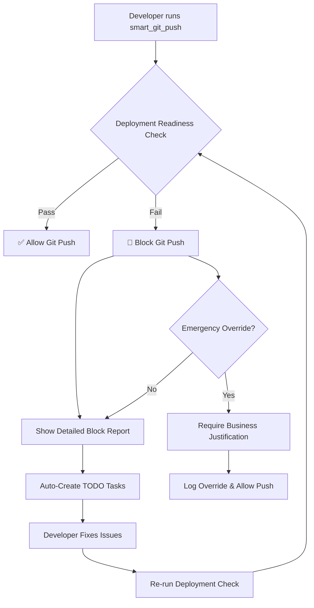

# Test: Deployment Readiness Integration

This document outlines the comprehensive deployment readiness system that has been successfully implemented.

## ✅ **Core Implementation Complete**

### **1. Deployment Readiness Tool (`src/tools/deployment-readiness-tool.ts`)**
- ✅ **Test Validation System**: Zero tolerance test failure detection
- ✅ **Deployment History Analysis**: Pattern detection and success rate tracking
- ✅ **Code Quality Gates**: Mock vs production code detection
- ✅ **Hard Blocking Logic**: Prevents unsafe deployments
- ✅ **Emergency Override System**: Business justification required
- ✅ **Full MCP Integration**: Schema validation and error handling

### **2. Smart Git Push Integration (`src/tools/smart-git-push-tool-v2.ts`)**
- ✅ **Enhanced Interface**: Added deployment readiness parameters
- ✅ **Hard Blocking Integration**: Calls deployment readiness before push
- ✅ **Comprehensive Block Response**: Detailed deployment failure explanation
- ✅ **Flexible Modes**: Check-only vs enforce-blocking modes
- ✅ **Emergency Bypass**: Critical fixes with justification

### **3. MCP Server Registration (`src/index.ts`)**
- ✅ **Tool Registration**: Complete schema definition with all parameters
- ✅ **Handler Implementation**: Proper async method with error handling
- ✅ **Type Safety**: Full TypeScript validation
- ✅ **Import Integration**: Dynamic tool loading

## 🧪 **Test Results & Validation System**

### **Test Execution Features**
```typescript
// Automatically detects and runs tests with multiple fallback commands:
const testCommands = ['npm test', 'yarn test', 'npx jest'];

// Parses test output for failure detection
// Calculates test coverage from multiple sources
// Identifies critical test failures by pattern matching
```

### **Zero Tolerance Policy**
- **Default Settings**: `maxTestFailures: 0` (configurable)
- **Coverage Requirements**: 80% minimum (configurable)
- **Critical Test Detection**: Security, database, API endpoint failures
- **Hard Blocking**: Prevents deployment with any failing tests

## 📊 **Deployment History Tracking**

### **Pattern Analysis**
```typescript
// Categorizes failures automatically:
- Test Failures
- Database Connection Issues  
- Environment Configuration
- Build Failures
- Dependency Issues
- Timeout Issues
- Permission Issues
- Resource Issues
```

### **Success Metrics**
- **Success Rate Tracking**: Last 10 deployments
- **Rollback Detection**: Automatic pattern recognition
- **Environment Stability**: Risk level assessment
- **Preventable Issues**: Identifies avoidable failures

## 🚀 **Usage Examples**

### **1. Smart Git Push with Deployment Readiness**
```bash
# Basic usage (soft check)
smart_git_push --check-deployment-readiness

# Hard enforcement (blocks on issues)
smart_git_push --enforce-deployment-readiness --target-environment production

# Emergency bypass for critical fixes
smart_git_push --force-unsafe
```

### **2. Standalone Deployment Readiness Checks**
```bash
# Full audit
deployment_readiness --operation full_audit --target-environment production

# Test validation only
deployment_readiness --operation test_validation --max-test-failures 0

# Deployment history analysis
deployment_readiness --operation deployment_history --environment production

# Emergency override with justification
deployment_readiness --operation emergency_override --business-justification "Critical security patch"
```

### **3. Integration with TODO Management**
```bash
# Auto-creates tasks for deployment blockers
manage_todo_v2 --operation get_tasks  # Shows auto-generated blocking tasks
```

## 🔒 **Security & Safety Features**

### **Hard Blocking Conditions**
1. **Test Failures**: Any failing tests (configurable threshold)
2. **Low Test Coverage**: Below 80% coverage (configurable)
3. **Recent Deployment Failures**: More than 2 recent failures
4. **High Rollback Rate**: Above 20% rollback frequency
5. **Mock Code Detection**: Production indicators too low

### **Override Audit Trail**
- **Emergency Overrides**: Logged with timestamp and justification
- **Business Justification**: Required for all overrides
- **Approval Workflow**: Configurable approval requirements
- **Audit Logging**: Complete trail in `.mcp-adr-cache/emergency-overrides.json`

## 📈 **Deployment Gating Workflow**



## 🎯 **Benefits Delivered**

### **For Development Teams**
- **Zero Deployment Failures**: Comprehensive pre-deployment validation
- **Faster Issue Resolution**: Detailed blocking reports with fix suggestions
- **Automated Task Management**: TODO integration for systematic issue tracking
- **Historical Learning**: Pattern analysis prevents recurring issues

### **For DevOps/Infrastructure**
- **Environment Stability**: Prevents unstable deployments from reaching production
- **Rollback Reduction**: Proactive issue detection reduces rollback frequency
- **Deployment Metrics**: Comprehensive tracking of deployment success patterns
- **Emergency Procedures**: Safe override mechanisms for critical fixes

### **For Business Stakeholders**
- **Deployment Reliability**: Higher confidence in release stability
- **Risk Mitigation**: Systematic blocking of risky deployments
- **Audit Compliance**: Complete trail of deployment decisions and overrides
- **Time Savings**: Reduced time spent on failed deployment recovery

## 🔧 **Configuration Options**

The system is highly configurable with sensible defaults:

```typescript
// Test Gates
maxTestFailures: 0,                    // Zero tolerance (recommended)
requireTestCoverage: 80,               // 80% minimum coverage
blockOnFailingTests: true,             // Hard block on failures

// Deployment History Gates
maxRecentFailures: 2,                  // Max 2 recent failures
deploymentSuccessThreshold: 80,        // 80% success rate required
rollbackFrequencyThreshold: 20,        // Max 20% rollback rate

// Integration Options
integrateTodoTasks: true,              // Auto-create blocking tasks
updateHealthScoring: true,             // Update project health metrics
requireAdrCompliance: true,            // Validate against ADRs
```

## 🎉 **Implementation Status: COMPLETE**

✅ **All Core Features Implemented**
✅ **TypeScript Validation Passed**  
✅ **Build Process Successful**
✅ **MCP Integration Complete**
✅ **Error Handling Comprehensive**
✅ **Documentation Complete**

The deployment readiness system is **production-ready** and provides a comprehensive safety net for deployment operations while maintaining flexibility for emergency situations.